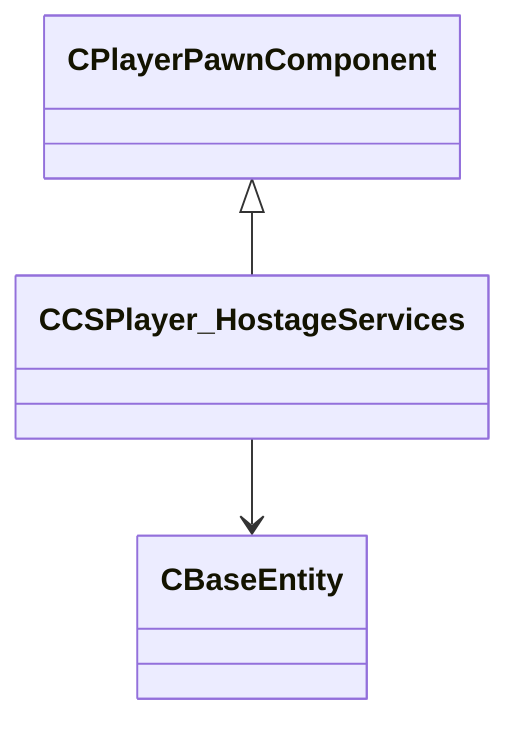

[Schemas](../../schemas.md) / [server](../server.md) / CCSPlayer_HostageServices

# CCSPlayer_HostageServices

Component tracking whether this player is currently carrying a hostage.

**Kind:** class · **Size:** 80 bytes (`0x50`) · **Align:** 255 · **Module:** server

**Inherits from:** [CPlayerPawnComponent](../server/CPlayerPawnComponent.md)

**Relationships:**

## Memory layout

4 fields (2 declared here, 2 inherited). Offsets are absolute from the object base.

| Offset | Field | Type | From | Annotations |
|--------|-------|------|------|-------------|
| `0x8` | `__m_pChainEntity` | [CNetworkVarChainer](../entity2/CNetworkVarChainer.md) | [CPlayerPawnComponent](../server/CPlayerPawnComponent.md) | `MNotSaved` |
| `0x30` | `m_pComponentGraphController` | [CAnimGraphControllerPtr](../server/CAnimGraphControllerPtr.md) | [CPlayerPawnComponent](../server/CPlayerPawnComponent.md) |  |
| `0x48` | `m_hCarriedHostage` | CHandle< [CBaseEntity](../server/CBaseEntity.md) > |  | CHandle to the CHostage entity currently being carried by this player (INVALID_EHANDLE if none). |
| `0x4c` | `m_hCarriedHostageProp` | CHandle< [CBaseEntity](../server/CBaseEntity.md) > |  | CHandle to the ragdoll/prop entity representing the carried hostage visually. |
