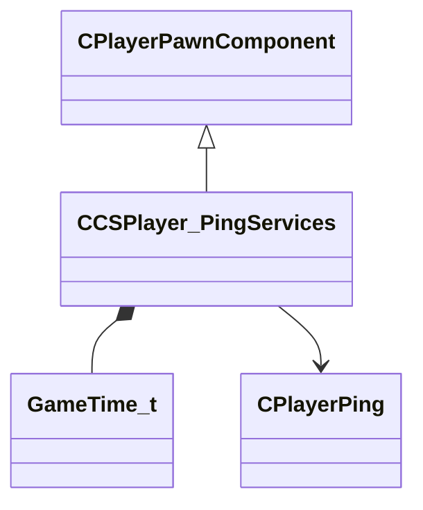

[Schemas](../../schemas.md) / [server](../server.md) / CCSPlayer_PingServices

# CCSPlayer_PingServices

> Source: **Build 25000182** · 2026-08-28 · `windows-x86_64` · schema `0.10.0`

**Kind:** class · **Size:** 96 bytes (`0x60`) · **Align:** n/a (unspecified) · **Module:** server

**Twin:** [CCSPlayer_PingServices (client)](../client/CCSPlayer_PingServices.md)

**Inherits from:** [CPlayerPawnComponent](../server/CPlayerPawnComponent.md)

**Relationships:**

## Memory layout

4 fields (2 declared here, 2 inherited). Offsets are absolute from the object base.

| Offset | Field | Type | From | Annotations |
|--------|-------|------|------|-------------|
| `0x8` | `__m_pChainEntity` | [CNetworkVarChainer](../entity2/CNetworkVarChainer.md) | [CPlayerPawnComponent](../server/CPlayerPawnComponent.md) | `MNotSaved` |
| `0x30` | `m_pComponentGraphController` | [CAnimGraphControllerPtr](../server/CAnimGraphControllerPtr.md) | [CPlayerPawnComponent](../server/CPlayerPawnComponent.md) |  |
| `0x48` | `m_flPlayerPingTokens` | [GameTime_t](../entity2/GameTime_t.md)[5] |  |  |
| `0x5c` | `m_hPlayerPing` | CHandle< [CPlayerPing](../server/CPlayerPing.md) > |  |  |
