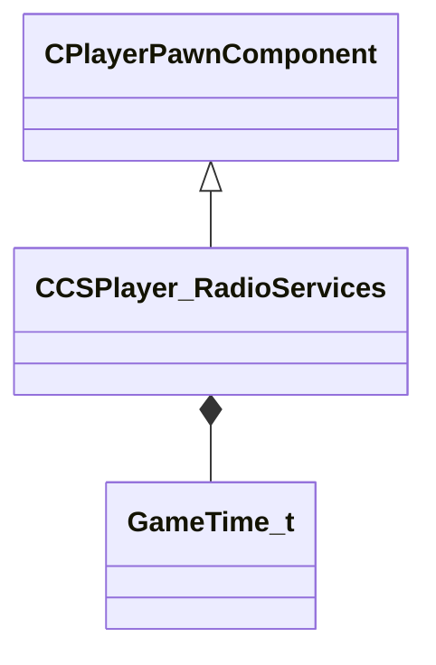

[Schemas](../../schemas.md) / [server](../server.md) / CCSPlayer_RadioServices

# CCSPlayer_RadioServices

**Kind:** class · **Size:** 104 bytes (`0x68`) · **Align:** 255 · **Module:** server

**Inherits from:** [CPlayerPawnComponent](../server/CPlayerPawnComponent.md)

**Relationships:**

## Memory layout

7 fields (5 declared here, 2 inherited). Offsets are absolute from the object base.

| Offset | Field | Type | From | Annotations |
|--------|-------|------|------|-------------|
| `0x8` | `__m_pChainEntity` | [CNetworkVarChainer](../entity2/CNetworkVarChainer.md) | [CPlayerPawnComponent](../server/CPlayerPawnComponent.md) | `MNotSaved` |
| `0x30` | `m_pComponentGraphController` | [CAnimGraphControllerPtr](../server/CAnimGraphControllerPtr.md) | [CPlayerPawnComponent](../server/CPlayerPawnComponent.md) |  |
| `0x48` | `m_flGotHostageTalkTimer` | [GameTime_t](../entity2/GameTime_t.md) |  |  |
| `0x4c` | `m_flDefusingTalkTimer` | [GameTime_t](../entity2/GameTime_t.md) |  |  |
| `0x50` | `m_flC4PlantTalkTimer` | [GameTime_t](../entity2/GameTime_t.md) |  |  |
| `0x54` | `m_flRadioTokenSlots` | [GameTime_t](../entity2/GameTime_t.md)[3] |  |  |
| `0x60` | `m_bIgnoreRadio` | bool |  |  |
