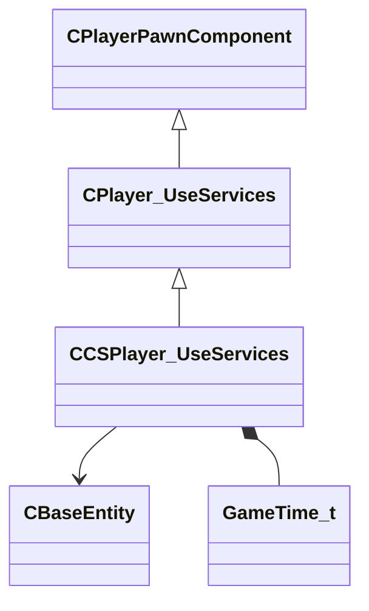

[Schemas](../../schemas.md) / [server](../server.md) / CCSPlayer_UseServices

# CCSPlayer_UseServices

**Kind:** class · **Size:** 88 bytes (`0x58`) · **Align:** 255 · **Module:** server

**Inherits from:** [CPlayer_UseServices](../server/CPlayer_UseServices.md)

**Relationships:**

## Memory layout

5 fields (3 declared here, 2 inherited). Offsets are absolute from the object base.

| Offset | Field | Type | From | Annotations |
|--------|-------|------|------|-------------|
| `0x8` | `__m_pChainEntity` | [CNetworkVarChainer](../entity2/CNetworkVarChainer.md) | [CPlayerPawnComponent](../server/CPlayerPawnComponent.md) | `MNotSaved` |
| `0x30` | `m_pComponentGraphController` | [CAnimGraphControllerPtr](../server/CAnimGraphControllerPtr.md) | [CPlayerPawnComponent](../server/CPlayerPawnComponent.md) |  |
| `0x48` | `m_hLastKnownUseEntity` | CHandle< [CBaseEntity](../server/CBaseEntity.md) > |  |  |
| `0x4c` | `m_flLastUseTimeStamp` | [GameTime_t](../entity2/GameTime_t.md) |  |  |
| `0x50` | `m_flTimeLastUsedWindow` | [GameTime_t](../entity2/GameTime_t.md) |  |  |
