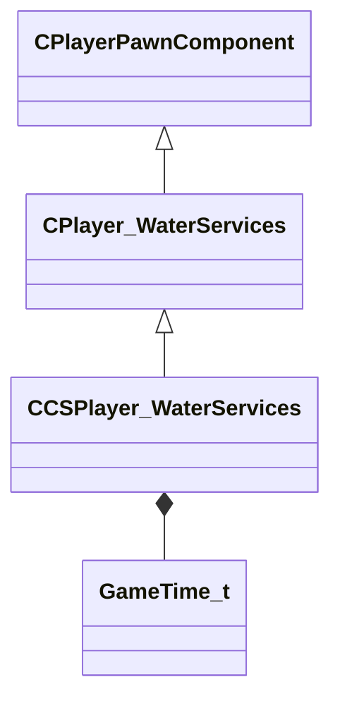

[Schemas](../../schemas.md) / [server](../server.md) / CCSPlayer_WaterServices

# CCSPlayer_WaterServices

**Kind:** class · **Size:** 128 bytes (`0x80`) · **Align:** 255 · **Module:** server

**Inherits from:** [CPlayer_WaterServices](../server/CPlayer_WaterServices.md)

**Relationships:**

## Memory layout

8 fields (6 declared here, 2 inherited). Offsets are absolute from the object base.

| Offset | Field | Type | From | Annotations |
|--------|-------|------|------|-------------|
| `0x8` | `__m_pChainEntity` | [CNetworkVarChainer](../entity2/CNetworkVarChainer.md) | [CPlayerPawnComponent](../server/CPlayerPawnComponent.md) | `MNotSaved` |
| `0x30` | `m_pComponentGraphController` | [CAnimGraphControllerPtr](../server/CAnimGraphControllerPtr.md) | [CPlayerPawnComponent](../server/CPlayerPawnComponent.md) |  |
| `0x48` | `m_NextDrownDamageTime` | [GameTime_t](../entity2/GameTime_t.md) |  |  |
| `0x4c` | `m_nDrownDmgRate` | int32 |  |  |
| `0x50` | `m_AirFinishedTime` | [GameTime_t](../entity2/GameTime_t.md) |  |  |
| `0x54` | `m_flWaterJumpTime` | float32 |  |  |
| `0x58` | `m_vecWaterJumpVel` | Vector |  |  |
| `0x64` | `m_flSwimSoundTime` | float32 |  |  |
