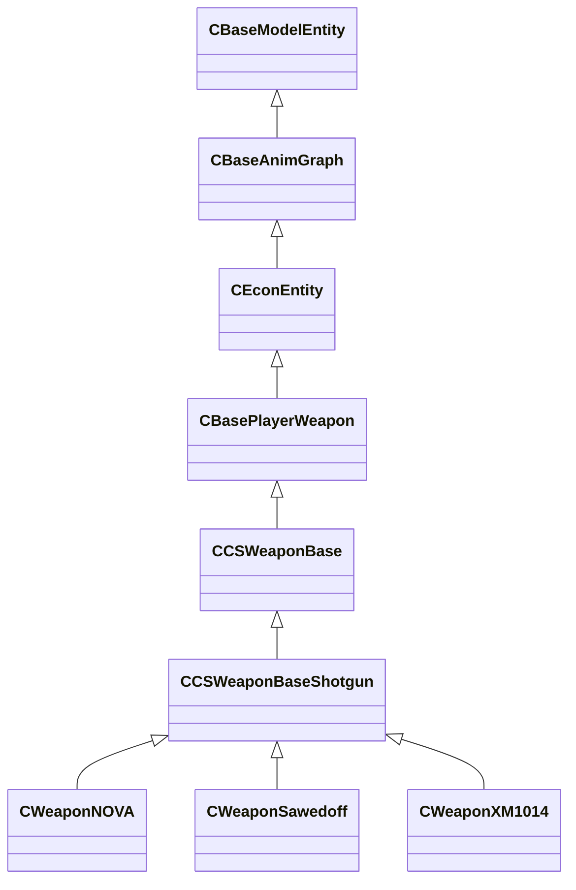

[Schemas](../../schemas.md) / [server](../server.md) / CCSWeaponBaseShotgun

# CCSWeaponBaseShotgun

> Source: **Build 25000182** · 2026-08-28 · `windows-x86_64` · schema `0.10.0`

**Kind:** class · **Size:** 4176 bytes (`0x1050`) · **Align:** 16 · **Module:** server

**Inherits from:** [CCSWeaponBase](../server/CCSWeaponBase.md)

**Derived by:** [CWeaponNOVA](../server/CWeaponNOVA.md), [CWeaponSawedoff](../server/CWeaponSawedoff.md), [CWeaponXM1014](../server/CWeaponXM1014.md)

**Relationships:**

## Memory layout

212 fields (0 declared here, 212 inherited). Offsets are absolute from the object base.

| Offset | Field | Type | From | Annotations |
|--------|-------|------|------|-------------|
| `0x8` | `m_iszPrivateVScripts` | CUtlSymbolLarge | [CEntityInstance](../entity2/CEntityInstance.md) |  |
| `0x10` | `m_pEntity` | [CEntityIdentity](../entity2/CEntityIdentity.md)* | [CEntityInstance](../entity2/CEntityInstance.md) | CEntityIdentity pointer — the entity's identity record (name, class, handle, flags). |
| `0x28` | `m_CScriptComponent` | [CScriptComponent](../entity2/CScriptComponent.md)* | [CEntityInstance](../entity2/CEntityInstance.md) | VScript component attached to the entity, when scripted. |
| `0x30` | `m_CBodyComponent` | [CBodyComponent](../server/CBodyComponent.md)* | [CBaseEntity](../server/CBaseEntity.md) |  |
| `0x38` | `m_NetworkTransmitComponent` | [CNetworkTransmitComponent](../server/CNetworkTransmitComponent.md) | [CBaseEntity](../server/CBaseEntity.md) |  |
| `0x248` | `m_aThinkFunctions` | CUtlVector< thinkfunc_t > | [CBaseEntity](../server/CBaseEntity.md) |  |
| `0x260` | `m_iCurrentThinkContext` | int32 | [CBaseEntity](../server/CBaseEntity.md) | `MNotSaved` |
| `0x264` | `m_nLastThinkTick` | [GameTick_t](../entity2/GameTick_t.md) | [CBaseEntity](../server/CBaseEntity.md) |  |
| `0x268` | `m_bDisabledContextThinks` | bool | [CBaseEntity](../server/CBaseEntity.md) |  |
| `0x278` | `m_isSteadyState` | CTypedBitVec< 64 > | [CBaseEntity](../server/CBaseEntity.md) | `MNotSaved` |
| `0x280` | `m_lastNetworkChange` | float32 | [CBaseEntity](../server/CBaseEntity.md) | `MNotSaved` |
| `0x288` | `m_think` | BASEPTR | [CBaseEntity](../server/CBaseEntity.md) |  |
| `0x290` | `m_ResponseContexts` | CUtlVector< [ResponseContext_t](../server/ResponseContext_t.md) > | [CBaseEntity](../server/CBaseEntity.md) |  |
| `0x2a8` | `m_iszResponseContext` | CUtlSymbolLarge | [CBaseEntity](../server/CBaseEntity.md) |  |
| `0x2b0` | `m_pfnTouch` | ENTITYFUNCPTR | [CBaseEntity](../server/CBaseEntity.md) |  |
| `0x2b8` | `m_pfnUse` | USEPTR | [CBaseEntity](../server/CBaseEntity.md) |  |
| `0x2c0` | `m_pfnBlocked` | ENTITYFUNCPTR | [CBaseEntity](../server/CBaseEntity.md) |  |
| `0x2c8` | `m_pfnMoveDone` | BASEPTR | [CBaseEntity](../server/CBaseEntity.md) |  |
| `0x2d0` | `m_iHealth` | int32 | [CBaseEntity](../server/CBaseEntity.md) | Current health points of the entity. Serialised with the 'ClampHealth' encoder so values above max are clamped. *Sent only to the Player network group and LocalPlayerExclusive.* |
| `0x2d4` | `m_iMaxHealth` | int32 | [CBaseEntity](../server/CBaseEntity.md) | Maximum health points; used to normalise health bars in the HUD. |
| `0x2d8` | `m_lifeState` | uint8 | [CBaseEntity](../server/CBaseEntity.md) | LIFE_STATE enum: 0 = Alive, 1 = Dying, 2 = Dead, 3 = Respawnable, 4 = Discardbody. |
| `0x2dc` | `m_flDamageAccumulator` | float32 | [CBaseEntity](../server/CBaseEntity.md) |  |
| `0x2e0` | `m_bTakesDamage` | bool | [CBaseEntity](../server/CBaseEntity.md) |  |
| `0x2e8` | `m_nTakeDamageFlags` | [TakeDamageFlags_t](../server/TakeDamageFlags_t.md) | [CBaseEntity](../server/CBaseEntity.md) |  |
| `0x2f0` | `m_nPlatformType` | [EntityPlatformTypes_t](../server/EntityPlatformTypes_t.md) | [CBaseEntity](../server/CBaseEntity.md) |  |
| `0x2f2` | `m_MoveCollide` | [MoveCollide_t](../server/MoveCollide_t.md) | [CBaseEntity](../server/CBaseEntity.md) |  |
| `0x2f3` | `m_MoveType` | [MoveType_t](../server/MoveType_t.md) | [CBaseEntity](../server/CBaseEntity.md) |  |
| `0x2f4` | `m_nPreviouslySetMoveType` | [MoveType_t](../server/MoveType_t.md) | [CBaseEntity](../server/CBaseEntity.md) |  |
| `0x2f5` | `m_nActualMoveType` | [MoveType_t](../server/MoveType_t.md) | [CBaseEntity](../server/CBaseEntity.md) |  |
| `0x2f6` | `m_nWaterTouch` | uint8 | [CBaseEntity](../server/CBaseEntity.md) | `MNotSaved` |
| `0x2f7` | `m_nSlimeTouch` | uint8 | [CBaseEntity](../server/CBaseEntity.md) | `MNotSaved` |
| `0x2f8` | `m_bRestoreInHierarchy` | bool | [CBaseEntity](../server/CBaseEntity.md) |  |
| `0x300` | `m_target` | CUtlSymbolLarge | [CBaseEntity](../server/CBaseEntity.md) |  |
| `0x308` | `m_hDamageFilter` | CHandle< [CBaseFilter](../server/CBaseFilter.md) > | [CBaseEntity](../server/CBaseEntity.md) |  |
| `0x310` | `m_iszDamageFilterName` | CUtlSymbolLarge | [CBaseEntity](../server/CBaseEntity.md) |  |
| `0x318` | `m_flMoveDoneTime` | float32 | [CBaseEntity](../server/CBaseEntity.md) |  |
| `0x31c` | `m_nSubclassID` | CUtlStringToken | [CBaseEntity](../server/CBaseEntity.md) |  |
| `0x328` | `m_flAnimTime` | float32 | [CBaseEntity](../server/CBaseEntity.md) | Floating-point timestamp of the most-recent animation update; used by the client for animation interpolation. `MKV3TransferSaveOpsForField GetEngineTimeSaveRestoreOps` |
| `0x32c` | `m_flSimulationTime` | float32 | [CBaseEntity](../server/CBaseEntity.md) | Floating-point timestamp of the most-recent physics simulation step; used by the client for position interpolation. `MKV3TransferSaveOpsForField GetEngineTimeSaveRestoreOps` |
| `0x330` | `m_flCreateTime` | [GameTime_t](../entity2/GameTime_t.md) | [CBaseEntity](../server/CBaseEntity.md) |  |
| `0x334` | `m_bClientSideRagdoll` | bool | [CBaseEntity](../server/CBaseEntity.md) |  |
| `0x335` | `m_ubInterpolationFrame` | uint8 | [CBaseEntity](../server/CBaseEntity.md) |  |
| `0x338` | `m_vPrevVPhysicsUpdatePos` | VectorWS | [CBaseEntity](../server/CBaseEntity.md) |  |
| `0x344` | `m_iTeamNum` | uint8 | [CBaseEntity](../server/CBaseEntity.md) | Team number: 0 = Unassigned, 1 = Spectator, 2 = Terrorist, 3 = Counter-Terrorist. |
| `0x348` | `m_iGlobalname` | CUtlSymbolLarge | [CBaseEntity](../server/CBaseEntity.md) | `MSaveBehavior` |
| `0x350` | `m_iSentToClients` | int32 | [CBaseEntity](../server/CBaseEntity.md) | `MNotSaved` |
| `0x358` | `m_sUniqueHammerID` | CUtlString | [CBaseEntity](../server/CBaseEntity.md) |  |
| `0x360` | `m_spawnflags` | uint32 | [CBaseEntity](../server/CBaseEntity.md) |  |
| `0x364` | `m_nNextThinkTick` | [GameTick_t](../entity2/GameTick_t.md) | [CBaseEntity](../server/CBaseEntity.md) | Server tick on which the entity's Think() function will next execute (-1 = never). |
| `0x368` | `m_nSimulationTick` | int32 | [CBaseEntity](../server/CBaseEntity.md) | `MKV3TransferSaveOpsForField GetEngineTickSaveRestoreOps` |
| `0x370` | `m_OnKilled` | [CEntityIOOutput](../entity2/CEntityIOOutput.md) | [CBaseEntity](../server/CBaseEntity.md) |  |
| `0x388` | `m_fFlags` | uint32 | [CBaseEntity](../server/CBaseEntity.md) | Entity flags bitmask (FL_ONGROUND = 1, FL_DUCKING = 4, FL_INWATER = 8, FL_FROZEN = 0x200, etc.). |
| `0x38c` | `m_vecAbsVelocity` | Vector | [CBaseEntity](../server/CBaseEntity.md) |  |
| `0x398` | `m_vecVelocity` | [CNetworkVelocityVector](../server/CNetworkVelocityVector.md) | [CBaseEntity](../server/CBaseEntity.md) | Current world-space velocity vector of the entity. |
| `0x3c8` | `m_vecBaseVelocity` | Vector | [CBaseEntity](../server/CBaseEntity.md) | Additional world-space velocity contributed by moving platforms, conveyor belts, etc. |
| `0x3d4` | `m_nPushEnumCount` | int32 | [CBaseEntity](../server/CBaseEntity.md) | `MNotSaved` |
| `0x3d8` | `m_pCollision` | [CCollisionProperty](../server/CCollisionProperty.md)* | [CBaseEntity](../server/CBaseEntity.md) | `MNotSaved` |
| `0x3e0` | `m_hEffectEntity` | CHandle< [CBaseEntity](../server/CBaseEntity.md) > | [CBaseEntity](../server/CBaseEntity.md) |  |
| `0x3e4` | `m_hOwnerEntity` | CHandle< [CBaseEntity](../server/CBaseEntity.md) > | [CBaseEntity](../server/CBaseEntity.md) | CHandle to the entity that owns or spawned this entity (e.g. the thrower of a grenade). |
| `0x3e8` | `m_fEffects` | uint32 | [CBaseEntity](../server/CBaseEntity.md) | Effect flags bitmask (EF_NODRAW = 32, EF_NORECEIVESHADOW = 64, etc.). |
| `0x3ec` | `m_hGroundEntity` | CHandle< [CBaseEntity](../server/CBaseEntity.md) > | [CBaseEntity](../server/CBaseEntity.md) | CHandle to the entity this entity is standing on (INVALID_EHANDLE if airborne). |
| `0x3f0` | `m_nGroundBodyIndex` | int32 | [CBaseEntity](../server/CBaseEntity.md) |  |
| `0x3f4` | `m_flFriction` | float32 | [CBaseEntity](../server/CBaseEntity.md) | Surface friction multiplier (1.0 = normal; lower values make the entity slide more). |
| `0x3f8` | `m_flElasticity` | float32 | [CBaseEntity](../server/CBaseEntity.md) |  |
| `0x3fc` | `m_flGravityScale` | float32 | [CBaseEntity](../server/CBaseEntity.md) | Gravity scale multiplier (1.0 = normal; 0 = no gravity). |
| `0x400` | `m_flTimeScale` | float32 | [CBaseEntity](../server/CBaseEntity.md) | Time-scale multiplier applied to this entity's simulation (1.0 = real time; used by bullet time effects). |
| `0x404` | `m_flWaterLevel` | float32 | [CBaseEntity](../server/CBaseEntity.md) |  |
| `0x408` | `m_bGravityDisabled` | bool | [CBaseEntity](../server/CBaseEntity.md) |  |
| `0x409` | `m_bAnimatedEveryTick` | bool | [CBaseEntity](../server/CBaseEntity.md) | True when the entity's animation must be updated every server tick regardless of network interest. |
| `0x40c` | `m_flActualGravityScale` | float32 | [CBaseEntity](../server/CBaseEntity.md) |  |
| `0x410` | `m_bGravityActuallyDisabled` | bool | [CBaseEntity](../server/CBaseEntity.md) |  |
| `0x411` | `m_bDisableLowViolence` | bool | [CBaseEntity](../server/CBaseEntity.md) |  |
| `0x412` | `m_nWaterType` | uint8 | [CBaseEntity](../server/CBaseEntity.md) |  |
| `0x414` | `m_iEFlags` | int32 | [CBaseEntity](../server/CBaseEntity.md) |  |
| `0x418` | `m_OnUser1` | [CEntityIOOutput](../entity2/CEntityIOOutput.md) | [CBaseEntity](../server/CBaseEntity.md) |  |
| `0x430` | `m_OnUser2` | [CEntityIOOutput](../entity2/CEntityIOOutput.md) | [CBaseEntity](../server/CBaseEntity.md) |  |
| `0x448` | `m_OnUser3` | [CEntityIOOutput](../entity2/CEntityIOOutput.md) | [CBaseEntity](../server/CBaseEntity.md) |  |
| `0x460` | `m_OnUser4` | [CEntityIOOutput](../entity2/CEntityIOOutput.md) | [CBaseEntity](../server/CBaseEntity.md) |  |
| `0x478` | `m_iInitialTeamNum` | int32 | [CBaseEntity](../server/CBaseEntity.md) |  |
| `0x47c` | `m_flNavIgnoreUntilTime` | [GameTime_t](../entity2/GameTime_t.md) | [CBaseEntity](../server/CBaseEntity.md) |  |
| `0x480` | `m_vecAngVelocity` | QAngle | [CBaseEntity](../server/CBaseEntity.md) |  |
| `0x48c` | `m_bNetworkQuantizeOriginAndAngles` | bool | [CBaseEntity](../server/CBaseEntity.md) |  |
| `0x48d` | `m_bLagCompensate` | bool | [CBaseEntity](../server/CBaseEntity.md) |  |
| `0x490` | `m_pBlocker` | CHandle< [CBaseEntity](../server/CBaseEntity.md) > | [CBaseEntity](../server/CBaseEntity.md) |  |
| `0x494` | `m_flLocalTime` | float32 | [CBaseEntity](../server/CBaseEntity.md) |  |
| `0x498` | `m_flVPhysicsUpdateLocalTime` | float32 | [CBaseEntity](../server/CBaseEntity.md) |  |
| `0x49c` | `m_nBloodType` | [BloodType](../server/BloodType.md) | [CBaseEntity](../server/CBaseEntity.md) |  |
| `0x4a0` | `m_pPulseGraphInstance` | [CPulseGraphInstance_ServerEntity](../server/CPulseGraphInstance_ServerEntity.md)* | [CBaseEntity](../server/CBaseEntity.md) | `MKV3TransferSaveOpsForField GetPulseInstanceSaveRestoreOps` |
| `0x4a8` | `m_CRenderComponent` | [CRenderComponent](../server/CRenderComponent.md)* | [CBaseModelEntity](../server/CBaseModelEntity.md) | `MNotSaved` |
| `0x4b0` | `m_CHitboxComponent` | [CHitboxComponent](../server/CHitboxComponent.md) | [CBaseModelEntity](../server/CBaseModelEntity.md) |  |
| `0x4c8` | `m_pChoreoComponent` | [CChoreoComponent](../server/CChoreoComponent.md)* | [CBaseModelEntity](../server/CBaseModelEntity.md) |  |
| `0x4d0` | `m_nDestructiblePartInitialStateDestructed0` | [HitGroup_t](../server/HitGroup_t.md) | [CBaseModelEntity](../server/CBaseModelEntity.md) |  |
| `0x4d4` | `m_nDestructiblePartInitialStateDestructed1` | [HitGroup_t](../server/HitGroup_t.md) | [CBaseModelEntity](../server/CBaseModelEntity.md) |  |
| `0x4d8` | `m_nDestructiblePartInitialStateDestructed2` | [HitGroup_t](../server/HitGroup_t.md) | [CBaseModelEntity](../server/CBaseModelEntity.md) |  |
| `0x4dc` | `m_nDestructiblePartInitialStateDestructed3` | [HitGroup_t](../server/HitGroup_t.md) | [CBaseModelEntity](../server/CBaseModelEntity.md) |  |
| `0x4e0` | `m_nDestructiblePartInitialStateDestructed4` | [HitGroup_t](../server/HitGroup_t.md) | [CBaseModelEntity](../server/CBaseModelEntity.md) |  |
| `0x4e4` | `m_nDestructiblePartInitialStateDestructed0_PartIndex` | int32 | [CBaseModelEntity](../server/CBaseModelEntity.md) |  |
| `0x4e8` | `m_nDestructiblePartInitialStateDestructed1_PartIndex` | int32 | [CBaseModelEntity](../server/CBaseModelEntity.md) |  |
| `0x4ec` | `m_nDestructiblePartInitialStateDestructed2_PartIndex` | int32 | [CBaseModelEntity](../server/CBaseModelEntity.md) |  |
| `0x4f0` | `m_nDestructiblePartInitialStateDestructed3_PartIndex` | int32 | [CBaseModelEntity](../server/CBaseModelEntity.md) |  |
| `0x4f4` | `m_nDestructiblePartInitialStateDestructed4_PartIndex` | int32 | [CBaseModelEntity](../server/CBaseModelEntity.md) |  |
| `0x4f8` | `m_bDestructiblePartInitialStateDestructed0_GenerateBreakpieces` | bool | [CBaseModelEntity](../server/CBaseModelEntity.md) |  |
| `0x4f9` | `m_bDestructiblePartInitialStateDestructed1_GenerateBreakpieces` | bool | [CBaseModelEntity](../server/CBaseModelEntity.md) |  |
| `0x4fa` | `m_bDestructiblePartInitialStateDestructed2_GenerateBreakpieces` | bool | [CBaseModelEntity](../server/CBaseModelEntity.md) |  |
| `0x4fb` | `m_bDestructiblePartInitialStateDestructed3_GenerateBreakpieces` | bool | [CBaseModelEntity](../server/CBaseModelEntity.md) |  |
| `0x4fc` | `m_bDestructiblePartInitialStateDestructed4_GenerateBreakpieces` | bool | [CBaseModelEntity](../server/CBaseModelEntity.md) |  |
| `0x500` | `m_pDestructiblePartsSystemComponent` | [CDestructiblePartsComponent](../server/CDestructiblePartsComponent.md)* | [CBaseModelEntity](../server/CBaseModelEntity.md) |  |
| `0x508` | `m_OnDestructibleHitGroupDamageLevelChanged` | CEntityOutputTemplate< [CBaseModelEntity::OnDamageLevelChangedArgs_t](../server/CBaseModelEntity.OnDamageLevelChangedArgs_t.md) > | [CBaseModelEntity](../server/CBaseModelEntity.md) |  |
| `0x530` | `m_flDissolveStartTime` | [GameTime_t](../entity2/GameTime_t.md) | [CBaseModelEntity](../server/CBaseModelEntity.md) |  |
| `0x538` | `m_OnIgnite` | [CEntityIOOutput](../entity2/CEntityIOOutput.md) | [CBaseModelEntity](../server/CBaseModelEntity.md) |  |
| `0x550` | `m_nRenderMode` | [RenderMode_t](../server/RenderMode_t.md) | [CBaseModelEntity](../server/CBaseModelEntity.md) | RenderMode_t enum controlling transparency and rendering method (0 = Normal, 5 = Translucent, etc.). |
| `0x551` | `m_nRenderFX` | [RenderFx_t](../server/RenderFx_t.md) | [CBaseModelEntity](../server/CBaseModelEntity.md) | RenderFx_t enum for special rendering effects (pulsing, fading, hologram, etc.). |
| `0x552` | `m_bAllowFadeInView` | bool | [CBaseModelEntity](../server/CBaseModelEntity.md) |  |
| `0x570` | `m_clrRender` | Color | [CBaseModelEntity](../server/CBaseModelEntity.md) | RGBA tint colour multiplied onto the entity's diffuse texture. |
| `0x578` | `m_vecRenderAttributes` | CUtlVectorEmbeddedNetworkVar< [EntityRenderAttribute_t](../server/EntityRenderAttribute_t.md) > | [CBaseModelEntity](../server/CBaseModelEntity.md) |  |
| `0x5e0` | `m_bRenderToCubemaps` | bool | [CBaseModelEntity](../server/CBaseModelEntity.md) |  |
| `0x5e1` | `m_bNoInterpolate` | bool | [CBaseModelEntity](../server/CBaseModelEntity.md) |  |
| `0x5e8` | `m_Collision` | [CCollisionProperty](../server/CCollisionProperty.md) | [CBaseModelEntity](../server/CBaseModelEntity.md) | CCollisionProperty struct encoding the entity's collision bounding box shape and flags. |
| `0x6a0` | `m_Glow` | [CGlowProperty](../server/CGlowProperty.md) | [CBaseModelEntity](../server/CBaseModelEntity.md) | CGlowProperty struct controlling the entity's glow outline (colour, radius, visibility rules). |
| `0x6f8` | `m_flGlowBackfaceMult` | float32 | [CBaseModelEntity](../server/CBaseModelEntity.md) | Multiplier for the glow effect on back-facing surfaces of the model. |
| `0x6fc` | `m_fadeMinDist` | float32 | [CBaseModelEntity](../server/CBaseModelEntity.md) | Minimum distance (world units) at which the entity starts to fade out. |
| `0x700` | `m_fadeMaxDist` | float32 | [CBaseModelEntity](../server/CBaseModelEntity.md) | Distance at which the entity is fully faded out and invisible. |
| `0x704` | `m_flFadeScale` | float32 | [CBaseModelEntity](../server/CBaseModelEntity.md) | Scale factor applied to fade distances; 0 disables distance fading. |
| `0x708` | `m_flShadowStrength` | float32 | [CBaseModelEntity](../server/CBaseModelEntity.md) | Opacity of this entity's cast shadow (0 = no shadow, 1 = full shadow). |
| `0x70c` | `m_nObjectCulling` | uint8 | [CBaseModelEntity](../server/CBaseModelEntity.md) |  |
| `0x710` | `m_bodyGroupChoices` | CUtlOrderedMap< CGlobalSymbol, int32 > | [CBaseModelEntity](../server/CBaseModelEntity.md) |  |
| `0x738` | `m_vecViewOffset` | [CNetworkViewOffsetVector](../server/CNetworkViewOffsetVector.md) | [CBaseModelEntity](../server/CBaseModelEntity.md) | Offset from the entity origin to the player's view position (eye height). |
| `0x768` | `m_bvDisabledHitGroups` | uint32[1] | [CBaseModelEntity](../server/CBaseModelEntity.md) | `MKV3TransferSaveOpsForField GetHitgroupDisableListSaveRestoreOps` |
| `0x770` | `m_graphControllerManager` | [CAnimGraphControllerManager](../server/CAnimGraphControllerManager.md) | [CBaseAnimGraph](../server/CBaseAnimGraph.md) |  |
| `0x808` | `m_pMainGraphController` | [CAnimGraphControllerPtr](../server/CAnimGraphControllerPtr.md) | [CBaseAnimGraph](../server/CBaseAnimGraph.md) | The primary animation-graph controller instance for this entity. |
| `0x810` | `m_bInitiallyPopulateInterpHistory` | bool | [CBaseAnimGraph](../server/CBaseAnimGraph.md) |  |
| `0x818` | `m_OnLayerCycleUpdated` | CEntityOutputTemplate< float32 > | [CBaseAnimGraph](../server/CBaseAnimGraph.md) |  |
| `0x838` | `m_OnExternalChoreoGraphChanged` | [CEntityIOOutput](../entity2/CEntityIOOutput.md) | [CBaseAnimGraph](../server/CBaseAnimGraph.md) |  |
| `0x850` | `m_pChoreoServices` | [IChoreoServices](../server/IChoreoServices.md)* | [CBaseAnimGraph](../server/CBaseAnimGraph.md) | `MKV3TransferSaveOpsForField GetChoreoServicesSaveRestoreOps` |
| `0x858` | `m_bAnimGraphUpdateEnabled` | bool | [CBaseAnimGraph](../server/CBaseAnimGraph.md) |  |
| `0x859` | `m_bAnimationUpdateScheduled` | bool | [CBaseAnimGraph](../server/CBaseAnimGraph.md) | `MNotSaved` |
| `0x85c` | `m_vecForce` | Vector | [CBaseAnimGraph](../server/CBaseAnimGraph.md) | `MNotSaved` |
| `0x868` | `m_nForceBone` | int32 | [CBaseAnimGraph](../server/CBaseAnimGraph.md) | `MNotSaved` |
| `0x878` | `m_pRagdollControl` | [IPhysicsRagdollControl](../vphysics2/IPhysicsRagdollControl.md)* | [CBaseAnimGraph](../server/CBaseAnimGraph.md) | `MPhysPtr` |
| `0x880` | `m_RagdollPose` | [PhysicsRagdollPose_t](../server/PhysicsRagdollPose_t.md) | [CBaseAnimGraph](../server/CBaseAnimGraph.md) |  |
| `0x8a8` | `m_bRagdollEnabled` | bool | [CBaseAnimGraph](../server/CBaseAnimGraph.md) | True while the entity is simulated as a ragdoll rather than animated. |
| `0x8a9` | `m_bRagdollClientSide` | bool | [CBaseAnimGraph](../server/CBaseAnimGraph.md) | `MNotSaved` |
| `0x8b0` | `m_xParentedRagdollRootInEntitySpace` | CTransform | [CBaseAnimGraph](../server/CBaseAnimGraph.md) |  |
| `0x978` | `m_AttributeManager` | [CAttributeContainer](../server/CAttributeContainer.md) | [CEconEntity](../server/CEconEntity.md) |  |
| `0xc70` | `m_OriginalOwnerXuidLow` | uint32 | [CEconEntity](../server/CEconEntity.md) | Low 32 bits of the item's original-owner SteamID. |
| `0xc74` | `m_OriginalOwnerXuidHigh` | uint32 | [CEconEntity](../server/CEconEntity.md) | High 32 bits of the item's original-owner SteamID. |
| `0xc78` | `m_nFallbackPaintKit` | int32 | [CEconEntity](../server/CEconEntity.md) | Paint-kit (skin) id used when full econ item data isn't attached. |
| `0xc7c` | `m_nFallbackSeed` | int32 | [CEconEntity](../server/CEconEntity.md) |  |
| `0xc80` | `m_flFallbackWear` | float32 | [CEconEntity](../server/CEconEntity.md) | Skin wear / float value (0 = factory new … 1 = battle-scarred). |
| `0xc84` | `m_nFallbackStatTrak` | int32 | [CEconEntity](../server/CEconEntity.md) | StatTrak kill-counter value. |
| `0xc88` | `m_hOldProvidee` | CHandle< [CBaseEntity](../server/CBaseEntity.md) > | [CEconEntity](../server/CEconEntity.md) |  |
| `0xc8c` | `m_iOldOwnerClass` | int32 | [CEconEntity](../server/CEconEntity.md) |  |
| `0xc90` | `m_nNextPrimaryAttackTick` | [GameTick_t](../entity2/GameTick_t.md) | [CBasePlayerWeapon](../server/CBasePlayerWeapon.md) | Server game-tick after which the next primary fire is permitted. *Only sent to the owning player (LocalWeaponExclusive). Pair with m_flNextPrimaryAttackTickRatio for sub-tick precision.* |
| `0xc94` | `m_flNextPrimaryAttackTickRatio` | float32 | [CBasePlayerWeapon](../server/CBasePlayerWeapon.md) | Fractional sub-tick ratio for m_nNextPrimaryAttackTick; together they encode the exact fire-rate timing. |
| `0xc98` | `m_nNextSecondaryAttackTick` | [GameTick_t](../entity2/GameTick_t.md) | [CBasePlayerWeapon](../server/CBasePlayerWeapon.md) | Server game-tick after which the next secondary fire is permitted. *Only sent to the owning player (LocalWeaponExclusive).* |
| `0xc9c` | `m_flNextSecondaryAttackTickRatio` | float32 | [CBasePlayerWeapon](../server/CBasePlayerWeapon.md) | Fractional sub-tick ratio for m_nNextSecondaryAttackTick. |
| `0xca0` | `m_iClip1` | int32 | [CBasePlayerWeapon](../server/CBasePlayerWeapon.md) | Current ammunition in the primary clip/magazine. *Serialized with the 'minusone' encoder so -1 means 'use weapon max-clip'. Sent to all clients.* |
| `0xca4` | `m_iClip2` | int32 | [CBasePlayerWeapon](../server/CBasePlayerWeapon.md) | Current ammunition in the secondary clip (unused by most weapons; grenade count for grenade weapons). *Only sent to the owning player (LocalWeaponExclusive).* |
| `0xca8` | `m_pReserveAmmo` | int32[2] | [CBasePlayerWeapon](../server/CBasePlayerWeapon.md) | Array of 2 reserve-ammo counts; index 0 = primary ammo type, index 1 = secondary ammo type. *Only sent to the owning player (LocalWeaponExclusive).* |
| `0xcb0` | `m_OnPlayerUse` | [CEntityIOOutput](../entity2/CEntityIOOutput.md) | [CBasePlayerWeapon](../server/CBasePlayerWeapon.md) |  |
| `0xcd8` | `m_bRemoveable` | bool | [CCSWeaponBase](../server/CCSWeaponBase.md) |  |
| `0xcd9` | `m_bPlayerAmmoStockOnPickup` | bool | [CCSWeaponBase](../server/CCSWeaponBase.md) |  |
| `0xcda` | `m_bRequireUseToTouch` | bool | [CCSWeaponBase](../server/CCSWeaponBase.md) |  |
| `0xcdc` | `m_iWeaponGameplayAnimState` | [WeaponGameplayAnimState](../server/WeaponGameplayAnimState.md) | [CCSWeaponBase](../server/CCSWeaponBase.md) | WeaponGameplayAnimState enum controlling the weapon's anim-graph state (idle, firing, reloading, inspecting, etc.). |
| `0xce0` | `m_flWeaponGameplayAnimStateTimestamp` | [GameTime_t](../entity2/GameTime_t.md) | [CCSWeaponBase](../server/CCSWeaponBase.md) |  |
| `0xce4` | `m_flInspectCancelCompleteTime` | [GameTime_t](../entity2/GameTime_t.md) | [CCSWeaponBase](../server/CCSWeaponBase.md) | GameTime at which an in-progress inspect cancel animation will finish. |
| `0xce8` | `m_bInspectPending` | bool | [CCSWeaponBase](../server/CCSWeaponBase.md) | True when an inspect animation has been queued but not yet started. |
| `0xce9` | `m_bInspectShouldLoop` | bool | [CCSWeaponBase](../server/CCSWeaponBase.md) | True when the inspect animation should loop (held-inspect mode). |
| `0xd14` | `m_nLastEmptySoundCmdNum` | int32 | [CCSWeaponBase](../server/CCSWeaponBase.md) |  |
| `0xd30` | `m_bFireOnEmpty` | bool | [CCSWeaponBase](../server/CCSWeaponBase.md) |  |
| `0xd38` | `m_OnPlayerPickup` | [CEntityIOOutput](../entity2/CEntityIOOutput.md) | [CCSWeaponBase](../server/CCSWeaponBase.md) |  |
| `0xd50` | `m_weaponMode` | [CSWeaponMode](../server/CSWeaponMode.md) | [CCSWeaponBase](../server/CCSWeaponBase.md) | CSWeaponMode enum: Primary_Mode = 0, Secondary_Mode = 1. Governs which attack function runs on fire. |
| `0xd54` | `m_flTurningInaccuracyDelta` | float32 | [CCSWeaponBase](../server/CCSWeaponBase.md) |  |
| `0xd58` | `m_vecTurningInaccuracyEyeDirLast` | Vector | [CCSWeaponBase](../server/CCSWeaponBase.md) |  |
| `0xd64` | `m_flTurningInaccuracy` | float32 | [CCSWeaponBase](../server/CCSWeaponBase.md) |  |
| `0xd68` | `m_fAccuracyPenalty` | float32 | [CCSWeaponBase](../server/CCSWeaponBase.md) | Additive inaccuracy penalty accumulated by recent shots; decays over time. Feeds into the cone-spread calculation. |
| `0xd6c` | `m_flLastAccuracyUpdateTime` | [GameTime_t](../entity2/GameTime_t.md) | [CCSWeaponBase](../server/CCSWeaponBase.md) |  |
| `0xd70` | `m_fAccuracySmoothedForZoom` | float32 | [CCSWeaponBase](../server/CCSWeaponBase.md) |  |
| `0xd74` | `m_iRecoilIndex` | int32 | [CCSWeaponBase](../server/CCSWeaponBase.md) | Integer index into the weapon's recoil table; incremented with each shot, decays when not firing. |
| `0xd78` | `m_flRecoilIndex` | float32 | [CCSWeaponBase](../server/CCSWeaponBase.md) | Fractional recoil index for sub-step interpolation of the recoil pattern table. *Demo parsers often use this to reproduce exact spray patterns.* |
| `0xd7c` | `m_bBurstMode` | bool | [CCSWeaponBase](../server/CCSWeaponBase.md) | True when the weapon is in burst-fire mode (e.g. Famas burst, Glock18 burst). |
| `0xd80` | `m_nPostponeFireReadyTicks` | [GameTick_t](../entity2/GameTick_t.md) | [CCSWeaponBase](../server/CCSWeaponBase.md) | Tick after which a postponed shot will fire (used for the tick-aligned fire mechanism in sub-tick shooting). |
| `0xd84` | `m_flPostponeFireReadyFrac` | float32 | [CCSWeaponBase](../server/CCSWeaponBase.md) | Fractional tick ratio for m_nPostponeFireReadyTicks. |
| `0xd88` | `m_bInReload` | bool | [CCSWeaponBase](../server/CCSWeaponBase.md) | True while the weapon is performing its reload animation. |
| `0xd8c` | `m_nDeployTick` | [GameTick_t](../entity2/GameTick_t.md) | [CCSWeaponBase](../server/CCSWeaponBase.md) |  |
| `0xd90` | `m_flDroppedAtTime` | [GameTime_t](../entity2/GameTime_t.md) | [CCSWeaponBase](../server/CCSWeaponBase.md) | GameTime at which this weapon was dropped onto the ground. |
| `0xd98` | `m_bIsHauledBack` | bool | [CCSWeaponBase](../server/CCSWeaponBase.md) | True while the player is winding up to throw a grenade (held throw). |
| `0xd99` | `m_bSilencerOn` | bool | [CCSWeaponBase](../server/CCSWeaponBase.md) | True when the suppressor is attached (M4A1-S / USP-S). |
| `0xd9c` | `m_flTimeSilencerSwitchComplete` | [GameTime_t](../entity2/GameTime_t.md) | [CCSWeaponBase](../server/CCSWeaponBase.md) | GameTime at which the suppressor attach/detach animation completes. |
| `0xda0` | `m_flWeaponActionPlaybackRate` | float32 | [CCSWeaponBase](../server/CCSWeaponBase.md) |  |
| `0xda4` | `m_iOriginalTeamNumber` | int32 | [CCSWeaponBase](../server/CCSWeaponBase.md) | Team that originally spawned this weapon; buy-zone weapon pools are filtered by this. |
| `0xda8` | `m_iMostRecentTeamNumber` | int32 | [CCSWeaponBase](../server/CCSWeaponBase.md) | Team of the player most recently holding this weapon. |
| `0xdac` | `m_bDroppedNearBuyZone` | bool | [CCSWeaponBase](../server/CCSWeaponBase.md) | True if the weapon was dropped close to a buy zone (affects whether bots will pick it up). |
| `0xdb0` | `m_flNextAttackRenderTimeOffset` | float32 | [CCSWeaponBase](../server/CCSWeaponBase.md) |  |
| `0xdc8` | `m_bCanBePickedUp` | bool | [CCSWeaponBase](../server/CCSWeaponBase.md) |  |
| `0xdc9` | `m_bUseCanOverrideNextOwnerTouchTime` | bool | [CCSWeaponBase](../server/CCSWeaponBase.md) |  |
| `0xdcc` | `m_nextOwnerTouchTime` | [GameTime_t](../entity2/GameTime_t.md) | [CCSWeaponBase](../server/CCSWeaponBase.md) |  |
| `0xdd0` | `m_nextPrevOwnerTouchTime` | [GameTime_t](../entity2/GameTime_t.md) | [CCSWeaponBase](../server/CCSWeaponBase.md) |  |
| `0xdd8` | `m_nextPrevOwnerUseTime` | [GameTime_t](../entity2/GameTime_t.md) | [CCSWeaponBase](../server/CCSWeaponBase.md) | GameTime before which the previous owner cannot pick this weapon back up (prevents instant re-pickup after dropping). |
| `0xddc` | `m_hPrevOwner` | CHandle< [CCSPlayerPawn](../server/CCSPlayerPawn.md) > | [CCSWeaponBase](../server/CCSWeaponBase.md) | CHandle to the CCSPlayerPawn that most recently owned this weapon before it was dropped. |
| `0xde0` | `m_nDropTick` | [GameTick_t](../entity2/GameTick_t.md) | [CCSWeaponBase](../server/CCSWeaponBase.md) | Server tick on which the weapon was most recently dropped. |
| `0xde4` | `m_bWasActiveWeaponWhenDropped` | bool | [CCSWeaponBase](../server/CCSWeaponBase.md) | True if the weapon was the active weapon at the moment it was dropped. |
| `0xe04` | `m_donated` | bool | [CCSWeaponBase](../server/CCSWeaponBase.md) |  |
| `0xe08` | `m_fLastShotTime` | [GameTime_t](../entity2/GameTime_t.md) | [CCSWeaponBase](../server/CCSWeaponBase.md) | GameTime of the most recent shot fired from this weapon. |
| `0xe0c` | `m_bWasOwnedByCT` | bool | [CCSWeaponBase](../server/CCSWeaponBase.md) |  |
| `0xe0d` | `m_bWasOwnedByTerrorist` | bool | [CCSWeaponBase](../server/CCSWeaponBase.md) |  |
| `0xe10` | `m_numRemoveUnownedWeaponThink` | int32 | [CCSWeaponBase](../server/CCSWeaponBase.md) |  |
| `0xe70` | `m_IronSightController` | [CIronSightController](../server/CIronSightController.md) | [CCSWeaponBase](../server/CCSWeaponBase.md) |  |
| `0xe88` | `m_iIronSightMode` | int32 | [CCSWeaponBase](../server/CCSWeaponBase.md) | Iron-sight zoom state (0 = none, 1 = iron-sighted). |
| `0xe8c` | `m_flLastLOSTraceFailureTime` | [GameTime_t](../entity2/GameTime_t.md) | [CCSWeaponBase](../server/CCSWeaponBase.md) |  |
| `0xe90` | `m_flWatTickOffset` | float32 | [CCSWeaponBase](../server/CCSWeaponBase.md) |  |
| `0xea0` | `m_flLastShakeTime` | [GameTime_t](../entity2/GameTime_t.md) | [CCSWeaponBase](../server/CCSWeaponBase.md) |  |

**Also inherits (secondary base classes):** [IHasAttributes](../server/IHasAttributes.md) — additional-base fields sit at a shifted offset the schema does not record; see each base's own page for its layout.
