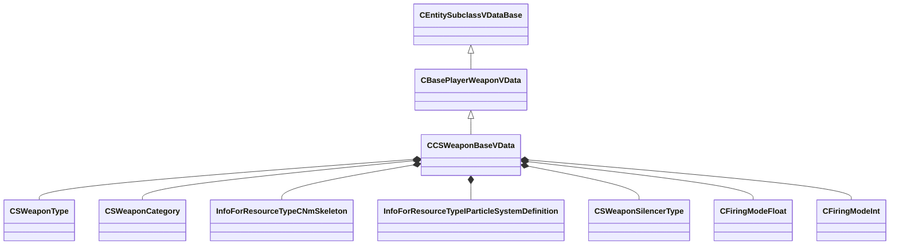

[Schemas](../../schemas.md) / [server](../server.md) / CCSWeaponBaseVData

# CCSWeaponBaseVData

**Kind:** class · **Size:** 2216 bytes (`0x8a8`) · **Align:** 8 · **Module:** server

**Inherits from:** [CBasePlayerWeaponVData](../server/CBasePlayerWeaponVData.md)

**Metadata:** `MPropertySuppressBaseClassField m_iPosition`, `MPropertySuppressBaseClassField m_iSlot`

**Relationships:**

## Memory layout

116 fields (84 declared here, 32 inherited). Offsets are absolute from the object base.

| Offset | Field | Type | From | Annotations |
|--------|-------|------|------|-------------|
| `0x28` | `m_szWorldModel` | CResourceNameTyped< CWeakHandle< [InfoForResourceTypeCModel](../resourcesystem/InfoForResourceTypeCModel.md) > > | [CBasePlayerWeaponVData](../server/CBasePlayerWeaponVData.md) | `MPropertyDescription Model used on the ground or held by an entity` `MPropertyProvidesEditContextString ToolEditContext_ID_VMDL` `MPropertyStartGroup Visuals` |
| `0x108` | `m_szWorldModelAg2Override` | CResourceNameTyped< CWeakHandle< [InfoForResourceTypeCModel](../resourcesystem/InfoForResourceTypeCModel.md) > > | [CBasePlayerWeaponVData](../server/CBasePlayerWeaponVData.md) | `MPropertyDescription Model used on the ground or held by an entity` `MPropertyProvidesEditContextString ToolEditContext_ID_VMDL` |
| `0x1e8` | `m_sToolsOnlyOwnerModelName` | CResourceNameTyped< CWeakHandle< [InfoForResourceTypeCModel](../resourcesystem/InfoForResourceTypeCModel.md) > > | [CBasePlayerWeaponVData](../server/CBasePlayerWeaponVData.md) | `MPropertyDescription Model used by the tools only to populate comboboxes for things like animgraph parameter pickers` |
| `0x2c8` | `m_bBuiltRightHanded` | bool | [CBasePlayerWeaponVData](../server/CBasePlayerWeaponVData.md) | `MPropertyDescription Was the weapon was built right-handed?` |
| `0x2c9` | `m_bAllowFlipping` | bool | [CBasePlayerWeaponVData](../server/CBasePlayerWeaponVData.md) | `MPropertyDescription Allows flipping the model, regardless of whether it is built left or right handed` |
| `0x2d0` | `m_sMuzzleAttachment` | CAttachmentNameSymbolWithStorage | [CBasePlayerWeaponVData](../server/CBasePlayerWeaponVData.md) | `MPropertyDescription Attachment to fire bullets from` |
| `0x2f0` | `m_szMuzzleFlashParticle` | CResourceNameTyped< CWeakHandle< [InfoForResourceTypeIParticleSystemDefinition](../resourcesystem/InfoForResourceTypeIParticleSystemDefinition.md) > > | [CBasePlayerWeaponVData](../server/CBasePlayerWeaponVData.md) | `MPropertyDescription Effect when firing this weapon` |
| `0x3d0` | `m_szMuzzleFlashParticleConfig` | CUtlString | [CBasePlayerWeaponVData](../server/CBasePlayerWeaponVData.md) | `MPropertyAttributeEditor ParticleConfigName()` `MPropertyDescription Effect Config for Muzzle Flash - if set, will use this config specified in the particle effect, using whatever CP configuration is specified there, vdata muzzleflash attachment will be ignored` `MPropertyEditContextOverrideKey ToolEditContext_ID_VPCF` |
| `0x3d8` | `m_szBarrelSmokeParticle` | CResourceNameTyped< CWeakHandle< [InfoForResourceTypeIParticleSystemDefinition](../resourcesystem/InfoForResourceTypeIParticleSystemDefinition.md) > > | [CBasePlayerWeaponVData](../server/CBasePlayerWeaponVData.md) | `MPropertyDescription Barrel smoke after firing this weapon` |
| `0x4b8` | `m_nMuzzleSmokeShotThreshold` | uint8 | [CBasePlayerWeaponVData](../server/CBasePlayerWeaponVData.md) | `MPropertyDescription Barrel smoke shot threshold to create smoke` |
| `0x4bc` | `m_flMuzzleSmokeTimeout` | float32 | [CBasePlayerWeaponVData](../server/CBasePlayerWeaponVData.md) | `MPropertyDescription Barrel smoke shot timeout` |
| `0x4c0` | `m_flMuzzleSmokeDecrementRate` | float32 | [CBasePlayerWeaponVData](../server/CBasePlayerWeaponVData.md) | `MPropertyDescription Barrel smoke decrement rate when not firing` |
| `0x4c4` | `m_bGenerateMuzzleLight` | bool | [CBasePlayerWeaponVData](../server/CBasePlayerWeaponVData.md) |  |
| `0x4c5` | `m_bLinkedCooldowns` | bool | [CBasePlayerWeaponVData](../server/CBasePlayerWeaponVData.md) | `MPropertyDescription Should both primary and secondary attacks be cooled down together (so cooling down primary attack would cooldown both primary + secondary attacks)?` `MPropertyStartGroup Behavior` |
| `0x4c6` | `m_iFlags` | [ItemFlagTypes_t](../!GlobalTypes/ItemFlagTypes_t.md) | [CBasePlayerWeaponVData](../server/CBasePlayerWeaponVData.md) |  |
| `0x4c8` | `m_iWeight` | int32 | [CBasePlayerWeaponVData](../server/CBasePlayerWeaponVData.md) | `MPropertyDescription This value used to determine this weapon's importance in autoselection` |
| `0x4cc` | `m_bAutoSwitchTo` | bool | [CBasePlayerWeaponVData](../server/CBasePlayerWeaponVData.md) | `MPropertyDescription Whether this weapon is safe to automatically switch to (should be false for eg. explosives that can the player may accidentally hurt themselves with)` `MPropertyFriendlyName Safe To Auto-Switch To` |
| `0x4cd` | `m_bAutoSwitchFrom` | bool | [CBasePlayerWeaponVData](../server/CBasePlayerWeaponVData.md) | `MPropertyFriendlyName Safe To Auto-Switch Away From` |
| `0x4ce` | `m_nPrimaryAmmoType` | [AmmoIndex_t](../server/AmmoIndex_t.md) | [CBasePlayerWeaponVData](../server/CBasePlayerWeaponVData.md) | `MPropertyAttributeEditor VDataChoice( scripts/ammo.vdata )` `MPropertyCustomFGDType string` `MPropertyStartGroup Ammo` |
| `0x4cf` | `m_nSecondaryAmmoType` | [AmmoIndex_t](../server/AmmoIndex_t.md) | [CBasePlayerWeaponVData](../server/CBasePlayerWeaponVData.md) | `MPropertyAttributeEditor VDataChoice( scripts/ammo.vdata )` `MPropertyCustomFGDType string` |
| `0x4d0` | `m_iMaxClip1` | int32 | [CBasePlayerWeaponVData](../server/CBasePlayerWeaponVData.md) | `MPropertyAttributeRange 0 255` `MPropertyDescription How many bullets this gun can fire before it reloads (0 if no clip)` `MPropertyFriendlyName Primary Clip Size` |
| `0x4d4` | `m_iMaxClip2` | int32 | [CBasePlayerWeaponVData](../server/CBasePlayerWeaponVData.md) | `MPropertyAttributeRange 0 255` `MPropertyDescription How many secondary bullets this gun can fire before it reloads (0 if no clip)` `MPropertyFriendlyName Secondary Clip Size` |
| `0x4d8` | `m_iDefaultClip1` | int32 | [CBasePlayerWeaponVData](../server/CBasePlayerWeaponVData.md) | `MPropertyAttributeRange -1 255` `MPropertyDescription Primary Initial Clip (-1 means use clip size)` |
| `0x4dc` | `m_iDefaultClip2` | int32 | [CBasePlayerWeaponVData](../server/CBasePlayerWeaponVData.md) | `MPropertyAttributeRange -1 255` `MPropertyDescription Secondary Initial Clip (-1 means use clip size)` |
| `0x4e0` | `m_bReserveAmmoAsClips` | bool | [CBasePlayerWeaponVData](../server/CBasePlayerWeaponVData.md) | `MPropertyDescription Indicates whether to treat reserve ammo as clips (reloads) instead of raw bullets` |
| `0x4e1` | `m_bTreatAsSingleClip` | bool | [CBasePlayerWeaponVData](../server/CBasePlayerWeaponVData.md) | `MPropertyDescription Regardless of ammo position, we'll always use clip1 as where our bullets come from` |
| `0x4e2` | `m_bKeepLoadedAmmo` | bool | [CBasePlayerWeaponVData](../server/CBasePlayerWeaponVData.md) | `MPropertyDescription Indicates whether to keep any loaded ammo in the weapon on reload` |
| `0x4e4` | `m_iRumbleEffect` | [RumbleEffect_t](../!GlobalTypes/RumbleEffect_t.md) | [CBasePlayerWeaponVData](../server/CBasePlayerWeaponVData.md) | `MPropertyStartGroup UI` |
| `0x4e8` | `m_flDropSpeed` | float32 | [CBasePlayerWeaponVData](../server/CBasePlayerWeaponVData.md) |  |
| `0x4ec` | `m_iSlot` | int32 | [CBasePlayerWeaponVData](../server/CBasePlayerWeaponVData.md) | `MPropertyDescription Which 'column' to display this weapon in the HUD` `MPropertyFriendlyName HUD Bucket` |
| `0x4f0` | `m_iPosition` | int32 | [CBasePlayerWeaponVData](../server/CBasePlayerWeaponVData.md) | `MPropertyDescription Which 'row' to display this weapon in the HUD` `MPropertyFriendlyName HUD Bucket Position` |
| `0x4f8` | `m_aShootSounds` | CUtlOrderedMap< [WeaponSound_t](../!GlobalTypes/WeaponSound_t.md), CSoundEventName > | [CBasePlayerWeaponVData](../server/CBasePlayerWeaponVData.md) | `MPropertyStartGroup Sounds` |
| `0x520` | `m_WeaponType` | [CSWeaponType](../!GlobalTypes/CSWeaponType.md) |  |  |
| `0x524` | `m_WeaponCategory` | [CSWeaponCategory](../!GlobalTypes/CSWeaponCategory.md) |  |  |
| `0x528` | `m_szAnimSkeleton` | CResourceNameTyped< CWeakHandle< [InfoForResourceTypeCNmSkeleton](../resourcesystem/InfoForResourceTypeCNmSkeleton.md) > > |  | `MPropertyStartGroup Visuals` |
| `0x608` | `m_vecMuzzlePos0` | Vector |  |  |
| `0x614` | `m_vecMuzzlePos1` | Vector |  |  |
| `0x620` | `m_szTracerParticle` | CResourceNameTyped< CWeakHandle< [InfoForResourceTypeIParticleSystemDefinition](../resourcesystem/InfoForResourceTypeIParticleSystemDefinition.md) > > |  | `MPropertyDescription Effect to actually fire into the world from this weapon` |
| `0x700` | `m_GearSlot` | gear_slot_t |  | `MPropertyDescription Which 'column' to display this weapon in the HUD` `MPropertyFriendlyName HUD Bucket` `MPropertyStartGroup HUD Positions` |
| `0x704` | `m_GearSlotPosition` | int32 |  |  |
| `0x708` | `m_DefaultLoadoutSlot` | loadout_slot_t |  | `MPropertyDescription Default team (non Terrorist or Counter-Terrorist) 'row' to display this weapon in the HUD.` `MPropertyFriendlyName HUD Bucket Position` |
| `0x70c` | `m_nPrice` | int32 |  | `MPropertyStartGroup In-Game Data` |
| `0x710` | `m_nKillAward` | int32 |  |  |
| `0x714` | `m_nPrimaryReserveAmmoMax` | int32 |  |  |
| `0x718` | `m_nSecondaryReserveAmmoMax` | int32 |  |  |
| `0x71c` | `m_bMeleeWeapon` | bool |  |  |
| `0x71d` | `m_bHasBurstMode` | bool |  |  |
| `0x71e` | `m_bIsRevolver` | bool |  |  |
| `0x71f` | `m_bCannotShootUnderwater` | bool |  |  |
| `0x720` | `m_szName` | CGlobalSymbol |  | `MPropertyFriendlyName In-Code weapon name` |
| `0x728` | `m_eSilencerType` | [CSWeaponSilencerType](../!GlobalTypes/CSWeaponSilencerType.md) |  |  |
| `0x72c` | `m_nCrosshairMinDistance` | int32 |  |  |
| `0x730` | `m_nCrosshairDeltaDistance` | int32 |  |  |
| `0x734` | `m_bIsFullAuto` | bool |  |  |
| `0x738` | `m_nNumBullets` | int32 |  |  |
| `0x73c` | `m_bReloadsSingleShells` | bool |  |  |
| `0x740` | `m_flCycleTime` | [CFiringModeFloat](../server/CFiringModeFloat.md) |  | `MPropertyStartGroup Firing Mode Data` |
| `0x748` | `m_flCycleTimeWhenInBurstMode` | float32 |  |  |
| `0x74c` | `m_flTimeBetweenBurstShots` | float32 |  |  |
| `0x750` | `m_flMaxSpeed` | [CFiringModeFloat](../server/CFiringModeFloat.md) |  |  |
| `0x758` | `m_flSpread` | [CFiringModeFloat](../server/CFiringModeFloat.md) |  |  |
| `0x760` | `m_flInaccuracyCrouch` | [CFiringModeFloat](../server/CFiringModeFloat.md) |  |  |
| `0x768` | `m_flInaccuracyStand` | [CFiringModeFloat](../server/CFiringModeFloat.md) |  |  |
| `0x770` | `m_flInaccuracyJump` | [CFiringModeFloat](../server/CFiringModeFloat.md) |  |  |
| `0x778` | `m_flInaccuracyLand` | [CFiringModeFloat](../server/CFiringModeFloat.md) |  |  |
| `0x780` | `m_flInaccuracyLadder` | [CFiringModeFloat](../server/CFiringModeFloat.md) |  |  |
| `0x788` | `m_flInaccuracyFire` | [CFiringModeFloat](../server/CFiringModeFloat.md) |  |  |
| `0x790` | `m_flInaccuracyMove` | [CFiringModeFloat](../server/CFiringModeFloat.md) |  |  |
| `0x798` | `m_flRecoilAngle` | [CFiringModeFloat](../server/CFiringModeFloat.md) |  |  |
| `0x7a0` | `m_flRecoilAngleVariance` | [CFiringModeFloat](../server/CFiringModeFloat.md) |  |  |
| `0x7a8` | `m_flRecoilMagnitude` | [CFiringModeFloat](../server/CFiringModeFloat.md) |  |  |
| `0x7b0` | `m_flRecoilMagnitudeVariance` | [CFiringModeFloat](../server/CFiringModeFloat.md) |  |  |
| `0x7b8` | `m_nTracerFrequency` | [CFiringModeInt](../server/CFiringModeInt.md) |  |  |
| `0x7c0` | `m_flInaccuracyJumpInitial` | float32 |  |  |
| `0x7c4` | `m_flInaccuracyJumpApex` | float32 |  |  |
| `0x7c8` | `m_flInaccuracyReload` | float32 |  |  |
| `0x7cc` | `m_flDeployDuration` | float32 |  |  |
| `0x7d0` | `m_flDisallowAttackAfterReloadStartDuration` | float32 |  |  |
| `0x7d4` | `m_nBurstShotCount` | int32 |  |  |
| `0x7d8` | `m_bAllowBurstHolster` | bool |  |  |
| `0x7dc` | `m_nRecoilSeed` | int32 |  | `MPropertyStartGroup Firing` |
| `0x7e0` | `m_nSpreadSeed` | int32 |  |  |
| `0x7e4` | `m_flAttackMovespeedFactor` | float32 |  |  |
| `0x7e8` | `m_flInaccuracyPitchShift` | float32 |  |  |
| `0x7ec` | `m_flInaccuracyAltSoundThreshold` | float32 |  |  |
| `0x7f0` | `m_szUseRadioSubtitle` | CUtlString |  |  |
| `0x7f8` | `m_bUnzoomsAfterShot` | bool |  | `MPropertyStartGroup Zooming` |
| `0x7f9` | `m_bHideViewModelWhenZoomed` | bool |  |  |
| `0x7fc` | `m_nZoomLevels` | int32 |  |  |
| `0x800` | `m_nZoomFOV1` | int32 |  |  |
| `0x804` | `m_nZoomFOV2` | int32 |  |  |
| `0x808` | `m_flZoomTime0` | float32 |  |  |
| `0x80c` | `m_flZoomTime1` | float32 |  |  |
| `0x810` | `m_flZoomTime2` | float32 |  |  |
| `0x814` | `m_flIronSightPullUpSpeed` | float32 |  | `MPropertyStartGroup Iron Sights` |
| `0x818` | `m_flIronSightPutDownSpeed` | float32 |  |  |
| `0x81c` | `m_flIronSightFOV` | float32 |  |  |
| `0x820` | `m_flIronSightPivotForward` | float32 |  |  |
| `0x824` | `m_flIronSightLooseness` | float32 |  |  |
| `0x828` | `m_nDamage` | int32 |  | `MPropertyStartGroup Damage` |
| `0x82c` | `m_flHeadshotMultiplier` | float32 |  |  |
| `0x830` | `m_flArmorRatio` | float32 |  |  |
| `0x834` | `m_flPenetration` | float32 |  |  |
| `0x838` | `m_flRange` | float32 |  |  |
| `0x83c` | `m_flRangeModifier` | float32 |  |  |
| `0x840` | `m_flFlinchVelocityModifierLarge` | float32 |  |  |
| `0x844` | `m_flFlinchVelocityModifierSmall` | float32 |  |  |
| `0x848` | `m_flRecoveryTimeCrouch` | float32 |  | `MPropertyStartGroup Recovery` |
| `0x84c` | `m_flRecoveryTimeStand` | float32 |  |  |
| `0x850` | `m_flRecoveryTimeCrouchFinal` | float32 |  |  |
| `0x854` | `m_flRecoveryTimeStandFinal` | float32 |  |  |
| `0x858` | `m_nRecoveryTransitionStartBullet` | int32 |  |  |
| `0x85c` | `m_nRecoveryTransitionEndBullet` | int32 |  |  |
| `0x860` | `m_flThrowVelocity` | float32 |  | `MPropertyStartGroup Grenade Data` |
| `0x864` | `m_vSmokeColor` | Vector |  |  |
| `0x870` | `m_szAnimClass` | CGlobalSymbol |  |  |

KV3 class defaults

<pre>{
	&quot;_class&quot;: &quot;CCSWeaponBaseVData&quot;,
	&quot;m_szWorldModel&quot;: &quot;&quot;,
	&quot;m_szWorldModelAg2Override&quot;: &quot;&quot;,
	&quot;m_sToolsOnlyOwnerModelName&quot;: &quot;&quot;,
	&quot;m_bBuiltRightHanded&quot;: true,
	&quot;m_bAllowFlipping&quot;: true,
	&quot;m_sMuzzleAttachment&quot;: &quot;muzzle&quot;,
	&quot;m_szMuzzleFlashParticle&quot;: &quot;&quot;,
	&quot;m_szMuzzleFlashParticleConfig&quot;: &quot;&quot;,
	&quot;m_szBarrelSmokeParticle&quot;: &quot;&quot;,
	&quot;m_nMuzzleSmokeShotThreshold&quot;: 4,
	&quot;m_flMuzzleSmokeTimeout&quot;: 0.250000,
	&quot;m_flMuzzleSmokeDecrementRate&quot;: 1.000000,
	&quot;m_bGenerateMuzzleLight&quot;: true,
	&quot;m_bLinkedCooldowns&quot;: false,
	&quot;m_iFlags&quot;: &quot;&quot;,
	&quot;m_iWeight&quot;: 0,
	&quot;m_bAutoSwitchTo&quot;: true,
	&quot;m_bAutoSwitchFrom&quot;: true,
	&quot;m_nPrimaryAmmoType&quot;: &quot;&quot;,
	&quot;m_nSecondaryAmmoType&quot;: &quot;&quot;,
	&quot;m_iMaxClip1&quot;: 0,
	&quot;m_iMaxClip2&quot;: 0,
	&quot;m_iDefaultClip1&quot;: -1,
	&quot;m_iDefaultClip2&quot;: -1,
	&quot;m_bReserveAmmoAsClips&quot;: false,
	&quot;m_bTreatAsSingleClip&quot;: false,
	&quot;m_bKeepLoadedAmmo&quot;: false,
	&quot;m_iRumbleEffect&quot;: &quot;RUMBLE_INVALID&quot;,
	&quot;m_flDropSpeed&quot;: 300.000000,
	&quot;m_iSlot&quot;: 0,
	&quot;m_iPosition&quot;: 0,
	&quot;m_aShootSounds&quot;:
	{
	},
	&quot;m_WeaponType&quot;: &quot;WEAPONTYPE_UNKNOWN&quot;,
	&quot;m_WeaponCategory&quot;: &quot;WEAPONCATEGORY_OTHER&quot;,
	&quot;m_szAnimSkeleton&quot;: &quot;&quot;,
	&quot;m_vecMuzzlePos0&quot;:
	[
		0.000000,
		0.000000,
		0.000000
	],
	&quot;m_vecMuzzlePos1&quot;:
	[
		0.000000,
		0.000000,
		0.000000
	],
	&quot;m_szTracerParticle&quot;: &quot;&quot;,
	&quot;m_GearSlot&quot;: &quot;GEAR_SLOT_INVALID&quot;,
	&quot;m_GearSlotPosition&quot;: -1,
	&quot;m_DefaultLoadoutSlot&quot;: &quot;LOADOUT_SLOT_INVALID&quot;,
	&quot;m_nPrice&quot;: 0,
	&quot;m_nKillAward&quot;: 0,
	&quot;m_nPrimaryReserveAmmoMax&quot;: 0,
	&quot;m_nSecondaryReserveAmmoMax&quot;: 0,
	&quot;m_bMeleeWeapon&quot;: false,
	&quot;m_bHasBurstMode&quot;: false,
	&quot;m_bIsRevolver&quot;: false,
	&quot;m_bCannotShootUnderwater&quot;: false,
	&quot;m_szName&quot;: &quot;&quot;,
	&quot;m_eSilencerType&quot;: &quot;WEAPONSILENCER_NONE&quot;,
	&quot;m_nCrosshairMinDistance&quot;: 0,
	&quot;m_nCrosshairDeltaDistance&quot;: 0,
	&quot;m_bIsFullAuto&quot;: false,
	&quot;m_nNumBullets&quot;: 0,
	&quot;m_bReloadsSingleShells&quot;: false,
	&quot;m_flCycleTime&quot;: 0.000000,
	&quot;m_flCycleTimeWhenInBurstMode&quot;: 0.000000,
	&quot;m_flTimeBetweenBurstShots&quot;: 0.000000,
	&quot;m_flMaxSpeed&quot;: 0.000000,
	&quot;m_flSpread&quot;: 0.000000,
	&quot;m_flInaccuracyCrouch&quot;: 0.000000,
	&quot;m_flInaccuracyStand&quot;: 0.000000,
	&quot;m_flInaccuracyJump&quot;: 0.000000,
	&quot;m_flInaccuracyLand&quot;: 0.000000,
	&quot;m_flInaccuracyLadder&quot;: 0.000000,
	&quot;m_flInaccuracyFire&quot;: 0.000000,
	&quot;m_flInaccuracyMove&quot;: 0.000000,
	&quot;m_flRecoilAngle&quot;: 0.000000,
	&quot;m_flRecoilAngleVariance&quot;: 0.000000,
	&quot;m_flRecoilMagnitude&quot;: 0.000000,
	&quot;m_flRecoilMagnitudeVariance&quot;: 0.000000,
	&quot;m_nTracerFrequency&quot;: 0,
	&quot;m_flInaccuracyJumpInitial&quot;: 0.000000,
	&quot;m_flInaccuracyJumpApex&quot;: 0.000000,
	&quot;m_flInaccuracyReload&quot;: 0.000000,
	&quot;m_flDeployDuration&quot;: 0.000000,
	&quot;m_flDisallowAttackAfterReloadStartDuration&quot;: 0.000000,
	&quot;m_nBurstShotCount&quot;: 2,
	&quot;m_bAllowBurstHolster&quot;: true,
	&quot;m_nRecoilSeed&quot;: 0,
	&quot;m_nSpreadSeed&quot;: 0,
	&quot;m_flAttackMovespeedFactor&quot;: 0.000000,
	&quot;m_flInaccuracyPitchShift&quot;: 0.000000,
	&quot;m_flInaccuracyAltSoundThreshold&quot;: 0.000000,
	&quot;m_szUseRadioSubtitle&quot;: &quot;&quot;,
	&quot;m_bUnzoomsAfterShot&quot;: false,
	&quot;m_bHideViewModelWhenZoomed&quot;: false,
	&quot;m_nZoomLevels&quot;: 0,
	&quot;m_nZoomFOV1&quot;: 0,
	&quot;m_nZoomFOV2&quot;: 0,
	&quot;m_flZoomTime0&quot;: 0.000000,
	&quot;m_flZoomTime1&quot;: 0.000000,
	&quot;m_flZoomTime2&quot;: 0.000000,
	&quot;m_flIronSightPullUpSpeed&quot;: 8.000000,
	&quot;m_flIronSightPutDownSpeed&quot;: 4.000000,
	&quot;m_flIronSightFOV&quot;: 80.000000,
	&quot;m_flIronSightPivotForward&quot;: 10.000000,
	&quot;m_flIronSightLooseness&quot;: 0.500000,
	&quot;m_nDamage&quot;: 0,
	&quot;m_flHeadshotMultiplier&quot;: 0.000000,
	&quot;m_flArmorRatio&quot;: 0.000000,
	&quot;m_flPenetration&quot;: 0.000000,
	&quot;m_flRange&quot;: 0.000000,
	&quot;m_flRangeModifier&quot;: 0.000000,
	&quot;m_flFlinchVelocityModifierLarge&quot;: 0.000000,
	&quot;m_flFlinchVelocityModifierSmall&quot;: 0.000000,
	&quot;m_flRecoveryTimeCrouch&quot;: 0.000000,
	&quot;m_flRecoveryTimeStand&quot;: 0.000000,
	&quot;m_flRecoveryTimeCrouchFinal&quot;: 0.000000,
	&quot;m_flRecoveryTimeStandFinal&quot;: 0.000000,
	&quot;m_nRecoveryTransitionStartBullet&quot;: 0,
	&quot;m_nRecoveryTransitionEndBullet&quot;: 0,
	&quot;m_flThrowVelocity&quot;: 0.000000,
	&quot;m_vSmokeColor&quot;:
	[
		1.000000,
		1.000000,
		1.000000
	],
	&quot;m_szAnimClass&quot;: &quot;&quot;
}</pre>

