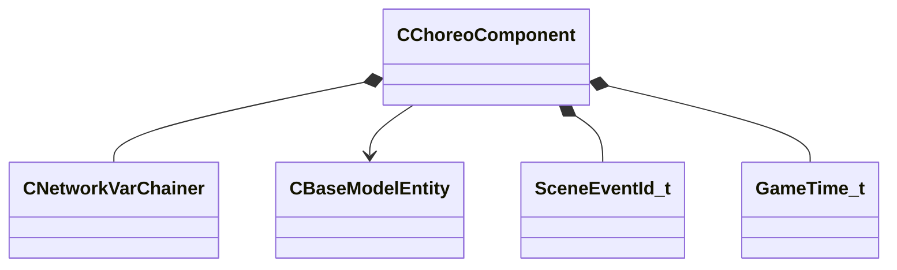

[Schemas](../../schemas.md) / [server](../server.md) / CChoreoComponent

# CChoreoComponent

> Source: **Build 25000182** · 2026-08-28 · `windows-x86_64` · schema `0.10.0`

**Kind:** class · **Size:** 128 bytes (`0x80`) · **Align:** 8 · **Module:** server

**Twin:** [CChoreoComponent (client)](../client/CChoreoComponent.md)

**Relationships:**

## Memory layout

6 fields (6 declared here, 0 inherited). Offsets are absolute from the object base.

| Offset | Field | Type | From | Annotations |
|--------|-------|------|------|-------------|
| `0x8` | `__m_pChainEntity` | [CNetworkVarChainer](../entity2/CNetworkVarChainer.md) |  | `MNotSaved` |
| `0x30` | `m_hOwner` | CHandle< [CBaseModelEntity](../server/CBaseModelEntity.md) > |  |  |
| `0x34` | `m_nExernalChoreoGraphCount` | int32 |  |  |
| `0x38` | `m_sActiveExternalChoreoGraphSlotID` | CGlobalSymbol |  |  |
| `0x70` | `m_nNextSceneEventId` | [SceneEventId_t](../server/SceneEventId_t.md) |  |  |
| `0x74` | `m_flAllowResponsesEndTime` | [GameTime_t](../entity2/GameTime_t.md) |  |  |

KV3 class defaults

<pre>{
	&quot;_class&quot;: &quot;CChoreoComponent&quot;,
	&quot;m_hOwner&quot;: null,
	&quot;m_nExernalChoreoGraphCount&quot;: 0,
	&quot;m_sActiveExternalChoreoGraphSlotID&quot;: &quot;&quot;,
	&quot;m_nNextSceneEventId&quot;: 0,
	&quot;m_flAllowResponsesEndTime&quot;: null
}</pre>

