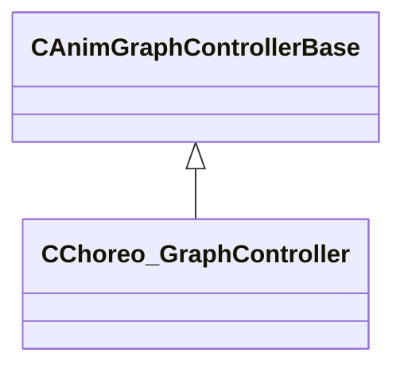

[Schemas](../../schemas.md) / [server](../server.md) / CChoreo_GraphController

# CChoreo_GraphController

> Source: **Build 25000182** · 2026-08-28 · `windows-x86_64` · schema `0.10.0`

**Kind:** class · **Size:** 272 bytes (`0x110`) · **Align:** 8 · **Module:** server

**Inherits from:** [CAnimGraphControllerBase](../server/CAnimGraphControllerBase.md)

**Relationships:**

## Memory layout

4 fields (3 declared here, 1 inherited). Offsets are absolute from the object base.

| Offset | Field | Type | From | Annotations |
|--------|-------|------|------|-------------|
| `0x10` | `m_hExternalGraph` | [ExternalAnimGraphHandle_t](../server/ExternalAnimGraphHandle_t.md) | [CAnimGraphControllerBase](../server/CAnimGraphControllerBase.md) |  |
| `0x88` | `m_eChoreoState` | CAnimGraph2ParamOptionalRef< CGlobalSymbol > |  |  |
| `0xa0` | `m_tChoreoTargetWarp` | CAnimGraph2ParamOptionalRef< CTransform > |  |  |
| `0xb8` | `m_tChoreoExitWarp` | CAnimGraph2ParamOptionalRef< CTransform > |  |  |

KV3 class defaults

<pre>{
	&quot;_class&quot;: &quot;CChoreo_GraphController&quot;,
	&quot;m_hExternalGraph&quot;: 4294967295,
	&quot;m_eChoreoState&quot;: null,
	&quot;m_tChoreoTargetWarp&quot;: null,
	&quot;m_tChoreoExitWarp&quot;: null
}</pre>

