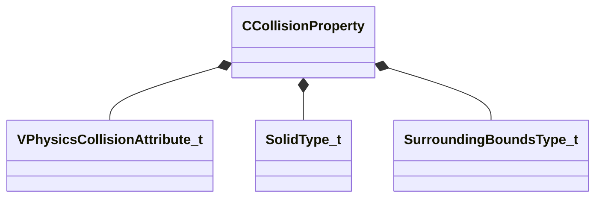

[Schemas](../../schemas.md) / [server](../server.md) / CCollisionProperty

# CCollisionProperty

> Source: **Build 25000182** · 2026-08-28 · `windows-x86_64` · schema `0.10.0`

**Kind:** class · **Size:** 184 bytes (`0xb8`) · **Align:** 8 · **Module:** server

**Twin:** [CCollisionProperty (client)](../client/CCollisionProperty.md)

**Relationships:**

## Memory layout

17 fields (17 declared here, 0 inherited). Offsets are absolute from the object base.

| Offset | Field | Type | From | Annotations |
|--------|-------|------|------|-------------|
| `0x10` | `m_collisionAttribute` | [VPhysicsCollisionAttribute_t](../server/VPhysicsCollisionAttribute_t.md) |  |  |
| `0x40` | `m_vecMins` | Vector |  | `MSaveBehavior` |
| `0x4c` | `m_vecMaxs` | Vector |  | `MSaveBehavior` |
| `0x5a` | `m_usSolidFlags` | uint8 |  |  |
| `0x5b` | `m_nSolidType` | [SolidType_t](../server/SolidType_t.md) |  |  |
| `0x5c` | `m_triggerBloat` | uint8 |  |  |
| `0x5d` | `m_nSurroundType` | [SurroundingBoundsType_t](../server/SurroundingBoundsType_t.md) |  |  |
| `0x5e` | `m_CollisionGroup` | uint8 |  |  |
| `0x5f` | `m_nEnablePhysics` | uint8 |  |  |
| `0x60` | `m_flBoundingRadius` | float32 |  |  |
| `0x64` | `m_vecSpecifiedSurroundingMins` | Vector |  |  |
| `0x70` | `m_vecSpecifiedSurroundingMaxs` | Vector |  |  |
| `0x7c` | `m_vecSurroundingMaxs` | Vector |  |  |
| `0x88` | `m_vecSurroundingMins` | Vector |  |  |
| `0x94` | `m_vCapsuleCenter1` | Vector |  |  |
| `0xa0` | `m_vCapsuleCenter2` | Vector |  |  |
| `0xac` | `m_flCapsuleRadius` | float32 |  |  |

KV3 class defaults

<pre>{
	&quot;_class&quot;: &quot;CCollisionProperty&quot;,
	&quot;m_collisionAttribute&quot;:
	{
		&quot;m_nInteractsAs&quot;: 131072,
		&quot;m_nInteractsWith&quot;: 0,
		&quot;m_nInteractsExclude&quot;: 0,
		&quot;m_nEntityId&quot;: 0,
		&quot;m_nOwnerId&quot;: 4294967295,
		&quot;m_nHierarchyId&quot;: 0,
		&quot;m_nDetailLayerMask&quot;: 0,
		&quot;m_nDetailLayerMaskType&quot;: 0,
		&quot;m_nTargetDetailLayer&quot;: 0,
		&quot;m_nCollisionGroup&quot;: 4,
		&quot;m_nCollisionFunctionMask&quot;: 7
	},
	&quot;m_vecMins&quot;:
	[
		0.000000,
		0.000000,
		0.000000
	],
	&quot;m_vecMaxs&quot;:
	[
		0.000000,
		0.000000,
		0.000000
	],
	&quot;m_usSolidFlags&quot;: 0,
	&quot;m_nSolidType&quot;: &quot;SOLID_NONE&quot;,
	&quot;m_triggerBloat&quot;: 0,
	&quot;m_nSurroundType&quot;: &quot;USE_OBB_COLLISION_BOUNDS&quot;,
	&quot;m_CollisionGroup&quot;: 4,
	&quot;m_nEnablePhysics&quot;: 1,
	&quot;m_flBoundingRadius&quot;: 0.000000,
	&quot;m_vecSpecifiedSurroundingMins&quot;:
	[
		0.000000,
		0.000000,
		0.000000
	],
	&quot;m_vecSpecifiedSurroundingMaxs&quot;:
	[
		0.000000,
		0.000000,
		0.000000
	],
	&quot;m_vecSurroundingMaxs&quot;:
	[
		0.000000,
		0.000000,
		0.000000
	],
	&quot;m_vecSurroundingMins&quot;:
	[
		0.000000,
		0.000000,
		0.000000
	],
	&quot;m_vCapsuleCenter1&quot;:
	[
		0.000000,
		0.000000,
		0.000000
	],
	&quot;m_vCapsuleCenter2&quot;:
	[
		0.000000,
		0.000000,
		0.000000
	],
	&quot;m_flCapsuleRadius&quot;: 0.000000
}</pre>

