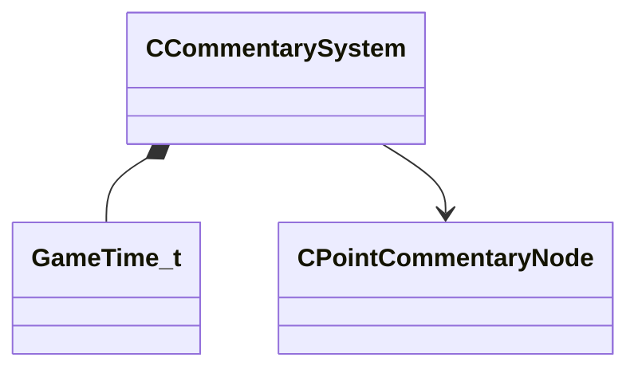

[Schemas](../../schemas.md) / [server](../server.md) / CCommentarySystem

# CCommentarySystem

> Source: **Build 25000182** · 2026-08-28 · `windows-x86_64` · schema `0.10.0`

**Kind:** class · **Size:** 96 bytes (`0x60`) · **Align:** 8 · **Module:** server

**Relationships:**

## Memory layout

10 fields (10 declared here, 0 inherited). Offsets are absolute from the object base.

| Offset | Field | Type | From | Annotations |
|--------|-------|------|------|-------------|
| `0x12` | `m_bCommentaryEnabledMidGame` | bool |  |  |
| `0x14` | `m_flNextTeleportTime` | [GameTime_t](../entity2/GameTime_t.md) |  |  |
| `0x18` | `m_iTeleportStage` | int32 |  |  |
| `0x1c` | `m_bCheatState` | bool |  |  |
| `0x1d` | `m_bIsFirstSpawnGroupToLoad` | bool |  |  |
| `0x20` | `m_ModifiedConvars` | CUtlVector< modifiedconvars_t > |  |  |
| `0x38` | `m_hCurrentNode` | CHandle< [CPointCommentaryNode](../server/CPointCommentaryNode.md) > |  |  |
| `0x3c` | `m_hActiveCommentaryNode` | CHandle< [CPointCommentaryNode](../server/CPointCommentaryNode.md) > |  |  |
| `0x40` | `m_hLastCommentaryNode` | CHandle< [CPointCommentaryNode](../server/CPointCommentaryNode.md) > |  |  |
| `0x48` | `m_vecNodes` | CUtlVector< CHandle< [CPointCommentaryNode](../server/CPointCommentaryNode.md) > > |  |  |

KV3 class defaults

<pre>{
	&quot;_class&quot;: &quot;CCommentarySystem&quot;,
	&quot;m_bCommentaryEnabledMidGame&quot;: false,
	&quot;m_flNextTeleportTime&quot;: null,
	&quot;m_iTeleportStage&quot;: 0,
	&quot;m_bCheatState&quot;: false,
	&quot;m_bIsFirstSpawnGroupToLoad&quot;: false,
	&quot;m_ModifiedConvars&quot;:
	[
	],
	&quot;m_hCurrentNode&quot;: null,
	&quot;m_hActiveCommentaryNode&quot;: null,
	&quot;m_hLastCommentaryNode&quot;: null,
	&quot;m_vecNodes&quot;:
	[
	]
}</pre>

