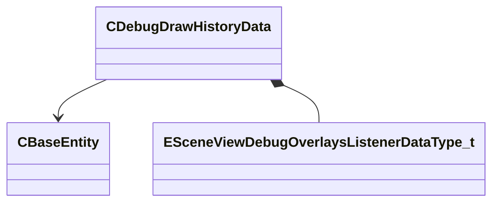

[Schemas](../../schemas.md) / [server](../server.md) / CDebugDrawHistoryData

# CDebugDrawHistoryData

> Source: **Build 25000182** · 2026-08-28 · `windows-x86_64` · schema `0.10.0`

**Kind:** class · **Size:** 120 bytes (`0x78`) · **Align:** 8 · **Module:** server

**Relationships:**

## Memory layout

9 fields (9 declared here, 0 inherited). Offsets are absolute from the object base.

| Offset | Field | Type | From | Annotations |
|--------|-------|------|------|-------------|
| `0x0` | `m_hEntity` | CHandle< [CBaseEntity](../server/CBaseEntity.md) > |  |  |
| `0x4` | `m_etype` | [ESceneViewDebugOverlaysListenerDataType_t](../scenesystem/ESceneViewDebugOverlaysListenerDataType_t.md) |  |  |
| `0x8` | `m_vectors` | CUtlLeanVector< Vector4D > |  |  |
| `0x18` | `m_colors` | CUtlLeanVector< Color > |  |  |
| `0x28` | `m_dimensions` | CUtlLeanVector< float32 > |  |  |
| `0x38` | `m_times` | CUtlLeanVector< float64 > |  |  |
| `0x48` | `m_uint64s` | CUtlLeanVector< uint64 > |  |  |
| `0x58` | `m_bools` | CUtlLeanVector< bool > |  |  |
| `0x68` | `m_strings` | CUtlLeanVector< CUtlString > |  |  |

KV3 class defaults

<pre>{
	&quot;m_hEntity&quot;: null,
	&quot;m_etype&quot;: &quot;k_ESceneViewDebugOverlaysListenerDataType_Unknown&quot;,
	&quot;m_vectors&quot;:
	[
	],
	&quot;m_colors&quot;:
	[
	],
	&quot;m_dimensions&quot;:
	[
	],
	&quot;m_times&quot;:
	[
	],
	&quot;m_uint64s&quot;:
	[
	],
	&quot;m_bools&quot;:
	[
	],
	&quot;m_strings&quot;:
	[
	]
}</pre>

