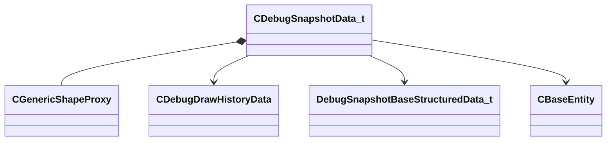

[Schemas](../../schemas.md) / [server](../server.md) / CDebugSnapshotData_t

# CDebugSnapshotData_t

> Source: **Build 25000182** · 2026-08-28 · `windows-x86_64` · schema `0.10.0`

**Kind:** class · **Size:** 304 bytes (`0x130`) · **Align:** 16 · **Module:** server

**Relationships:**

## Memory layout

14 fields (14 declared here, 0 inherited). Offsets are absolute from the object base.

| Offset | Field | Type | From | Annotations |
|--------|-------|------|------|-------------|
| `0x0` | `m_text` | CUtlString |  |  |
| `0x8` | `m_dataType` | uint32 |  |  |
| `0xc` | `m_userFlags` | uint32 |  |  |
| `0x10` | `m_userData` | uint32 |  |  |
| `0x14` | `m_userVector` | VectorWS |  |  |
| `0x20` | `m_userTransform` | CTransformWS |  |  |
| `0x40` | `m_userShape` | [CGenericShapeProxy](../physicslib/CGenericShapeProxy.md) |  |  |
| `0xd8` | `m_drawColor` | Color |  |  |
| `0xe0` | `m_vecDebugOverlayData` | CUtlVector< [CDebugDrawHistoryData](../server/CDebugDrawHistoryData.md)* > |  |  |
| `0xf8` | `m_pStructuredData` | [DebugSnapshotBaseStructuredData_t](../server/DebugSnapshotBaseStructuredData_t.md)* |  |  |
| `0x100` | `m_hEntity` | CHandle< [CBaseEntity](../server/CBaseEntity.md) > |  |  |
| `0x108` | `m_sEntityName` | CUtlString |  |  |
| `0x110` | `m_nEntityIndex` | CEntityIndex |  |  |
| `0x120` | `m_children` | CUtlLeanVector< [CDebugSnapshotData_t](../server/CDebugSnapshotData_t.md) > |  |  |

KV3 class defaults

<pre>null</pre>

