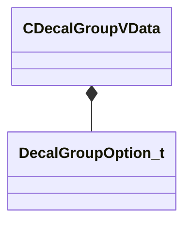

[Schemas](../../schemas.md) / [server](../server.md) / CDecalGroupVData

# CDecalGroupVData

> Source: **Build 25000182** · 2026-08-28 · `windows-x86_64` · schema `0.10.0`

**Kind:** class · **Size:** 32 bytes (`0x20`) · **Align:** 8 · **Module:** server

**Metadata:** `MVDataRoot`

**Relationships:**

## Memory layout

2 fields (2 declared here, 0 inherited). Offsets are absolute from the object base.

| Offset | Field | Type | From | Annotations |
|--------|-------|------|------|-------------|
| `0x0` | `m_vecOptions` | CUtlVector< [DecalGroupOption_t](../server/DecalGroupOption_t.md) > |  |  |
| `0x18` | `m_flTotalProbability` | float32 |  | `MPropertySuppressField` |

KV3 class defaults

<pre>{
	&quot;m_vecOptions&quot;:
	[
	],
	&quot;m_flTotalProbability&quot;: 0.000000
}</pre>

