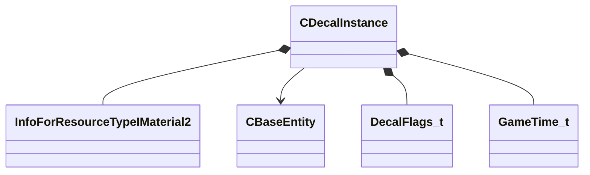

[Schemas](../../schemas.md) / [server](../server.md) / CDecalInstance

# CDecalInstance

**Kind:** class · **Size:** 192 bytes (`0xc0`) · **Align:** 16 · **Module:** server

**Relationships:**

## Memory layout

27 fields (27 declared here, 0 inherited). Offsets are absolute from the object base.

| Offset | Field | Type | From | Annotations |
|--------|-------|------|------|-------------|
| `0x0` | `m_sDecalGroup` | CGlobalSymbol |  |  |
| `0x8` | `m_hMaterial` | CStrongHandle< [InfoForResourceTypeIMaterial2](../resourcesystem/InfoForResourceTypeIMaterial2.md) > |  |  |
| `0x10` | `m_sSequenceName` | CUtlStringToken |  |  |
| `0x14` | `m_hEntity` | CHandle< [CBaseEntity](../server/CBaseEntity.md) > |  |  |
| `0x18` | `m_nBoneIndex` | int32 |  |  |
| `0x1c` | `m_nTriangleIndex` | int32 |  |  |
| `0x20` | `m_vPositionLS` | Vector |  |  |
| `0x2c` | `m_vPositionOS` | Vector |  |  |
| `0x38` | `m_vNormalLS` | Vector |  |  |
| `0x44` | `m_vNormalOS` | Vector |  |  |
| `0x50` | `m_vSAxisLS` | Vector |  |  |
| `0x5c` | `m_nFlags` | [DecalFlags_t](../!GlobalTypes/DecalFlags_t.md) |  |  |
| `0x60` | `m_Color` | Color |  |  |
| `0x64` | `m_flWidth` | float32 |  |  |
| `0x68` | `m_flHeight` | float32 |  |  |
| `0x6c` | `m_flDepth` | float32 |  |  |
| `0x70` | `m_transform` | CTransformWS |  |  |
| `0x90` | `m_flAnimationScale` | float32 |  |  |
| `0x94` | `m_flAnimationStartTime` | float32 |  |  |
| `0x98` | `m_flPlaceTime` | [GameTime_t](../entity2/GameTime_t.md) |  |  |
| `0x9c` | `m_flFadeStartTime` | float32 |  |  |
| `0xa0` | `m_flFadeDuration` | float32 |  |  |
| `0xa4` | `m_flLightingOriginOffset` | float32 |  |  |
| `0xb0` | `m_flBoundingRadiusSqr` | float32 |  |  |
| `0xb4` | `m_nSequenceIndex` | int16 |  | `MNotSaved` |
| `0xb6` | `m_bIsAdjacent` | bool |  | `MNotSaved` |
| `0xb7` | `m_bDoDecalLightmapping` | bool |  |  |

KV3 class defaults

<pre>null</pre>

