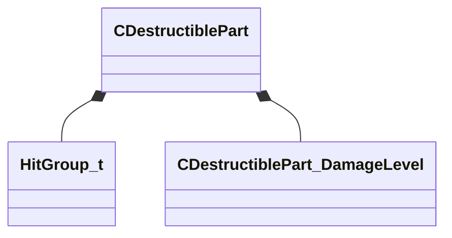

[Schemas](../../schemas.md) / [server](../server.md) / CDestructiblePart

# CDestructiblePart

> Source: **Build 25000182** · 2026-08-28 · `windows-x86_64` · schema `0.10.0`

**Kind:** class · **Size:** 80 bytes (`0x50`) · **Align:** 8 · **Module:** server

**Metadata:** `MFgdHelper game_data_list{ key = 'CDestructiblePart' }`, `MModelGameData`

**Relationships:**

## Memory layout

7 fields (7 declared here, 0 inherited). Offsets are absolute from the object base.

| Offset | Field | Type | From | Annotations |
|--------|-------|------|------|-------------|
| `0x0` | `m_DebugName` | CGlobalSymbol |  | `MPropertySuppressField` |
| `0x8` | `m_nHitGroup` | [HitGroup_t](../server/HitGroup_t.md) |  | `MPropertyDescription The hitgroup this is related to.` `MPropertyStartGroup +Hitgroup` |
| `0xc` | `m_bDisableHitGroupWhenDestroyed` | bool |  | `MPropertyDescription Do we disable the hitgroup and physics bodies tagged with said hitgroup when all damage levels are destroyed?` `MPropertyFriendlyName Disable Hit Group & Remove Tagged Physics Bodies When Destroyed` |
| `0x10` | `m_nOtherHitgroupsToDestroyWhenFullyDestructed` | CUtlVector< [HitGroup_t](../server/HitGroup_t.md) > |  | `MPropertyDescription Other hitgroups to destroy when this one is fully destroyed.  Useful for chaining destructibles like blowing up the lower arm when the upper arm dies.` |
| `0x28` | `m_bOnlyDestroyWhenGibbing` | bool |  | `MPropertyDescription Only allow this part to be destroyed when gibbing.  Useful for special case gibbing breakables like torsos.` `MPropertyStartGroup +Gibbing` |
| `0x30` | `m_sBodyGroupName` | CGlobalSymbol |  | `MPropertyAttributeEditor ModelDocPicker( MODELDOC_PICK_TYPE_BODY_GROUP )` `MPropertyDescription Body group to set when this damage level is broken.` `MPropertyStartGroup +Model Setup/+Body Group` |
| `0x38` | `m_DamageLevels` | CUtlVector< [CDestructiblePart_DamageLevel](../server/CDestructiblePart_DamageLevel.md) > |  | `MPropertyAutoExpandSelf` `MPropertyDescription The various damage levels for this hitgroup.` `MPropertyFriendlyName Damage Levels` `MPropertyStartGroup` |

KV3 class defaults

<pre>{
	&quot;m_DebugName&quot;: &quot;&quot;,
	&quot;m_nHitGroup&quot;: &quot;HITGROUP_GENERIC&quot;,
	&quot;m_bDisableHitGroupWhenDestroyed&quot;: true,
	&quot;m_nOtherHitgroupsToDestroyWhenFullyDestructed&quot;:
	[
	],
	&quot;m_bOnlyDestroyWhenGibbing&quot;: false,
	&quot;m_sBodyGroupName&quot;: &quot;&quot;,
	&quot;m_DamageLevels&quot;:
	[
	]
}</pre>

