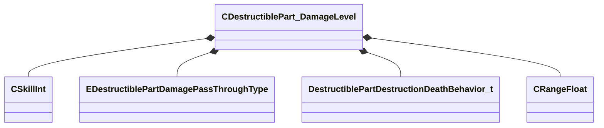

[Schemas](../../schemas.md) / [server](../server.md) / CDestructiblePart_DamageLevel

# CDestructiblePart_DamageLevel

> Source: **Build 25000182** · 2026-08-28 · `windows-x86_64` · schema `0.10.0`

**Kind:** class · **Size:** 72 bytes (`0x48`) · **Align:** 8 · **Module:** server

**Relationships:**

## Memory layout

10 fields (10 declared here, 0 inherited). Offsets are absolute from the object base.

| Offset | Field | Type | From | Annotations |
|--------|-------|------|------|-------------|
| `0x0` | `m_sName` | CUtlString |  | `MPropertyDescription Name for this damage level.  Presently only used for debugging/display - one day may be used in code to allow destroying by name.` |
| `0x8` | `m_sBreakablePieceName` | CGlobalSymbol |  | `MPropertyAttributeEditor ModelDocPicker( MODELDOC_PICK_TYPE_BREAKPIECE )` `MPropertyDescription Name of the breakable to trigger breaking on when health reaches zero.` `MPropertyStartGroup +Model Setup` |
| `0x10` | `m_nBodyGroupValue` | int32 |  | `MPropertyDescription Value to set for the body group when the damage level is broken.` |
| `0x14` | `m_nHealth` | [CSkillInt](../server/CSkillInt.md) |  | `MPropertyDescription Total health of this damage level. When it reaches 0, the damage level is 'broken' using the breakable prop system.` `MPropertyStartGroup +Damage` `MPropertySuppressExpr m_nDamagePassthroughType == InvincibleAbsorb &#124;&#124; m_nDamagePassthroughType == InvinciblePassthrough` |
| `0x24` | `m_flCriticalDamagePercent` | float32 |  | `MPropertyDescription % chance (0-1) of dealing 'critical' damage, which destroys this damage level, regardless of damage pass through type.` |
| `0x28` | `m_nDamagePassthroughType` | [EDestructiblePartDamagePassThroughType](../server/EDestructiblePartDamagePassThroughType.md) |  | `MPropertyDescription How damage to this damage level is handled.` |
| `0x2c` | `m_nDestructionDeathBehavior` | [DestructiblePartDestructionDeathBehavior_t](../server/DestructiblePartDestructionDeathBehavior_t.md) |  | `MPropertyDescription Should the entity die when this damage level is destroyed?` `MPropertyStartGroup +Death` |
| `0x30` | `m_sCustomDeathHandshake` | CGlobalSymbol |  | `MPropertyDescription Custom death handshake to set when this damage level is destroyed.` `MPropertySuppressExpr m_nDestructionDeathBehavior == eDoNotKill` |
| `0x38` | `m_bShouldDestroyOnDeath` | bool |  | `MPropertyDescription Whether the damage level should be destroyed when the entity dies.` |
| `0x3c` | `m_flDeathDestroyTime` | [CRangeFloat](../tier2/CRangeFloat.md) |  | `MPropertyDescription Time after death the damage level should be destroyed` `MPropertySuppressExpr m_bShouldDestroyOnDeath == false` |

KV3 class defaults

<pre>{
	&quot;m_sName&quot;: &quot;&quot;,
	&quot;m_sBreakablePieceName&quot;: &quot;&quot;,
	&quot;m_nBodyGroupValue&quot;: -1,
	&quot;m_nHealth&quot;: 1,
	&quot;m_flCriticalDamagePercent&quot;: 0.000000,
	&quot;m_nDamagePassthroughType&quot;: &quot;Normal&quot;,
	&quot;m_nDestructionDeathBehavior&quot;: &quot;eDoNotKill&quot;,
	&quot;m_sCustomDeathHandshake&quot;: &quot;&quot;,
	&quot;m_bShouldDestroyOnDeath&quot;: false,
	&quot;m_flDeathDestroyTime&quot;:
	[
		0.100000,
		1.000000
	]
}</pre>

