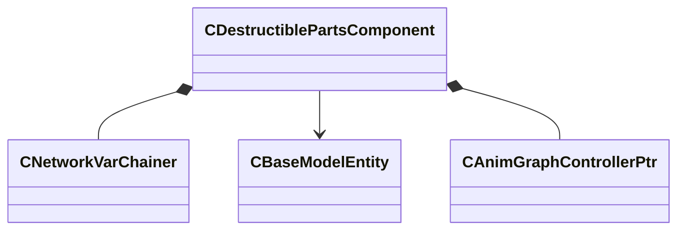

[Schemas](../../schemas.md) / [server](../server.md) / CDestructiblePartsComponent

# CDestructiblePartsComponent

**Kind:** class · **Size:** 112 bytes (`0x70`) · **Align:** 8 · **Module:** server

**Relationships:**

## Memory layout

4 fields (4 declared here, 0 inherited). Offsets are absolute from the object base.

| Offset | Field | Type | From | Annotations |
|--------|-------|------|------|-------------|
| `0x0` | `__m_pChainEntity` | [CNetworkVarChainer](../entity2/CNetworkVarChainer.md) |  | `MNotSaved` |
| `0x48` | `m_vecDamageTakenByHitGroup` | CUtlVector< uint16 > |  |  |
| `0x60` | `m_hOwner` | CHandle< [CBaseModelEntity](../server/CBaseModelEntity.md) > |  |  |
| `0x68` | `m_pAnimGraphDestructibleGraphController` | [CAnimGraphControllerPtr](../server/CAnimGraphControllerPtr.md) |  |  |

KV3 class defaults

<pre>{
	&quot;m_vecDamageTakenByHitGroup&quot;:
	[
	],
	&quot;m_hOwner&quot;: null,
	&quot;m_pAnimGraphDestructibleGraphController&quot;: null
}</pre>

