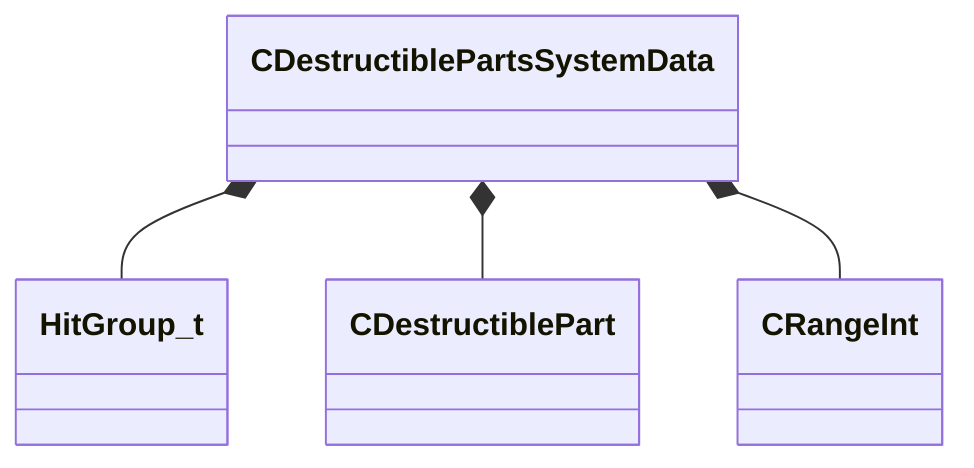

[Schemas](../../schemas.md) / [server](../server.md) / CDestructiblePartsSystemData

# CDestructiblePartsSystemData

> Source: **Build 25000182** · 2026-08-28 · `windows-x86_64` · schema `0.10.0`

**Kind:** class · **Size:** 48 bytes (`0x30`) · **Align:** 8 · **Module:** server

**Metadata:** `MModelGameData`

**Relationships:**

## Memory layout

2 fields (2 declared here, 0 inherited). Offsets are absolute from the object base.

| Offset | Field | Type | From | Annotations |
|--------|-------|------|------|-------------|
| `0x0` | `m_PartsDataByHitGroup` | CUtlOrderedMap< [HitGroup_t](../server/HitGroup_t.md), [CDestructiblePart](../server/CDestructiblePart.md) > |  | `MPropertyDescription Destructible Parts` |
| `0x28` | `m_nMinMaxNumberHitGroupsToDestroyWhenGibbing` | [CRangeInt](../tier2/CRangeInt.md) |  | `MPropertyDescription Min/Max number parts to destroy when gibbing` |

KV3 class defaults

<pre>{
	&quot;m_PartsDataByHitGroup&quot;:
	{
	},
	&quot;m_nMinMaxNumberHitGroupsToDestroyWhenGibbing&quot;:
	[
		1,
		3
	]
}</pre>

