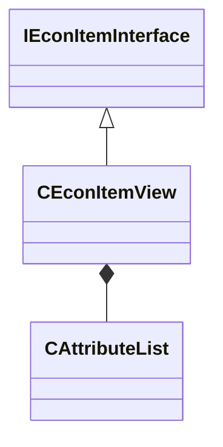

[Schemas](../../schemas.md) / [server](../server.md) / CEconItemView

# CEconItemView

**Kind:** class · **Size:** 680 bytes (`0x2a8`) · **Align:** 255 · **Module:** server

**Inherits from:** [IEconItemInterface](../server/IEconItemInterface.md)

**Relationships:**

## Memory layout

13 fields (13 declared here, 0 inherited). Offsets are absolute from the object base.

| Offset | Field | Type | From | Annotations |
|--------|-------|------|------|-------------|
| `0x38` | `m_iItemDefinitionIndex` | uint16 |  |  |
| `0x3c` | `m_iEntityQuality` | int32 |  |  |
| `0x40` | `m_iEntityLevel` | uint32 |  |  |
| `0x48` | `m_iItemID` | uint64 |  |  |
| `0x50` | `m_iItemIDHigh` | uint32 |  |  |
| `0x54` | `m_iItemIDLow` | uint32 |  |  |
| `0x58` | `m_iAccountID` | uint32 |  |  |
| `0x5c` | `m_iInventoryPosition` | uint32 |  |  |
| `0x68` | `m_bInitialized` | bool |  |  |
| `0x70` | `m_AttributeList` | [CAttributeList](../server/CAttributeList.md) |  |  |
| `0xe8` | `m_NetworkedDynamicAttributes` | [CAttributeList](../server/CAttributeList.md) |  |  |
| `0x160` | `m_szCustomName` | char[161] |  |  |
| `0x201` | `m_szCustomNameOverride` | char[161] |  |  |
