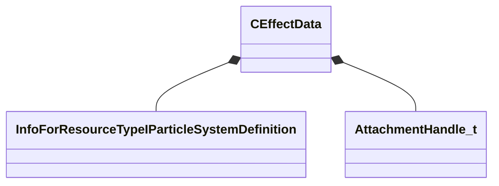

[Schemas](../../schemas.md) / [server](../server.md) / CEffectData

# CEffectData

**Kind:** class · **Size:** 112 bytes (`0x70`) · **Align:** 255 · **Module:** server

**Relationships:**

## Memory layout

20 fields (20 declared here, 0 inherited). Offsets are absolute from the object base.

| Offset | Field | Type | From | Annotations |
|--------|-------|------|------|-------------|
| `0x8` | `m_vOrigin` | VectorWS |  |  |
| `0x14` | `m_vStart` | VectorWS |  |  |
| `0x20` | `m_vNormal` | Vector |  |  |
| `0x2c` | `m_vAngles` | QAngle |  |  |
| `0x38` | `m_hEntity` | CEntityHandle |  |  |
| `0x3c` | `m_hOtherEntity` | CEntityHandle |  |  |
| `0x40` | `m_flScale` | float32 |  |  |
| `0x44` | `m_flMagnitude` | float32 |  |  |
| `0x48` | `m_flRadius` | float32 |  |  |
| `0x4c` | `m_nSurfaceProp` | CUtlStringToken |  |  |
| `0x50` | `m_nEffectIndex` | CWeakHandle< [InfoForResourceTypeIParticleSystemDefinition](../resourcesystem/InfoForResourceTypeIParticleSystemDefinition.md) > |  |  |
| `0x58` | `m_nDamageType` | uint32 |  |  |
| `0x5c` | `m_nPenetrate` | uint8 |  |  |
| `0x5e` | `m_nMaterial` | uint16 |  |  |
| `0x60` | `m_nHitBox` | int16 |  |  |
| `0x62` | `m_nColor` | uint8 |  |  |
| `0x63` | `m_fFlags` | uint8 |  |  |
| `0x64` | `m_nAttachmentIndex` | [AttachmentHandle_t](../modellib/AttachmentHandle_t.md) |  |  |
| `0x68` | `m_nAttachmentName` | CUtlStringToken |  |  |
| `0x6c` | `m_iEffectName` | uint16 |  |  |
