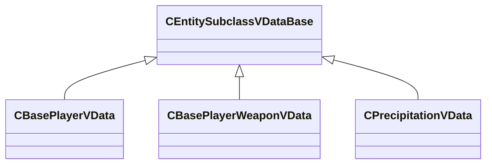

[Schemas](../../schemas.md) / [server](../server.md) / CEntitySubclassVDataBase

# CEntitySubclassVDataBase

**Kind:** class · **Size:** 40 bytes (`0x28`) · **Align:** 8 · **Module:** server

**Derived by:** [CBasePlayerVData](../server/CBasePlayerVData.md), [CBasePlayerWeaponVData](../server/CBasePlayerWeaponVData.md), [CPrecipitationVData](../server/CPrecipitationVData.md)

**Metadata:** `MVDataNodeType 1`, `MVDataOverlayType 1`, `MVDataRoot`, `MVDataUseLinkedEntityClasses`

**Relationships:**

KV3 class defaults

<pre>{
	&quot;_class&quot;: &quot;CEntitySubclassVDataBase&quot;
}</pre>

