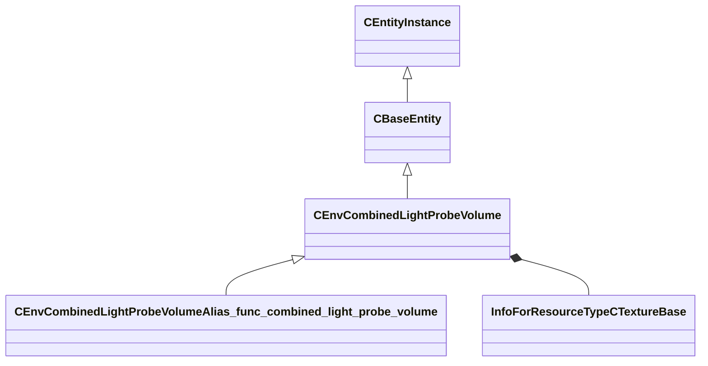

[Schemas](../../schemas.md) / [server](../server.md) / CEnvCombinedLightProbeVolume

# CEnvCombinedLightProbeVolume

> Source: **Build 25000182** · 2026-08-28 · `windows-x86_64` · schema `0.10.0`

**Kind:** class · **Size:** 5616 bytes (`0x15f0`) · **Align:** 8 · **Module:** server

**Inherits from:** [CBaseEntity](../server/CBaseEntity.md)

**Derived by:** [CEnvCombinedLightProbeVolumeAlias_func_combined_light_probe_volume](../server/CEnvCombinedLightProbeVolumeAlias_func_combined_light_probe_volume.md)

**Metadata:** `MEntityAllowsPortraitWorldSpawn`

**Relationships:**

## Memory layout

117 fields (29 declared here, 88 inherited). Offsets are absolute from the object base.

| Offset | Field | Type | From | Annotations |
|--------|-------|------|------|-------------|
| `0x8` | `m_iszPrivateVScripts` | CUtlSymbolLarge | [CEntityInstance](../entity2/CEntityInstance.md) |  |
| `0x10` | `m_pEntity` | [CEntityIdentity](../entity2/CEntityIdentity.md)* | [CEntityInstance](../entity2/CEntityInstance.md) | CEntityIdentity pointer — the entity's identity record (name, class, handle, flags). |
| `0x28` | `m_CScriptComponent` | [CScriptComponent](../entity2/CScriptComponent.md)* | [CEntityInstance](../entity2/CEntityInstance.md) | VScript component attached to the entity, when scripted. |
| `0x30` | `m_CBodyComponent` | [CBodyComponent](../server/CBodyComponent.md)* | [CBaseEntity](../server/CBaseEntity.md) |  |
| `0x38` | `m_NetworkTransmitComponent` | [CNetworkTransmitComponent](../server/CNetworkTransmitComponent.md) | [CBaseEntity](../server/CBaseEntity.md) |  |
| `0x248` | `m_aThinkFunctions` | CUtlVector< thinkfunc_t > | [CBaseEntity](../server/CBaseEntity.md) |  |
| `0x260` | `m_iCurrentThinkContext` | int32 | [CBaseEntity](../server/CBaseEntity.md) | `MNotSaved` |
| `0x264` | `m_nLastThinkTick` | [GameTick_t](../entity2/GameTick_t.md) | [CBaseEntity](../server/CBaseEntity.md) |  |
| `0x268` | `m_bDisabledContextThinks` | bool | [CBaseEntity](../server/CBaseEntity.md) |  |
| `0x278` | `m_isSteadyState` | CTypedBitVec< 64 > | [CBaseEntity](../server/CBaseEntity.md) | `MNotSaved` |
| `0x280` | `m_lastNetworkChange` | float32 | [CBaseEntity](../server/CBaseEntity.md) | `MNotSaved` |
| `0x288` | `m_think` | BASEPTR | [CBaseEntity](../server/CBaseEntity.md) |  |
| `0x290` | `m_ResponseContexts` | CUtlVector< [ResponseContext_t](../server/ResponseContext_t.md) > | [CBaseEntity](../server/CBaseEntity.md) |  |
| `0x2a8` | `m_iszResponseContext` | CUtlSymbolLarge | [CBaseEntity](../server/CBaseEntity.md) |  |
| `0x2b0` | `m_pfnTouch` | ENTITYFUNCPTR | [CBaseEntity](../server/CBaseEntity.md) |  |
| `0x2b8` | `m_pfnUse` | USEPTR | [CBaseEntity](../server/CBaseEntity.md) |  |
| `0x2c0` | `m_pfnBlocked` | ENTITYFUNCPTR | [CBaseEntity](../server/CBaseEntity.md) |  |
| `0x2c8` | `m_pfnMoveDone` | BASEPTR | [CBaseEntity](../server/CBaseEntity.md) |  |
| `0x2d0` | `m_iHealth` | int32 | [CBaseEntity](../server/CBaseEntity.md) | Current health points of the entity. Serialised with the 'ClampHealth' encoder so values above max are clamped. *Sent only to the Player network group and LocalPlayerExclusive.* |
| `0x2d4` | `m_iMaxHealth` | int32 | [CBaseEntity](../server/CBaseEntity.md) | Maximum health points; used to normalise health bars in the HUD. |
| `0x2d8` | `m_lifeState` | uint8 | [CBaseEntity](../server/CBaseEntity.md) | LIFE_STATE enum: 0 = Alive, 1 = Dying, 2 = Dead, 3 = Respawnable, 4 = Discardbody. |
| `0x2dc` | `m_flDamageAccumulator` | float32 | [CBaseEntity](../server/CBaseEntity.md) |  |
| `0x2e0` | `m_bTakesDamage` | bool | [CBaseEntity](../server/CBaseEntity.md) |  |
| `0x2e8` | `m_nTakeDamageFlags` | [TakeDamageFlags_t](../server/TakeDamageFlags_t.md) | [CBaseEntity](../server/CBaseEntity.md) |  |
| `0x2f0` | `m_nPlatformType` | [EntityPlatformTypes_t](../server/EntityPlatformTypes_t.md) | [CBaseEntity](../server/CBaseEntity.md) |  |
| `0x2f2` | `m_MoveCollide` | [MoveCollide_t](../server/MoveCollide_t.md) | [CBaseEntity](../server/CBaseEntity.md) |  |
| `0x2f3` | `m_MoveType` | [MoveType_t](../server/MoveType_t.md) | [CBaseEntity](../server/CBaseEntity.md) |  |
| `0x2f4` | `m_nPreviouslySetMoveType` | [MoveType_t](../server/MoveType_t.md) | [CBaseEntity](../server/CBaseEntity.md) |  |
| `0x2f5` | `m_nActualMoveType` | [MoveType_t](../server/MoveType_t.md) | [CBaseEntity](../server/CBaseEntity.md) |  |
| `0x2f6` | `m_nWaterTouch` | uint8 | [CBaseEntity](../server/CBaseEntity.md) | `MNotSaved` |
| `0x2f7` | `m_nSlimeTouch` | uint8 | [CBaseEntity](../server/CBaseEntity.md) | `MNotSaved` |
| `0x2f8` | `m_bRestoreInHierarchy` | bool | [CBaseEntity](../server/CBaseEntity.md) |  |
| `0x300` | `m_target` | CUtlSymbolLarge | [CBaseEntity](../server/CBaseEntity.md) |  |
| `0x308` | `m_hDamageFilter` | CHandle< [CBaseFilter](../server/CBaseFilter.md) > | [CBaseEntity](../server/CBaseEntity.md) |  |
| `0x310` | `m_iszDamageFilterName` | CUtlSymbolLarge | [CBaseEntity](../server/CBaseEntity.md) |  |
| `0x318` | `m_flMoveDoneTime` | float32 | [CBaseEntity](../server/CBaseEntity.md) |  |
| `0x31c` | `m_nSubclassID` | CUtlStringToken | [CBaseEntity](../server/CBaseEntity.md) |  |
| `0x328` | `m_flAnimTime` | float32 | [CBaseEntity](../server/CBaseEntity.md) | Floating-point timestamp of the most-recent animation update; used by the client for animation interpolation. `MKV3TransferSaveOpsForField GetEngineTimeSaveRestoreOps` |
| `0x32c` | `m_flSimulationTime` | float32 | [CBaseEntity](../server/CBaseEntity.md) | Floating-point timestamp of the most-recent physics simulation step; used by the client for position interpolation. `MKV3TransferSaveOpsForField GetEngineTimeSaveRestoreOps` |
| `0x330` | `m_flCreateTime` | [GameTime_t](../entity2/GameTime_t.md) | [CBaseEntity](../server/CBaseEntity.md) |  |
| `0x334` | `m_bClientSideRagdoll` | bool | [CBaseEntity](../server/CBaseEntity.md) |  |
| `0x335` | `m_ubInterpolationFrame` | uint8 | [CBaseEntity](../server/CBaseEntity.md) |  |
| `0x338` | `m_vPrevVPhysicsUpdatePos` | VectorWS | [CBaseEntity](../server/CBaseEntity.md) |  |
| `0x344` | `m_iTeamNum` | uint8 | [CBaseEntity](../server/CBaseEntity.md) | Team number: 0 = Unassigned, 1 = Spectator, 2 = Terrorist, 3 = Counter-Terrorist. |
| `0x348` | `m_iGlobalname` | CUtlSymbolLarge | [CBaseEntity](../server/CBaseEntity.md) | `MSaveBehavior` |
| `0x350` | `m_iSentToClients` | int32 | [CBaseEntity](../server/CBaseEntity.md) | `MNotSaved` |
| `0x358` | `m_sUniqueHammerID` | CUtlString | [CBaseEntity](../server/CBaseEntity.md) |  |
| `0x360` | `m_spawnflags` | uint32 | [CBaseEntity](../server/CBaseEntity.md) |  |
| `0x364` | `m_nNextThinkTick` | [GameTick_t](../entity2/GameTick_t.md) | [CBaseEntity](../server/CBaseEntity.md) | Server tick on which the entity's Think() function will next execute (-1 = never). |
| `0x368` | `m_nSimulationTick` | int32 | [CBaseEntity](../server/CBaseEntity.md) | `MKV3TransferSaveOpsForField GetEngineTickSaveRestoreOps` |
| `0x370` | `m_OnKilled` | [CEntityIOOutput](../entity2/CEntityIOOutput.md) | [CBaseEntity](../server/CBaseEntity.md) |  |
| `0x388` | `m_fFlags` | uint32 | [CBaseEntity](../server/CBaseEntity.md) | Entity flags bitmask (FL_ONGROUND = 1, FL_DUCKING = 4, FL_INWATER = 8, FL_FROZEN = 0x200, etc.). |
| `0x38c` | `m_vecAbsVelocity` | Vector | [CBaseEntity](../server/CBaseEntity.md) |  |
| `0x398` | `m_vecVelocity` | [CNetworkVelocityVector](../server/CNetworkVelocityVector.md) | [CBaseEntity](../server/CBaseEntity.md) | Current world-space velocity vector of the entity. |
| `0x3c8` | `m_vecBaseVelocity` | Vector | [CBaseEntity](../server/CBaseEntity.md) | Additional world-space velocity contributed by moving platforms, conveyor belts, etc. |
| `0x3d4` | `m_nPushEnumCount` | int32 | [CBaseEntity](../server/CBaseEntity.md) | `MNotSaved` |
| `0x3d8` | `m_pCollision` | [CCollisionProperty](../server/CCollisionProperty.md)* | [CBaseEntity](../server/CBaseEntity.md) | `MNotSaved` |
| `0x3e0` | `m_hEffectEntity` | CHandle< [CBaseEntity](../server/CBaseEntity.md) > | [CBaseEntity](../server/CBaseEntity.md) |  |
| `0x3e4` | `m_hOwnerEntity` | CHandle< [CBaseEntity](../server/CBaseEntity.md) > | [CBaseEntity](../server/CBaseEntity.md) | CHandle to the entity that owns or spawned this entity (e.g. the thrower of a grenade). |
| `0x3e8` | `m_fEffects` | uint32 | [CBaseEntity](../server/CBaseEntity.md) | Effect flags bitmask (EF_NODRAW = 32, EF_NORECEIVESHADOW = 64, etc.). |
| `0x3ec` | `m_hGroundEntity` | CHandle< [CBaseEntity](../server/CBaseEntity.md) > | [CBaseEntity](../server/CBaseEntity.md) | CHandle to the entity this entity is standing on (INVALID_EHANDLE if airborne). |
| `0x3f0` | `m_nGroundBodyIndex` | int32 | [CBaseEntity](../server/CBaseEntity.md) |  |
| `0x3f4` | `m_flFriction` | float32 | [CBaseEntity](../server/CBaseEntity.md) | Surface friction multiplier (1.0 = normal; lower values make the entity slide more). |
| `0x3f8` | `m_flElasticity` | float32 | [CBaseEntity](../server/CBaseEntity.md) |  |
| `0x3fc` | `m_flGravityScale` | float32 | [CBaseEntity](../server/CBaseEntity.md) | Gravity scale multiplier (1.0 = normal; 0 = no gravity). |
| `0x400` | `m_flTimeScale` | float32 | [CBaseEntity](../server/CBaseEntity.md) | Time-scale multiplier applied to this entity's simulation (1.0 = real time; used by bullet time effects). |
| `0x404` | `m_flWaterLevel` | float32 | [CBaseEntity](../server/CBaseEntity.md) |  |
| `0x408` | `m_bGravityDisabled` | bool | [CBaseEntity](../server/CBaseEntity.md) |  |
| `0x409` | `m_bAnimatedEveryTick` | bool | [CBaseEntity](../server/CBaseEntity.md) | True when the entity's animation must be updated every server tick regardless of network interest. |
| `0x40c` | `m_flActualGravityScale` | float32 | [CBaseEntity](../server/CBaseEntity.md) |  |
| `0x410` | `m_bGravityActuallyDisabled` | bool | [CBaseEntity](../server/CBaseEntity.md) |  |
| `0x411` | `m_bDisableLowViolence` | bool | [CBaseEntity](../server/CBaseEntity.md) |  |
| `0x412` | `m_nWaterType` | uint8 | [CBaseEntity](../server/CBaseEntity.md) |  |
| `0x414` | `m_iEFlags` | int32 | [CBaseEntity](../server/CBaseEntity.md) |  |
| `0x418` | `m_OnUser1` | [CEntityIOOutput](../entity2/CEntityIOOutput.md) | [CBaseEntity](../server/CBaseEntity.md) |  |
| `0x430` | `m_OnUser2` | [CEntityIOOutput](../entity2/CEntityIOOutput.md) | [CBaseEntity](../server/CBaseEntity.md) |  |
| `0x448` | `m_OnUser3` | [CEntityIOOutput](../entity2/CEntityIOOutput.md) | [CBaseEntity](../server/CBaseEntity.md) |  |
| `0x460` | `m_OnUser4` | [CEntityIOOutput](../entity2/CEntityIOOutput.md) | [CBaseEntity](../server/CBaseEntity.md) |  |
| `0x478` | `m_iInitialTeamNum` | int32 | [CBaseEntity](../server/CBaseEntity.md) |  |
| `0x47c` | `m_flNavIgnoreUntilTime` | [GameTime_t](../entity2/GameTime_t.md) | [CBaseEntity](../server/CBaseEntity.md) |  |
| `0x480` | `m_vecAngVelocity` | QAngle | [CBaseEntity](../server/CBaseEntity.md) |  |
| `0x48c` | `m_bNetworkQuantizeOriginAndAngles` | bool | [CBaseEntity](../server/CBaseEntity.md) |  |
| `0x48d` | `m_bLagCompensate` | bool | [CBaseEntity](../server/CBaseEntity.md) |  |
| `0x490` | `m_pBlocker` | CHandle< [CBaseEntity](../server/CBaseEntity.md) > | [CBaseEntity](../server/CBaseEntity.md) |  |
| `0x494` | `m_flLocalTime` | float32 | [CBaseEntity](../server/CBaseEntity.md) |  |
| `0x498` | `m_flVPhysicsUpdateLocalTime` | float32 | [CBaseEntity](../server/CBaseEntity.md) |  |
| `0x49c` | `m_nBloodType` | [BloodType](../server/BloodType.md) | [CBaseEntity](../server/CBaseEntity.md) |  |
| `0x4a0` | `m_pPulseGraphInstance` | [CPulseGraphInstance_ServerEntity](../server/CPulseGraphInstance_ServerEntity.md)* | [CBaseEntity](../server/CBaseEntity.md) | `MKV3TransferSaveOpsForField GetPulseInstanceSaveRestoreOps` |
| `0x1520` | `m_Entity_Color` | Color |  |  |
| `0x1524` | `m_Entity_flBrightness` | float32 |  |  |
| `0x1528` | `m_Entity_hCubemapTexture` | CStrongHandle< [InfoForResourceTypeCTextureBase](../resourcesystem/InfoForResourceTypeCTextureBase.md) > |  |  |
| `0x1530` | `m_Entity_bCustomCubemapTexture` | bool |  |  |
| `0x1538` | `m_Entity_hLightProbeTexture_AmbientCube` | CStrongHandle< [InfoForResourceTypeCTextureBase](../resourcesystem/InfoForResourceTypeCTextureBase.md) > |  |  |
| `0x1540` | `m_Entity_hLightProbeTexture_SDF` | CStrongHandle< [InfoForResourceTypeCTextureBase](../resourcesystem/InfoForResourceTypeCTextureBase.md) > |  |  |
| `0x1548` | `m_Entity_hLightProbeTexture_SH2_DC` | CStrongHandle< [InfoForResourceTypeCTextureBase](../resourcesystem/InfoForResourceTypeCTextureBase.md) > |  |  |
| `0x1550` | `m_Entity_hLightProbeTexture_SH2_R` | CStrongHandle< [InfoForResourceTypeCTextureBase](../resourcesystem/InfoForResourceTypeCTextureBase.md) > |  |  |
| `0x1558` | `m_Entity_hLightProbeTexture_SH2_G` | CStrongHandle< [InfoForResourceTypeCTextureBase](../resourcesystem/InfoForResourceTypeCTextureBase.md) > |  |  |
| `0x1560` | `m_Entity_hLightProbeTexture_SH2_B` | CStrongHandle< [InfoForResourceTypeCTextureBase](../resourcesystem/InfoForResourceTypeCTextureBase.md) > |  |  |
| `0x1568` | `m_Entity_hLightProbeDirectLightIndicesTexture` | CStrongHandle< [InfoForResourceTypeCTextureBase](../resourcesystem/InfoForResourceTypeCTextureBase.md) > |  |  |
| `0x1570` | `m_Entity_hLightProbeDirectLightScalarsTexture` | CStrongHandle< [InfoForResourceTypeCTextureBase](../resourcesystem/InfoForResourceTypeCTextureBase.md) > |  |  |
| `0x1578` | `m_Entity_hLightProbeDirectLightShadowsTexture` | CStrongHandle< [InfoForResourceTypeCTextureBase](../resourcesystem/InfoForResourceTypeCTextureBase.md) > |  |  |
| `0x1580` | `m_Entity_vBoxMins` | Vector |  |  |
| `0x158c` | `m_Entity_vBoxMaxs` | Vector |  |  |
| `0x1598` | `m_Entity_bMoveable` | bool |  |  |
| `0x159c` | `m_Entity_nHandshake` | int32 |  |  |
| `0x15a0` | `m_Entity_nEnvCubeMapArrayIndex` | int32 |  |  |
| `0x15a4` | `m_Entity_nPriority` | int32 |  |  |
| `0x15a8` | `m_Entity_bStartDisabled` | bool |  |  |
| `0x15ac` | `m_Entity_flEdgeFadeDist` | float32 |  |  |
| `0x15b0` | `m_Entity_vEdgeFadeDists` | Vector |  |  |
| `0x15bc` | `m_Entity_nLightProbeSizeX` | int32 |  |  |
| `0x15c0` | `m_Entity_nLightProbeSizeY` | int32 |  |  |
| `0x15c4` | `m_Entity_nLightProbeSizeZ` | int32 |  |  |
| `0x15c8` | `m_Entity_nLightProbeAtlasX` | int32 |  |  |
| `0x15cc` | `m_Entity_nLightProbeAtlasY` | int32 |  |  |
| `0x15d0` | `m_Entity_nLightProbeAtlasZ` | int32 |  |  |
| `0x15e9` | `m_Entity_bEnabled` | bool |  |  |
