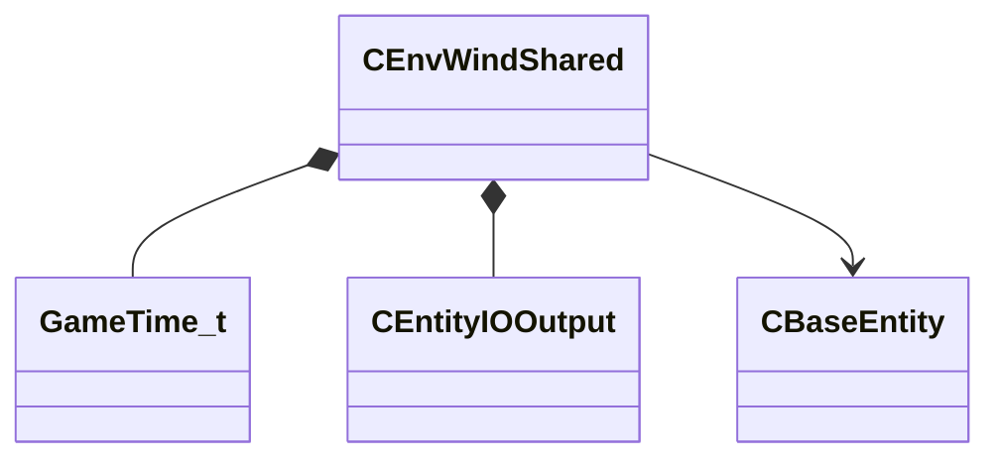

[Schemas](../../schemas.md) / [server](../server.md) / CEnvWindShared

# CEnvWindShared

> Source: **Build 25000182** · 2026-08-28 · `windows-x86_64` · schema `0.10.0`

**Kind:** class · **Size:** 304 bytes (`0x130`) · **Align:** 8 · **Module:** server

**Relationships:**

## Memory layout

17 fields (17 declared here, 0 inherited). Offsets are absolute from the object base.

| Offset | Field | Type | From | Annotations |
|--------|-------|------|------|-------------|
| `0x8` | `m_flStartTime` | [GameTime_t](../entity2/GameTime_t.md) |  | `MNotSaved` |
| `0xc` | `m_iWindSeed` | uint32 |  | `MNotSaved` |
| `0x10` | `m_iMinWind` | uint16 |  |  |
| `0x12` | `m_iMaxWind` | uint16 |  |  |
| `0x14` | `m_windRadius` | int32 |  |  |
| `0x18` | `m_iMinGust` | uint16 |  |  |
| `0x1a` | `m_iMaxGust` | uint16 |  |  |
| `0x1c` | `m_flMinGustDelay` | float32 |  |  |
| `0x20` | `m_flMaxGustDelay` | float32 |  |  |
| `0x24` | `m_flGustDuration` | float32 |  |  |
| `0x28` | `m_iGustDirChange` | uint16 |  |  |
| `0x2a` | `m_iInitialWindDir` | uint16 |  | `MNotSaved` |
| `0x2c` | `m_flInitialWindSpeed` | float32 |  | `MNotSaved` |
| `0x30` | `m_location` | VectorWS |  | `MNotSaved` |
| `0x40` | `m_OnGustStart` | [CEntityIOOutput](../entity2/CEntityIOOutput.md) |  |  |
| `0x58` | `m_OnGustEnd` | [CEntityIOOutput](../entity2/CEntityIOOutput.md) |  |  |
| `0x70` | `m_hEntOwner` | CHandle< [CBaseEntity](../server/CBaseEntity.md) > |  | `MNotSaved` |

KV3 class defaults

<pre>{
	&quot;_class&quot;: &quot;CEnvWindShared&quot;,
	&quot;m_iMinWind&quot;: 0,
	&quot;m_iMaxWind&quot;: 0,
	&quot;m_windRadius&quot;: 0,
	&quot;m_iMinGust&quot;: 0,
	&quot;m_iMaxGust&quot;: 0,
	&quot;m_flMinGustDelay&quot;: 0.000000,
	&quot;m_flMaxGustDelay&quot;: 0.000000,
	&quot;m_flGustDuration&quot;: 0.000000,
	&quot;m_iGustDirChange&quot;: 0,
	&quot;m_OnGustStart&quot;:
	{
	},
	&quot;m_OnGustEnd&quot;:
	{
	}
}</pre>

