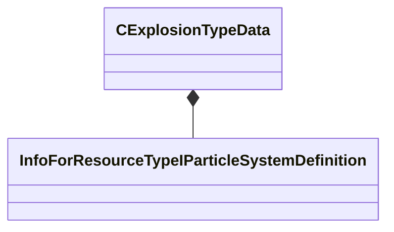

[Schemas](../../schemas.md) / [server](../server.md) / CExplosionTypeData

# CExplosionTypeData

**Kind:** class · **Size:** 256 bytes (`0x100`) · **Align:** 8 · **Module:** server

**Metadata:** `MVDataAssociatedFile scripts/explosion_types.vdata`, `MVDataOverlayType 1`, `MVDataRoot`

**Relationships:**

## Memory layout

5 fields (5 declared here, 0 inherited). Offsets are absolute from the object base.

| Offset | Field | Type | From | Annotations |
|--------|-------|------|------|-------------|
| `0x0` | `m_SoundName` | CSoundEventName |  |  |
| `0x10` | `m_ParticleEffect` | CResourceNameTyped< CWeakHandle< [InfoForResourceTypeIParticleSystemDefinition](../resourcesystem/InfoForResourceTypeIParticleSystemDefinition.md) > > |  |  |
| `0xf0` | `m_bIsIncindiary` | bool |  | `MPropertyDescription Whether this explosion relates to fire` |
| `0xf1` | `m_bHasForces` | bool |  | `MPropertyDescription Whether this explosion has explosive forces` |
| `0xf8` | `m_DecalType` | CGlobalSymbol |  | `MPropertyDescription Decal to use when this explosion occurs` |

KV3 class defaults

<pre>{
	&quot;m_SoundName&quot;: &quot;&quot;,
	&quot;m_ParticleEffect&quot;: &quot;&quot;,
	&quot;m_bIsIncindiary&quot;: false,
	&quot;m_bHasForces&quot;: false,
	&quot;m_DecalType&quot;: &quot;Scorch&quot;
}</pre>

