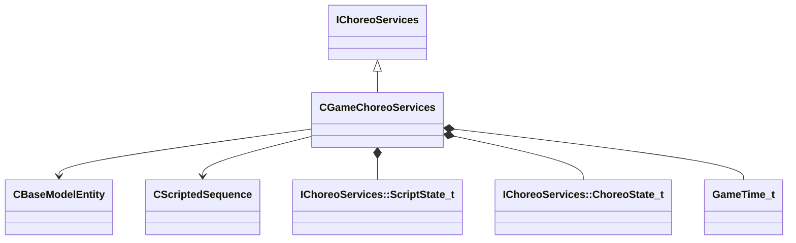

[Schemas](../../schemas.md) / [server](../server.md) / CGameChoreoServices

# CGameChoreoServices

> Source: **Build 25000182** · 2026-08-28 · `windows-x86_64` · schema `0.10.0`

**Kind:** class · **Size:** 32 bytes (`0x20`) · **Align:** 8 · **Module:** server

**Inherits from:** [IChoreoServices](../server/IChoreoServices.md)

**Relationships:**

## Memory layout

5 fields (5 declared here, 0 inherited). Offsets are absolute from the object base.

| Offset | Field | Type | From | Annotations |
|--------|-------|------|------|-------------|
| `0x8` | `m_hOwner` | CHandle< [CBaseModelEntity](../server/CBaseModelEntity.md) > |  |  |
| `0xc` | `m_hScriptedSequence` | CHandle< [CScriptedSequence](../server/CScriptedSequence.md) > |  |  |
| `0x10` | `m_scriptState` | [IChoreoServices::ScriptState_t](../server/IChoreoServices.ScriptState_t.md) |  |  |
| `0x14` | `m_choreoState` | [IChoreoServices::ChoreoState_t](../server/IChoreoServices.ChoreoState_t.md) |  |  |
| `0x18` | `m_flTimeStartedState` | [GameTime_t](../entity2/GameTime_t.md) |  |  |

KV3 class defaults

<pre>{
	&quot;_class&quot;: &quot;CGameChoreoServices&quot;,
	&quot;m_hOwner&quot;: null,
	&quot;m_hScriptedSequence&quot;: null,
	&quot;m_scriptState&quot;: &quot;SCRIPT_PLAYING&quot;,
	&quot;m_choreoState&quot;: &quot;STATE_PRE_SCRIPT&quot;,
	&quot;m_flTimeStartedState&quot;: null
}</pre>

