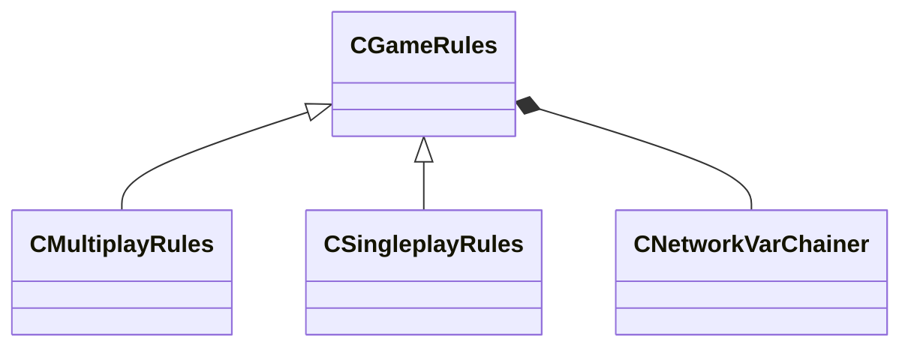

[Schemas](../../schemas.md) / [server](../server.md) / CGameRules

# CGameRules

**Kind:** class · **Size:** 208 bytes (`0xd0`) · **Align:** 255 · **Module:** server

**Derived by:** [CMultiplayRules](../server/CMultiplayRules.md), [CSingleplayRules](../server/CSingleplayRules.md)

**Relationships:**

## Memory layout

8 fields (8 declared here, 0 inherited). Offsets are absolute from the object base.

| Offset | Field | Type | From | Annotations |
|--------|-------|------|------|-------------|
| `0x8` | `__m_pChainEntity` | [CNetworkVarChainer](../entity2/CNetworkVarChainer.md) |  | `MNotSaved` |
| `0x30` | `m_szQuestName` | char[128] |  |  |
| `0xb0` | `m_nQuestPhase` | int32 |  |  |
| `0xb4` | `m_nLastMatchTime` | uint32 |  |  |
| `0xb8` | `m_nLastMatchTime_MatchID64` | uint64 |  |  |
| `0xc0` | `m_nTotalPausedTicks` | int32 |  |  |
| `0xc4` | `m_nPauseStartTick` | int32 |  |  |
| `0xc8` | `m_bGamePaused` | bool |  |  |
