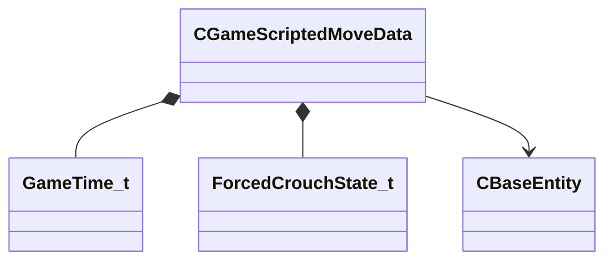

[Schemas](../../schemas.md) / [server](../server.md) / CGameScriptedMoveData

# CGameScriptedMoveData

**Kind:** class · **Size:** 116 bytes (`0x74`) · **Align:** 4 · **Module:** server

**Relationships:**

## Memory layout

18 fields (18 declared here, 0 inherited). Offsets are absolute from the object base.

| Offset | Field | Type | From | Annotations |
|--------|-------|------|------|-------------|
| `0x0` | `m_vAccumulatedRootMotion` | Vector |  |  |
| `0xc` | `m_angAccumulatedRootMotionRotation` | QAngle |  |  |
| `0x18` | `m_vSrc` | VectorWS |  |  |
| `0x24` | `m_angSrc` | QAngle |  |  |
| `0x30` | `m_angCurrent` | QAngle |  |  |
| `0x3c` | `m_flLockedSpeed` | float32 |  |  |
| `0x40` | `m_flAngRate` | float32 |  |  |
| `0x44` | `m_flDuration` | float32 |  |  |
| `0x48` | `m_flStartTime` | [GameTime_t](../entity2/GameTime_t.md) |  |  |
| `0x4c` | `m_bActive` | bool |  |  |
| `0x4d` | `m_bTeleportOnEnd` | bool |  |  |
| `0x4e` | `m_bIgnoreRotation` | bool |  |  |
| `0x4f` | `m_bSuccess` | bool |  |  |
| `0x50` | `m_nForcedCrouchState` | [ForcedCrouchState_t](../!GlobalTypes/ForcedCrouchState_t.md) |  |  |
| `0x54` | `m_bIgnoreCollisions` | bool |  |  |
| `0x58` | `m_vDest` | Vector |  |  |
| `0x64` | `m_angDst` | QAngle |  |  |
| `0x70` | `m_hDestEntity` | CHandle< [CBaseEntity](../server/CBaseEntity.md) > |  |  |

KV3 class defaults

<pre>{
	&quot;m_vAccumulatedRootMotion&quot;:
	[
		0.000000,
		0.000000,
		0.000000
	],
	&quot;m_angAccumulatedRootMotionRotation&quot;:
	[
		0.000000,
		0.000000,
		0.000000
	],
	&quot;m_vSrc&quot;: null,
	&quot;m_angSrc&quot;:
	[
		0.000000,
		0.000000,
		0.000000
	],
	&quot;m_angCurrent&quot;:
	[
		0.000000,
		0.000000,
		0.000000
	],
	&quot;m_flLockedSpeed&quot;: -1.000000,
	&quot;m_flAngRate&quot;: 0.000000,
	&quot;m_flDuration&quot;: 0.000000,
	&quot;m_flStartTime&quot;: null,
	&quot;m_bActive&quot;: false,
	&quot;m_bTeleportOnEnd&quot;: false,
	&quot;m_bIgnoreRotation&quot;: false,
	&quot;m_bSuccess&quot;: true,
	&quot;m_nForcedCrouchState&quot;: &quot;FORCEDCROUCH_NONE&quot;,
	&quot;m_bIgnoreCollisions&quot;: false,
	&quot;m_vDest&quot;:
	[
		0.000000,
		0.000000,
		0.000000
	],
	&quot;m_angDst&quot;:
	[
		0.000000,
		0.000000,
		0.000000
	],
	&quot;m_hDestEntity&quot;: null
}</pre>

