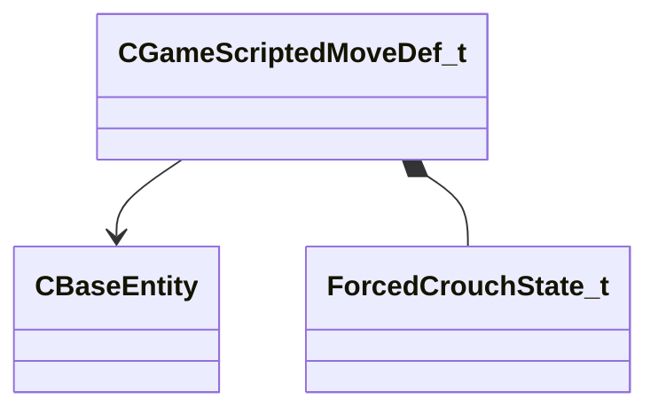

[Schemas](../../schemas.md) / [server](../server.md) / CGameScriptedMoveDef_t

# CGameScriptedMoveDef_t

> Source: **Build 25000182** · 2026-08-28 · `windows-x86_64` · schema `0.10.0`

**Kind:** class · **Size:** 48 bytes (`0x30`) · **Align:** n/a (unspecified) · **Module:** server

**Relationships:**

## Memory layout

9 fields (9 declared here, 0 inherited). Offsets are absolute from the object base.

| Offset | Field | Type | From | Annotations |
|--------|-------|------|------|-------------|
| `0x0` | `m_vDestOffset` | Vector |  |  |
| `0xc` | `m_hDestEntity` | CHandle< [CBaseEntity](../server/CBaseEntity.md) > |  |  |
| `0x10` | `m_angDest` | QAngle |  |  |
| `0x1c` | `m_flDuration` | float32 |  |  |
| `0x20` | `m_flAngRate` | float32 |  |  |
| `0x24` | `m_flMoveSpeed` | float32 |  |  |
| `0x28` | `m_bAimDisabled` | bool |  |  |
| `0x29` | `m_bIgnoreRotation` | bool |  |  |
| `0x2c` | `m_nForcedCrouchState` | [ForcedCrouchState_t](../server/ForcedCrouchState_t.md) |  |  |
