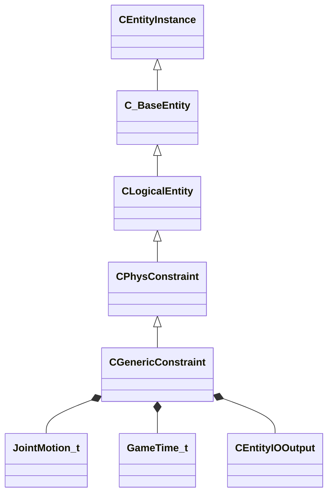

[Schemas](../../schemas.md) / [server](../server.md) / CGenericConstraint

# CGenericConstraint

**Kind:** class · **Size:** 1544 bytes (`0x608`) · **Align:** 8 · **Module:** server

**Inherits from:** [CPhysConstraint](../server/CPhysConstraint.md)

**Relationships:**

## Memory layout

148 fields (49 declared here, 99 inherited). Offsets are absolute from the object base.

| Offset | Field | Type | From | Annotations |
|--------|-------|------|------|-------------|
| `0x8` | `m_iszPrivateVScripts` | CUtlSymbolLarge | [CEntityInstance](../entity2/CEntityInstance.md) |  |
| `0x10` | `m_pEntity` | [CEntityIdentity](../entity2/CEntityIdentity.md)* | [CEntityInstance](../entity2/CEntityInstance.md) |  |
| `0x28` | `m_CScriptComponent` | [CScriptComponent](../entity2/CScriptComponent.md)* | [CEntityInstance](../entity2/CEntityInstance.md) |  |
| `0x30` | `m_CBodyComponent` | [CBodyComponent](../server/CBodyComponent.md)* | [C_BaseEntity](../client/C_BaseEntity.md) |  |
| `0x38` | `m_NetworkTransmitComponent` | [CNetworkTransmitComponent](../server/CNetworkTransmitComponent.md) | [C_BaseEntity](../client/C_BaseEntity.md) | `MNotSaved` |
| `0x328` | `m_nLastThinkTick` | [GameTick_t](../entity2/GameTick_t.md) | [C_BaseEntity](../client/C_BaseEntity.md) | `MNotSaved` |
| `0x330` | `m_pGameSceneNode` | [CGameSceneNode](../server/CGameSceneNode.md)* | [C_BaseEntity](../client/C_BaseEntity.md) | `MNotSaved` |
| `0x338` | `m_pRenderComponent` | [CRenderComponent](../server/CRenderComponent.md)* | [C_BaseEntity](../client/C_BaseEntity.md) | `MNotSaved` |
| `0x340` | `m_pCollision` | [CCollisionProperty](../server/CCollisionProperty.md)* | [C_BaseEntity](../client/C_BaseEntity.md) | `MNotSaved` |
| `0x348` | `m_iMaxHealth` | int32 | [C_BaseEntity](../client/C_BaseEntity.md) | `MNotSaved` |
| `0x34c` | `m_iHealth` | int32 | [C_BaseEntity](../client/C_BaseEntity.md) |  |
| `0x350` | `m_flDamageAccumulator` | float32 | [C_BaseEntity](../client/C_BaseEntity.md) | `MNotSaved` |
| `0x354` | `m_lifeState` | uint8 | [C_BaseEntity](../client/C_BaseEntity.md) | `MNotSaved` |
| `0x355` | `m_bTakesDamage` | bool | [C_BaseEntity](../client/C_BaseEntity.md) | `MNotSaved` |
| `0x358` | `m_nTakeDamageFlags` | [TakeDamageFlags_t](../server/TakeDamageFlags_t.md) | [C_BaseEntity](../client/C_BaseEntity.md) | `MNotSaved` |
| `0x360` | `m_nPlatformType` | [EntityPlatformTypes_t](../server/EntityPlatformTypes_t.md) | [C_BaseEntity](../client/C_BaseEntity.md) |  |
| `0x361` | `m_ubInterpolationFrame` | uint8 | [C_BaseEntity](../client/C_BaseEntity.md) | `MNotSaved` |
| `0x364` | `m_hSceneObjectController` | CHandle< [C_BaseEntity](../client/C_BaseEntity.md) > | [C_BaseEntity](../client/C_BaseEntity.md) |  |
| `0x368` | `m_nNoInterpolationTick` | int32 | [C_BaseEntity](../client/C_BaseEntity.md) | `MNotSaved` |
| `0x36c` | `m_nVisibilityNoInterpolationTick` | int32 | [C_BaseEntity](../client/C_BaseEntity.md) | `MNotSaved` |
| `0x370` | `m_flProxyRandomValue` | float32 | [C_BaseEntity](../client/C_BaseEntity.md) | `MNotSaved` |
| `0x374` | `m_iEFlags` | int32 | [C_BaseEntity](../client/C_BaseEntity.md) | `MNotSaved` |
| `0x378` | `m_nWaterType` | uint8 | [C_BaseEntity](../client/C_BaseEntity.md) | `MNotSaved` |
| `0x379` | `m_bInterpolateEvenWithNoModel` | bool | [C_BaseEntity](../client/C_BaseEntity.md) | `MNotSaved` |
| `0x37a` | `m_bPredictionEligible` | bool | [C_BaseEntity](../client/C_BaseEntity.md) | `MNotSaved` |
| `0x37b` | `m_bApplyLayerMatchIDToModel` | bool | [C_BaseEntity](../client/C_BaseEntity.md) | `MNotSaved` |
| `0x37c` | `m_tokLayerMatchID` | CUtlStringToken | [C_BaseEntity](../client/C_BaseEntity.md) | `MNotSaved` |
| `0x380` | `m_nSubclassID` | CUtlStringToken | [C_BaseEntity](../client/C_BaseEntity.md) |  |
| `0x390` | `m_nSimulationTick` | int32 | [C_BaseEntity](../client/C_BaseEntity.md) | `MNotSaved` |
| `0x394` | `m_iCurrentThinkContext` | int32 | [C_BaseEntity](../client/C_BaseEntity.md) | `MNotSaved` |
| `0x398` | `m_aThinkFunctions` | CUtlVector< thinkfunc_t > | [C_BaseEntity](../client/C_BaseEntity.md) | `MNotSaved` |
| `0x3b0` | `m_bDisabledContextThinks` | bool | [C_BaseEntity](../client/C_BaseEntity.md) |  |
| `0x3b4` | `m_flAnimTime` | float32 | [C_BaseEntity](../client/C_BaseEntity.md) | `MNotSaved` |
| `0x3b8` | `m_flSimulationTime` | float32 | [C_BaseEntity](../client/C_BaseEntity.md) | `MNotSaved` |
| `0x3bc` | `m_nSceneObjectOverrideFlags` | uint8 | [C_BaseEntity](../client/C_BaseEntity.md) |  |
| `0x3bd` | `m_bHasSuccessfullyInterpolated` | bool | [C_BaseEntity](../client/C_BaseEntity.md) | `MNotSaved` |
| `0x3be` | `m_bHasAddedVarsToInterpolation` | bool | [C_BaseEntity](../client/C_BaseEntity.md) | `MNotSaved` |
| `0x3bf` | `m_bRenderEvenWhenNotSuccessfullyInterpolated` | bool | [C_BaseEntity](../client/C_BaseEntity.md) | `MNotSaved` |
| `0x3c0` | `m_nInterpolationLatchDirtyFlags` | int32[2] | [C_BaseEntity](../client/C_BaseEntity.md) | `MNotSaved` |
| `0x3c8` | `m_ListEntry` | uint16[11] | [C_BaseEntity](../client/C_BaseEntity.md) | `MNotSaved` |
| `0x3e0` | `m_flCreateTime` | [GameTime_t](../entity2/GameTime_t.md) | [C_BaseEntity](../client/C_BaseEntity.md) | `MNotSaved` |
| `0x3e4` | `m_EntClientFlags` | uint16 | [C_BaseEntity](../client/C_BaseEntity.md) | `MNotSaved` |
| `0x3e6` | `m_bClientSideRagdoll` | bool | [C_BaseEntity](../client/C_BaseEntity.md) | `MNotSaved` |
| `0x3e7` | `m_iTeamNum` | uint8 | [C_BaseEntity](../client/C_BaseEntity.md) | `MNotSaved` |
| `0x3e8` | `m_spawnflags` | uint32 | [C_BaseEntity](../client/C_BaseEntity.md) |  |
| `0x3ec` | `m_nNextThinkTick` | [GameTick_t](../entity2/GameTick_t.md) | [C_BaseEntity](../client/C_BaseEntity.md) | `MNotSaved` |
| `0x3f4` | `m_fFlags` | uint32 | [C_BaseEntity](../client/C_BaseEntity.md) | `MSaveBehavior` |
| `0x3f8` | `m_vecAbsVelocity` | Vector | [C_BaseEntity](../client/C_BaseEntity.md) | `MNotSaved` |
| `0x404` | `m_vecServerVelocity` | [CNetworkVelocityVector](../server/CNetworkVelocityVector.md) | [C_BaseEntity](../client/C_BaseEntity.md) | `MNotSaved` |
| `0x430` | `m_vecVelocity` | [CNetworkVelocityVector](../server/CNetworkVelocityVector.md) | [C_BaseEntity](../client/C_BaseEntity.md) |  |
| `0x4a8` | `m_hJoint` | [IPhysicsJoint](../vphysics2/IPhysicsJoint.md)* | [CPhysConstraint](../server/CPhysConstraint.md) | `MPhysPtr` |
| `0x4b0` | `m_nameAttach1` | CUtlSymbolLarge | [CPhysConstraint](../server/CPhysConstraint.md) |  |
| `0x4b8` | `m_nameAttach2` | CUtlSymbolLarge | [CPhysConstraint](../server/CPhysConstraint.md) |  |
| `0x4c0` | `m_hAttach1` | CHandle< [CBaseEntity](../server/CBaseEntity.md) > | [CPhysConstraint](../server/CPhysConstraint.md) |  |
| `0x4c4` | `m_hAttach2` | CHandle< [CBaseEntity](../server/CBaseEntity.md) > | [CPhysConstraint](../server/CPhysConstraint.md) |  |
| `0x4c8` | `m_nameAttachment1` | CUtlSymbolLarge | [CPhysConstraint](../server/CPhysConstraint.md) |  |
| `0x4d0` | `m_nameAttachment2` | CUtlSymbolLarge | [CPhysConstraint](../server/CPhysConstraint.md) |  |
| `0x4d8` | `m_breakSound` | CGameSoundEventName | [CPhysConstraint](../server/CPhysConstraint.md) |  |
| `0x4e0` | `m_forceLimit` | float32 | [CPhysConstraint](../server/CPhysConstraint.md) |  |
| `0x4e4` | `m_torqueLimit` | float32 | [CPhysConstraint](../server/CPhysConstraint.md) |  |
| `0x4e8` | `m_minTeleportDistance` | float32 | [CPhysConstraint](../server/CPhysConstraint.md) |  |
| `0x4ec` | `m_bSnapObjectPositions` | bool | [CPhysConstraint](../server/CPhysConstraint.md) |  |
| `0x4ed` | `m_bTreatEntity1AsInfiniteMass` | bool | [CPhysConstraint](../server/CPhysConstraint.md) |  |
| `0x4f0` | `m_OnBreak` | [CEntityIOOutput](../entity2/CEntityIOOutput.md) | [CPhysConstraint](../server/CPhysConstraint.md) |  |
| `0x510` | `m_bPlaceAnchorsAtConstraintTransform` | bool |  |  |
| `0x510` | `m_vecBaseVelocity` | Vector | [C_BaseEntity](../client/C_BaseEntity.md) | `MNotSaved` |
| `0x514` | `m_nLinearMotionX` | [JointMotion_t](../physicslib/JointMotion_t.md) |  |  |
| `0x518` | `m_nLinearMotionY` | [JointMotion_t](../physicslib/JointMotion_t.md) |  |  |
| `0x51c` | `m_nLinearMotionZ` | [JointMotion_t](../physicslib/JointMotion_t.md) |  |  |
| `0x51c` | `m_hEffectEntity` | CHandle< [C_BaseEntity](../client/C_BaseEntity.md) > | [C_BaseEntity](../client/C_BaseEntity.md) | `MNotSaved` |
| `0x520` | `m_flLinearFrequencyX` | float32 |  |  |
| `0x520` | `m_hOwnerEntity` | CHandle< [C_BaseEntity](../client/C_BaseEntity.md) > | [C_BaseEntity](../client/C_BaseEntity.md) |  |
| `0x524` | `m_flLinearFrequencyY` | float32 |  |  |
| `0x524` | `m_MoveCollide` | [MoveCollide_t](../server/MoveCollide_t.md) | [C_BaseEntity](../client/C_BaseEntity.md) | `MNotSaved` |
| `0x525` | `m_MoveType` | [MoveType_t](../server/MoveType_t.md) | [C_BaseEntity](../client/C_BaseEntity.md) |  |
| `0x526` | `m_nActualMoveType` | [MoveType_t](../server/MoveType_t.md) | [C_BaseEntity](../client/C_BaseEntity.md) |  |
| `0x528` | `m_flLinearFrequencyZ` | float32 |  |  |
| `0x528` | `m_flWaterLevel` | float32 | [C_BaseEntity](../client/C_BaseEntity.md) | `MNotSaved` |
| `0x52c` | `m_flLinearDampingRatioX` | float32 |  |  |
| `0x52c` | `m_fEffects` | uint32 | [C_BaseEntity](../client/C_BaseEntity.md) | `MNotSaved` |
| `0x530` | `m_flLinearDampingRatioY` | float32 |  |  |
| `0x530` | `m_hGroundEntity` | CHandle< [C_BaseEntity](../client/C_BaseEntity.md) > | [C_BaseEntity](../client/C_BaseEntity.md) | `MNotSaved` |
| `0x534` | `m_flLinearDampingRatioZ` | float32 |  |  |
| `0x534` | `m_nGroundBodyIndex` | int32 | [C_BaseEntity](../client/C_BaseEntity.md) | `MNotSaved` |
| `0x538` | `m_flMaxLinearImpulseX` | float32 |  |  |
| `0x538` | `m_flFriction` | float32 | [C_BaseEntity](../client/C_BaseEntity.md) | `MNotSaved` |
| `0x53c` | `m_flMaxLinearImpulseY` | float32 |  |  |
| `0x53c` | `m_flElasticity` | float32 | [C_BaseEntity](../client/C_BaseEntity.md) | `MNotSaved` |
| `0x540` | `m_flMaxLinearImpulseZ` | float32 |  |  |
| `0x540` | `m_flGravityScale` | float32 | [C_BaseEntity](../client/C_BaseEntity.md) | `MNotSaved` |
| `0x544` | `m_flBreakAfterTimeX` | float32 |  |  |
| `0x544` | `m_flTimeScale` | float32 | [C_BaseEntity](../client/C_BaseEntity.md) | `MNotSaved` |
| `0x548` | `m_flBreakAfterTimeY` | float32 |  |  |
| `0x548` | `m_bAnimatedEveryTick` | bool | [C_BaseEntity](../client/C_BaseEntity.md) | `MNotSaved` |
| `0x549` | `m_bGravityDisabled` | bool | [C_BaseEntity](../client/C_BaseEntity.md) |  |
| `0x54c` | `m_flBreakAfterTimeZ` | float32 |  |  |
| `0x54c` | `m_flNavIgnoreUntilTime` | [GameTime_t](../entity2/GameTime_t.md) | [C_BaseEntity](../client/C_BaseEntity.md) | `MNotSaved` |
| `0x550` | `m_flBreakAfterTimeStartTimeX` | [GameTime_t](../entity2/GameTime_t.md) |  |  |
| `0x550` | `m_hThink` | uint16 | [C_BaseEntity](../client/C_BaseEntity.md) | `MNotSaved` |
| `0x554` | `m_flBreakAfterTimeStartTimeY` | [GameTime_t](../entity2/GameTime_t.md) |  |  |
| `0x558` | `m_flBreakAfterTimeStartTimeZ` | [GameTime_t](../entity2/GameTime_t.md) |  |  |
| `0x55c` | `m_flBreakAfterTimeThresholdX` | float32 |  |  |
| `0x560` | `m_flBreakAfterTimeThresholdY` | float32 |  |  |
| `0x560` | `m_fBBoxVisFlags` | uint8 | [C_BaseEntity](../client/C_BaseEntity.md) | `MNotSaved` |
| `0x564` | `m_flBreakAfterTimeThresholdZ` | float32 |  |  |
| `0x564` | `m_flActualGravityScale` | float32 | [C_BaseEntity](../client/C_BaseEntity.md) |  |
| `0x568` | `m_flNotifyForceX` | float32 |  |  |
| `0x568` | `m_bGravityActuallyDisabled` | bool | [C_BaseEntity](../client/C_BaseEntity.md) |  |
| `0x569` | `m_bPredictable` | bool | [C_BaseEntity](../client/C_BaseEntity.md) | `MNotSaved` |
| `0x56a` | `m_bRenderWithViewModels` | bool | [C_BaseEntity](../client/C_BaseEntity.md) |  |
| `0x56c` | `m_flNotifyForceY` | float32 |  |  |
| `0x56c` | `m_nFirstPredictableCommand` | int32 | [C_BaseEntity](../client/C_BaseEntity.md) | `MNotSaved` |
| `0x570` | `m_flNotifyForceZ` | float32 |  |  |
| `0x570` | `m_nLastPredictableCommand` | int32 | [C_BaseEntity](../client/C_BaseEntity.md) | `MNotSaved` |
| `0x574` | `m_flNotifyForceMinTimeX` | float32 |  |  |
| `0x574` | `m_hOldMoveParent` | CHandle< [C_BaseEntity](../client/C_BaseEntity.md) > | [C_BaseEntity](../client/C_BaseEntity.md) | `MNotSaved` |
| `0x578` | `m_flNotifyForceMinTimeY` | float32 |  |  |
| `0x578` | `m_Particles` | [CParticleProperty](../particleslib/CParticleProperty.md) | [C_BaseEntity](../client/C_BaseEntity.md) | `MNotSaved` |
| `0x57c` | `m_flNotifyForceMinTimeZ` | float32 |  |  |
| `0x580` | `m_flNotifyForceLastTimeX` | [GameTime_t](../entity2/GameTime_t.md) |  |  |
| `0x584` | `m_flNotifyForceLastTimeY` | [GameTime_t](../entity2/GameTime_t.md) |  |  |
| `0x588` | `m_flNotifyForceLastTimeZ` | [GameTime_t](../entity2/GameTime_t.md) |  |  |
| `0x58c` | `m_bAxisNotifiedX` | bool |  |  |
| `0x58d` | `m_bAxisNotifiedY` | bool |  |  |
| `0x58e` | `m_bAxisNotifiedZ` | bool |  |  |
| `0x590` | `m_nAngularMotionX` | [JointMotion_t](../physicslib/JointMotion_t.md) |  |  |
| `0x594` | `m_nAngularMotionY` | [JointMotion_t](../physicslib/JointMotion_t.md) |  |  |
| `0x598` | `m_nAngularMotionZ` | [JointMotion_t](../physicslib/JointMotion_t.md) |  |  |
| `0x59c` | `m_flAngularFrequencyX` | float32 |  |  |
| `0x5a0` | `m_flAngularFrequencyY` | float32 |  |  |
| `0x5a4` | `m_flAngularFrequencyZ` | float32 |  |  |
| `0x5a8` | `m_flAngularDampingRatioX` | float32 |  |  |
| `0x5a8` | `m_vecAngVelocity` | QAngle | [C_BaseEntity](../client/C_BaseEntity.md) |  |
| `0x5ac` | `m_flAngularDampingRatioY` | float32 |  |  |
| `0x5b0` | `m_flAngularDampingRatioZ` | float32 |  |  |
| `0x5b4` | `m_flMaxAngularImpulseX` | float32 |  |  |
| `0x5b4` | `m_DataChangeEventRef` | int32 | [C_BaseEntity](../client/C_BaseEntity.md) | `MNotSaved` |
| `0x5b8` | `m_flMaxAngularImpulseY` | float32 |  |  |
| `0x5b8` | `m_dependencies` | CUtlVector< CEntityHandle > | [C_BaseEntity](../client/C_BaseEntity.md) | `MNotSaved` |
| `0x5bc` | `m_flMaxAngularImpulseZ` | float32 |  |  |
| `0x5c0` | `m_NotifyForceReachedX` | [CEntityIOOutput](../entity2/CEntityIOOutput.md) |  |  |
| `0x5d0` | `m_nCreationTick` | int32 | [C_BaseEntity](../client/C_BaseEntity.md) | `MNotSaved` |
| `0x5d8` | `m_NotifyForceReachedY` | [CEntityIOOutput](../entity2/CEntityIOOutput.md) |  |  |
| `0x5e1` | `m_bAnimTimeChanged` | bool | [C_BaseEntity](../client/C_BaseEntity.md) | `MNotSaved` |
| `0x5e2` | `m_bSimulationTimeChanged` | bool | [C_BaseEntity](../client/C_BaseEntity.md) | `MNotSaved` |
| `0x5f0` | `m_NotifyForceReachedZ` | [CEntityIOOutput](../entity2/CEntityIOOutput.md) |  |  |
| `0x5f0` | `m_sUniqueHammerID` | CUtlString | [C_BaseEntity](../client/C_BaseEntity.md) | `MNotSaved` |
| `0x5f8` | `m_nBloodType` | [BloodType](../server/BloodType.md) | [C_BaseEntity](../client/C_BaseEntity.md) |  |
