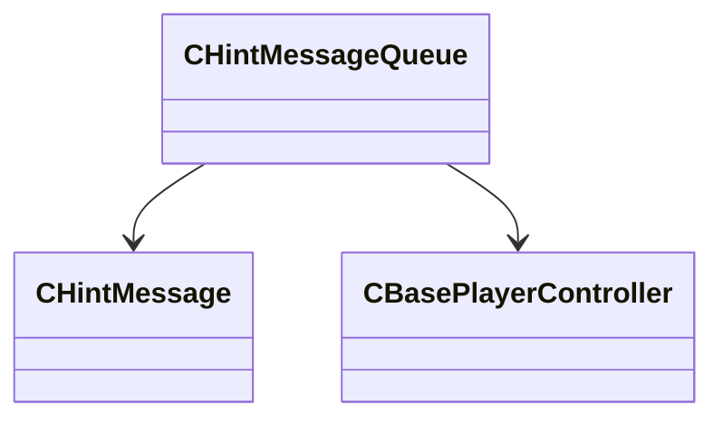

[Schemas](../../schemas.md) / [server](../server.md) / CHintMessageQueue

# CHintMessageQueue

**Kind:** class · **Size:** 40 bytes (`0x28`) · **Align:** 255 · **Module:** server

**Relationships:**

## Memory layout

3 fields (3 declared here, 0 inherited). Offsets are absolute from the object base.

| Offset | Field | Type | From | Annotations |
|--------|-------|------|------|-------------|
| `0x0` | `m_tmMessageEnd` | float32 |  |  |
| `0x8` | `m_messages` | CUtlVector< [CHintMessage](../server/CHintMessage.md)* > |  |  |
| `0x20` | `m_pPlayerController` | [CBasePlayerController](../server/CBasePlayerController.md)* |  |  |
