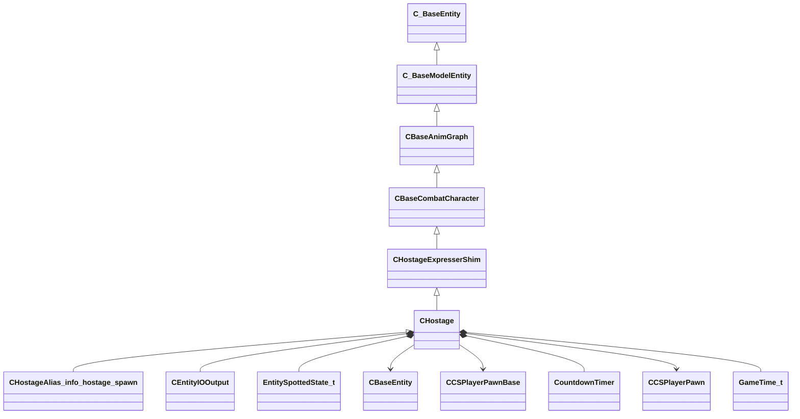

[Schemas](../../schemas.md) / [server](../server.md) / CHostage

# CHostage

Entity representing a hostage NPC in hostage-rescue game mode.  Each hostage has a simple navigation AI that follows the rescuing CT player.

**Kind:** class · **Size:** 11456 bytes (`0x2cc0`) · **Align:** 16 · **Module:** server

**Inherits from:** [CHostageExpresserShim](../server/CHostageExpresserShim.md)

**Derived by:** [CHostageAlias_info_hostage_spawn](../server/CHostageAlias_info_hostage_spawn.md)

**Relationships:**

## Memory layout

196 fields (39 declared here, 157 inherited). Offsets are absolute from the object base.

| Offset | Field | Type | From | Annotations |
|--------|-------|------|------|-------------|
| `0x8` | `m_iszPrivateVScripts` | CUtlSymbolLarge | [CEntityInstance](../entity2/CEntityInstance.md) |  |
| `0x10` | `m_pEntity` | [CEntityIdentity](../entity2/CEntityIdentity.md)* | [CEntityInstance](../entity2/CEntityInstance.md) |  |
| `0x28` | `m_CScriptComponent` | [CScriptComponent](../entity2/CScriptComponent.md)* | [CEntityInstance](../entity2/CEntityInstance.md) |  |
| `0x30` | `m_CBodyComponent` | [CBodyComponent](../server/CBodyComponent.md)* | [C_BaseEntity](../client/C_BaseEntity.md) |  |
| `0x38` | `m_NetworkTransmitComponent` | [CNetworkTransmitComponent](../server/CNetworkTransmitComponent.md) | [C_BaseEntity](../client/C_BaseEntity.md) | `MNotSaved` |
| `0x328` | `m_nLastThinkTick` | [GameTick_t](../entity2/GameTick_t.md) | [C_BaseEntity](../client/C_BaseEntity.md) | `MNotSaved` |
| `0x330` | `m_pGameSceneNode` | [CGameSceneNode](../server/CGameSceneNode.md)* | [C_BaseEntity](../client/C_BaseEntity.md) | `MNotSaved` |
| `0x338` | `m_pRenderComponent` | [CRenderComponent](../server/CRenderComponent.md)* | [C_BaseEntity](../client/C_BaseEntity.md) | `MNotSaved` |
| `0x340` | `m_pCollision` | [CCollisionProperty](../server/CCollisionProperty.md)* | [C_BaseEntity](../client/C_BaseEntity.md) | `MNotSaved` |
| `0x348` | `m_iMaxHealth` | int32 | [C_BaseEntity](../client/C_BaseEntity.md) | `MNotSaved` |
| `0x34c` | `m_iHealth` | int32 | [C_BaseEntity](../client/C_BaseEntity.md) |  |
| `0x350` | `m_flDamageAccumulator` | float32 | [C_BaseEntity](../client/C_BaseEntity.md) | `MNotSaved` |
| `0x354` | `m_lifeState` | uint8 | [C_BaseEntity](../client/C_BaseEntity.md) | `MNotSaved` |
| `0x355` | `m_bTakesDamage` | bool | [C_BaseEntity](../client/C_BaseEntity.md) | `MNotSaved` |
| `0x358` | `m_nTakeDamageFlags` | [TakeDamageFlags_t](../server/TakeDamageFlags_t.md) | [C_BaseEntity](../client/C_BaseEntity.md) | `MNotSaved` |
| `0x360` | `m_nPlatformType` | [EntityPlatformTypes_t](../server/EntityPlatformTypes_t.md) | [C_BaseEntity](../client/C_BaseEntity.md) |  |
| `0x361` | `m_ubInterpolationFrame` | uint8 | [C_BaseEntity](../client/C_BaseEntity.md) | `MNotSaved` |
| `0x364` | `m_hSceneObjectController` | CHandle< [C_BaseEntity](../client/C_BaseEntity.md) > | [C_BaseEntity](../client/C_BaseEntity.md) |  |
| `0x368` | `m_nNoInterpolationTick` | int32 | [C_BaseEntity](../client/C_BaseEntity.md) | `MNotSaved` |
| `0x36c` | `m_nVisibilityNoInterpolationTick` | int32 | [C_BaseEntity](../client/C_BaseEntity.md) | `MNotSaved` |
| `0x370` | `m_flProxyRandomValue` | float32 | [C_BaseEntity](../client/C_BaseEntity.md) | `MNotSaved` |
| `0x374` | `m_iEFlags` | int32 | [C_BaseEntity](../client/C_BaseEntity.md) | `MNotSaved` |
| `0x378` | `m_nWaterType` | uint8 | [C_BaseEntity](../client/C_BaseEntity.md) | `MNotSaved` |
| `0x379` | `m_bInterpolateEvenWithNoModel` | bool | [C_BaseEntity](../client/C_BaseEntity.md) | `MNotSaved` |
| `0x37a` | `m_bPredictionEligible` | bool | [C_BaseEntity](../client/C_BaseEntity.md) | `MNotSaved` |
| `0x37b` | `m_bApplyLayerMatchIDToModel` | bool | [C_BaseEntity](../client/C_BaseEntity.md) | `MNotSaved` |
| `0x37c` | `m_tokLayerMatchID` | CUtlStringToken | [C_BaseEntity](../client/C_BaseEntity.md) | `MNotSaved` |
| `0x380` | `m_nSubclassID` | CUtlStringToken | [C_BaseEntity](../client/C_BaseEntity.md) |  |
| `0x390` | `m_nSimulationTick` | int32 | [C_BaseEntity](../client/C_BaseEntity.md) | `MNotSaved` |
| `0x394` | `m_iCurrentThinkContext` | int32 | [C_BaseEntity](../client/C_BaseEntity.md) | `MNotSaved` |
| `0x398` | `m_aThinkFunctions` | CUtlVector< thinkfunc_t > | [C_BaseEntity](../client/C_BaseEntity.md) | `MNotSaved` |
| `0x3b0` | `m_bDisabledContextThinks` | bool | [C_BaseEntity](../client/C_BaseEntity.md) |  |
| `0x3b4` | `m_flAnimTime` | float32 | [C_BaseEntity](../client/C_BaseEntity.md) | `MNotSaved` |
| `0x3b8` | `m_flSimulationTime` | float32 | [C_BaseEntity](../client/C_BaseEntity.md) | `MNotSaved` |
| `0x3bc` | `m_nSceneObjectOverrideFlags` | uint8 | [C_BaseEntity](../client/C_BaseEntity.md) |  |
| `0x3bd` | `m_bHasSuccessfullyInterpolated` | bool | [C_BaseEntity](../client/C_BaseEntity.md) | `MNotSaved` |
| `0x3be` | `m_bHasAddedVarsToInterpolation` | bool | [C_BaseEntity](../client/C_BaseEntity.md) | `MNotSaved` |
| `0x3bf` | `m_bRenderEvenWhenNotSuccessfullyInterpolated` | bool | [C_BaseEntity](../client/C_BaseEntity.md) | `MNotSaved` |
| `0x3c0` | `m_nInterpolationLatchDirtyFlags` | int32[2] | [C_BaseEntity](../client/C_BaseEntity.md) | `MNotSaved` |
| `0x3c8` | `m_ListEntry` | uint16[11] | [C_BaseEntity](../client/C_BaseEntity.md) | `MNotSaved` |
| `0x3e0` | `m_flCreateTime` | [GameTime_t](../entity2/GameTime_t.md) | [C_BaseEntity](../client/C_BaseEntity.md) | `MNotSaved` |
| `0x3e4` | `m_EntClientFlags` | uint16 | [C_BaseEntity](../client/C_BaseEntity.md) | `MNotSaved` |
| `0x3e6` | `m_bClientSideRagdoll` | bool | [C_BaseEntity](../client/C_BaseEntity.md) | `MNotSaved` |
| `0x3e7` | `m_iTeamNum` | uint8 | [C_BaseEntity](../client/C_BaseEntity.md) | `MNotSaved` |
| `0x3e8` | `m_spawnflags` | uint32 | [C_BaseEntity](../client/C_BaseEntity.md) |  |
| `0x3ec` | `m_nNextThinkTick` | [GameTick_t](../entity2/GameTick_t.md) | [C_BaseEntity](../client/C_BaseEntity.md) | `MNotSaved` |
| `0x3f4` | `m_fFlags` | uint32 | [C_BaseEntity](../client/C_BaseEntity.md) | `MSaveBehavior` |
| `0x3f8` | `m_vecAbsVelocity` | Vector | [C_BaseEntity](../client/C_BaseEntity.md) | `MNotSaved` |
| `0x404` | `m_vecServerVelocity` | [CNetworkVelocityVector](../server/CNetworkVelocityVector.md) | [C_BaseEntity](../client/C_BaseEntity.md) | `MNotSaved` |
| `0x430` | `m_vecVelocity` | [CNetworkVelocityVector](../server/CNetworkVelocityVector.md) | [C_BaseEntity](../client/C_BaseEntity.md) |  |
| `0x510` | `m_vecBaseVelocity` | Vector | [C_BaseEntity](../client/C_BaseEntity.md) | `MNotSaved` |
| `0x51c` | `m_hEffectEntity` | CHandle< [C_BaseEntity](../client/C_BaseEntity.md) > | [C_BaseEntity](../client/C_BaseEntity.md) | `MNotSaved` |
| `0x520` | `m_hOwnerEntity` | CHandle< [C_BaseEntity](../client/C_BaseEntity.md) > | [C_BaseEntity](../client/C_BaseEntity.md) |  |
| `0x524` | `m_MoveCollide` | [MoveCollide_t](../server/MoveCollide_t.md) | [C_BaseEntity](../client/C_BaseEntity.md) | `MNotSaved` |
| `0x525` | `m_MoveType` | [MoveType_t](../server/MoveType_t.md) | [C_BaseEntity](../client/C_BaseEntity.md) |  |
| `0x526` | `m_nActualMoveType` | [MoveType_t](../server/MoveType_t.md) | [C_BaseEntity](../client/C_BaseEntity.md) |  |
| `0x528` | `m_flWaterLevel` | float32 | [C_BaseEntity](../client/C_BaseEntity.md) | `MNotSaved` |
| `0x52c` | `m_fEffects` | uint32 | [C_BaseEntity](../client/C_BaseEntity.md) | `MNotSaved` |
| `0x530` | `m_hGroundEntity` | CHandle< [C_BaseEntity](../client/C_BaseEntity.md) > | [C_BaseEntity](../client/C_BaseEntity.md) | `MNotSaved` |
| `0x534` | `m_nGroundBodyIndex` | int32 | [C_BaseEntity](../client/C_BaseEntity.md) | `MNotSaved` |
| `0x538` | `m_flFriction` | float32 | [C_BaseEntity](../client/C_BaseEntity.md) | `MNotSaved` |
| `0x53c` | `m_flElasticity` | float32 | [C_BaseEntity](../client/C_BaseEntity.md) | `MNotSaved` |
| `0x540` | `m_flGravityScale` | float32 | [C_BaseEntity](../client/C_BaseEntity.md) | `MNotSaved` |
| `0x544` | `m_flTimeScale` | float32 | [C_BaseEntity](../client/C_BaseEntity.md) | `MNotSaved` |
| `0x548` | `m_bAnimatedEveryTick` | bool | [C_BaseEntity](../client/C_BaseEntity.md) | `MNotSaved` |
| `0x549` | `m_bGravityDisabled` | bool | [C_BaseEntity](../client/C_BaseEntity.md) |  |
| `0x54c` | `m_flNavIgnoreUntilTime` | [GameTime_t](../entity2/GameTime_t.md) | [C_BaseEntity](../client/C_BaseEntity.md) | `MNotSaved` |
| `0x550` | `m_hThink` | uint16 | [C_BaseEntity](../client/C_BaseEntity.md) | `MNotSaved` |
| `0x560` | `m_fBBoxVisFlags` | uint8 | [C_BaseEntity](../client/C_BaseEntity.md) | `MNotSaved` |
| `0x564` | `m_flActualGravityScale` | float32 | [C_BaseEntity](../client/C_BaseEntity.md) |  |
| `0x568` | `m_bGravityActuallyDisabled` | bool | [C_BaseEntity](../client/C_BaseEntity.md) |  |
| `0x569` | `m_bPredictable` | bool | [C_BaseEntity](../client/C_BaseEntity.md) | `MNotSaved` |
| `0x56a` | `m_bRenderWithViewModels` | bool | [C_BaseEntity](../client/C_BaseEntity.md) |  |
| `0x56c` | `m_nFirstPredictableCommand` | int32 | [C_BaseEntity](../client/C_BaseEntity.md) | `MNotSaved` |
| `0x570` | `m_nLastPredictableCommand` | int32 | [C_BaseEntity](../client/C_BaseEntity.md) | `MNotSaved` |
| `0x574` | `m_hOldMoveParent` | CHandle< [C_BaseEntity](../client/C_BaseEntity.md) > | [C_BaseEntity](../client/C_BaseEntity.md) | `MNotSaved` |
| `0x578` | `m_Particles` | [CParticleProperty](../particleslib/CParticleProperty.md) | [C_BaseEntity](../client/C_BaseEntity.md) | `MNotSaved` |
| `0x5a8` | `m_vecAngVelocity` | QAngle | [C_BaseEntity](../client/C_BaseEntity.md) |  |
| `0x5b4` | `m_DataChangeEventRef` | int32 | [C_BaseEntity](../client/C_BaseEntity.md) | `MNotSaved` |
| `0x5b8` | `m_dependencies` | CUtlVector< CEntityHandle > | [C_BaseEntity](../client/C_BaseEntity.md) | `MNotSaved` |
| `0x5d0` | `m_nCreationTick` | int32 | [C_BaseEntity](../client/C_BaseEntity.md) | `MNotSaved` |
| `0x5e1` | `m_bAnimTimeChanged` | bool | [C_BaseEntity](../client/C_BaseEntity.md) | `MNotSaved` |
| `0x5e2` | `m_bSimulationTimeChanged` | bool | [C_BaseEntity](../client/C_BaseEntity.md) | `MNotSaved` |
| `0x5f0` | `m_sUniqueHammerID` | CUtlString | [C_BaseEntity](../client/C_BaseEntity.md) | `MNotSaved` |
| `0x5f8` | `m_nBloodType` | [BloodType](../server/BloodType.md) | [C_BaseEntity](../client/C_BaseEntity.md) |  |
| `0x960` | `m_bForceServerRagdoll` | bool | [CBaseCombatCharacter](../server/CBaseCombatCharacter.md) |  |
| `0x968` | `m_hMyWearables` | CNetworkUtlVectorBase< CHandle< [CEconWearable](../server/CEconWearable.md) > > | [CBaseCombatCharacter](../server/CBaseCombatCharacter.md) | `MNotSaved` |
| `0x980` | `m_impactEnergyScale` | float32 | [CBaseCombatCharacter](../server/CBaseCombatCharacter.md) |  |
| `0x984` | `m_bApplyStressDamage` | bool | [CBaseCombatCharacter](../server/CBaseCombatCharacter.md) |  |
| `0x985` | `m_bDeathEventsDispatched` | bool | [CBaseCombatCharacter](../server/CBaseCombatCharacter.md) |  |
| `0x9c8` | `m_vecRelationships` | CUtlVector< [RelationshipOverride_t](../server/RelationshipOverride_t.md) > | [CBaseCombatCharacter](../server/CBaseCombatCharacter.md) |  |
| `0x9e0` | `m_strRelationships` | CUtlSymbolLarge | [CBaseCombatCharacter](../server/CBaseCombatCharacter.md) |  |
| `0x9e8` | `m_eHull` | [Hull_t](../server/Hull_t.md) | [CBaseCombatCharacter](../server/CBaseCombatCharacter.md) |  |
| `0x9ec` | `m_nNavHullIdx` | uint32 | [CBaseCombatCharacter](../server/CBaseCombatCharacter.md) |  |
| `0x9f0` | `m_movementStats` | [CMovementStatsProperty](../server/CMovementStatsProperty.md) | [CBaseCombatCharacter](../server/CBaseCombatCharacter.md) |  |
| `0xa30` | `m_pExpresser` | [CAI_Expresser](../server/CAI_Expresser.md)* | [CHostageExpresserShim](../server/CHostageExpresserShim.md) |  |
| `0xa58` | `m_OnHostageBeginGrab` | [CEntityIOOutput](../entity2/CEntityIOOutput.md) |  |  |
| `0xa70` | `m_OnFirstPickedUp` | [CEntityIOOutput](../entity2/CEntityIOOutput.md) |  |  |
| `0xa88` | `m_OnDroppedNotRescued` | [CEntityIOOutput](../entity2/CEntityIOOutput.md) |  |  |
| `0xaa0` | `m_OnRescued` | [CEntityIOOutput](../entity2/CEntityIOOutput.md) |  |  |
| `0xab8` | `m_entitySpottedState` | [EntitySpottedState_t](../server/EntitySpottedState_t.md) |  | EntitySpottedState_t tracking which players have spotted (radar dot) this hostage. |
| `0xad0` | `m_nSpotRules` | int32 |  |  |
| `0xad4` | `m_uiHostageSpawnExclusionGroupMask` | uint32 |  |  |
| `0xad8` | `m_nHostageSpawnRandomFactor` | uint32 |  |  |
| `0xadc` | `m_bRemove` | bool |  |  |
| `0xae0` | `m_vel` | Vector |  | Current velocity vector of the hostage entity. |
| `0xaec` | `m_isRescued` | bool |  | True after the hostage has been delivered to the rescue zone. |
| `0xaed` | `m_jumpedThisFrame` | bool |  | True if the hostage jumped this tick (used to trigger jump animation). |
| `0xaf0` | `m_nHostageState` | int32 |  | State enum: 0 = Idle, 1 = Being grabbed, 2 = Being carried, 3 = Rescued, 4 = Dead. |
| `0xaf0` | `m_CRenderComponent` | [CRenderComponent](../server/CRenderComponent.md)* | [C_BaseModelEntity](../client/C_BaseModelEntity.md) | `MNotSaved` |
| `0xaf4` | `m_leader` | CHandle< [CBaseEntity](../server/CBaseEntity.md) > |  | CHandle to the entity (usually CCSPlayerPawn) that is currently leading this hostage. |
| `0xaf8` | `m_lastLeader` | CHandle< [CCSPlayerPawnBase](../server/CCSPlayerPawnBase.md) > |  |  |
| `0xaf8` | `m_CHitboxComponent` | [CHitboxComponent](../server/CHitboxComponent.md) | [C_BaseModelEntity](../client/C_BaseModelEntity.md) |  |
| `0xb00` | `m_reuseTimer` | [CountdownTimer](../server/CountdownTimer.md) |  | CountdownTimer preventing another player from grabbing this hostage too quickly after it was released. |
| `0xb10` | `m_pChoreoComponent` | [CChoreoComponent](../server/CChoreoComponent.md)* | [C_BaseModelEntity](../client/C_BaseModelEntity.md) |  |
| `0xb18` | `m_hasBeenUsed` | bool |  |  |
| `0xb18` | `m_nDestructiblePartInitialStateDestructed0` | [HitGroup_t](../server/HitGroup_t.md) | [C_BaseModelEntity](../client/C_BaseModelEntity.md) |  |
| `0xb1c` | `m_accel` | Vector |  |  |
| `0xb1c` | `m_nDestructiblePartInitialStateDestructed1` | [HitGroup_t](../server/HitGroup_t.md) | [C_BaseModelEntity](../client/C_BaseModelEntity.md) |  |
| `0xb20` | `m_nDestructiblePartInitialStateDestructed2` | [HitGroup_t](../server/HitGroup_t.md) | [C_BaseModelEntity](../client/C_BaseModelEntity.md) |  |
| `0xb24` | `m_nDestructiblePartInitialStateDestructed3` | [HitGroup_t](../server/HitGroup_t.md) | [C_BaseModelEntity](../client/C_BaseModelEntity.md) |  |
| `0xb28` | `m_isRunning` | bool |  |  |
| `0xb28` | `m_nDestructiblePartInitialStateDestructed4` | [HitGroup_t](../server/HitGroup_t.md) | [C_BaseModelEntity](../client/C_BaseModelEntity.md) |  |
| `0xb29` | `m_isCrouching` | bool |  |  |
| `0xb2c` | `m_nDestructiblePartInitialStateDestructed0_PartIndex` | int32 | [C_BaseModelEntity](../client/C_BaseModelEntity.md) |  |
| `0xb30` | `m_jumpTimer` | [CountdownTimer](../server/CountdownTimer.md) |  |  |
| `0xb30` | `m_nDestructiblePartInitialStateDestructed1_PartIndex` | int32 | [C_BaseModelEntity](../client/C_BaseModelEntity.md) |  |
| `0xb34` | `m_nDestructiblePartInitialStateDestructed2_PartIndex` | int32 | [C_BaseModelEntity](../client/C_BaseModelEntity.md) |  |
| `0xb38` | `m_nDestructiblePartInitialStateDestructed3_PartIndex` | int32 | [C_BaseModelEntity](../client/C_BaseModelEntity.md) |  |
| `0xb3c` | `m_nDestructiblePartInitialStateDestructed4_PartIndex` | int32 | [C_BaseModelEntity](../client/C_BaseModelEntity.md) |  |
| `0xb40` | `m_bDestructiblePartInitialStateDestructed0_GenerateBreakpieces` | bool | [C_BaseModelEntity](../client/C_BaseModelEntity.md) |  |
| `0xb41` | `m_bDestructiblePartInitialStateDestructed1_GenerateBreakpieces` | bool | [C_BaseModelEntity](../client/C_BaseModelEntity.md) |  |
| `0xb42` | `m_bDestructiblePartInitialStateDestructed2_GenerateBreakpieces` | bool | [C_BaseModelEntity](../client/C_BaseModelEntity.md) |  |
| `0xb43` | `m_bDestructiblePartInitialStateDestructed3_GenerateBreakpieces` | bool | [C_BaseModelEntity](../client/C_BaseModelEntity.md) |  |
| `0xb44` | `m_bDestructiblePartInitialStateDestructed4_GenerateBreakpieces` | bool | [C_BaseModelEntity](../client/C_BaseModelEntity.md) |  |
| `0xb48` | `m_isWaitingForLeader` | bool |  |  |
| `0xb48` | `m_pDestructiblePartsSystemComponent` | [CDestructiblePartsComponent](../server/CDestructiblePartsComponent.md)* | [C_BaseModelEntity](../client/C_BaseModelEntity.md) |  |
| `0xc70` | `m_bInitModelEffects` | bool | [C_BaseModelEntity](../client/C_BaseModelEntity.md) | `MNotSaved` |
| `0xc71` | `m_bDoingModelEffects` | bool | [C_BaseModelEntity](../client/C_BaseModelEntity.md) | `MNotSaved` |
| `0xc74` | `m_iOldHealth` | int32 | [C_BaseModelEntity](../client/C_BaseModelEntity.md) | `MNotSaved` |
| `0xc78` | `m_nRenderMode` | [RenderMode_t](../server/RenderMode_t.md) | [C_BaseModelEntity](../client/C_BaseModelEntity.md) |  |
| `0xc79` | `m_nRenderFX` | [RenderFx_t](../server/RenderFx_t.md) | [C_BaseModelEntity](../client/C_BaseModelEntity.md) |  |
| `0xc7a` | `m_bAllowFadeInView` | bool | [C_BaseModelEntity](../client/C_BaseModelEntity.md) |  |
| `0xc98` | `m_clrRender` | Color | [C_BaseModelEntity](../client/C_BaseModelEntity.md) |  |
| `0xca0` | `m_vecRenderAttributes` | C_UtlVectorEmbeddedNetworkVar< [EntityRenderAttribute_t](../server/EntityRenderAttribute_t.md) > | [C_BaseModelEntity](../client/C_BaseModelEntity.md) |  |
| `0xd20` | `m_bRenderToCubemaps` | bool | [C_BaseModelEntity](../client/C_BaseModelEntity.md) |  |
| `0xd21` | `m_bNoInterpolate` | bool | [C_BaseModelEntity](../client/C_BaseModelEntity.md) |  |
| `0xd28` | `m_Collision` | [CCollisionProperty](../server/CCollisionProperty.md) | [C_BaseModelEntity](../client/C_BaseModelEntity.md) |  |
| `0xde0` | `m_Glow` | [CGlowProperty](../server/CGlowProperty.md) | [C_BaseModelEntity](../client/C_BaseModelEntity.md) |  |
| `0xe38` | `m_flGlowBackfaceMult` | float32 | [C_BaseModelEntity](../client/C_BaseModelEntity.md) |  |
| `0xe3c` | `m_fadeMinDist` | float32 | [C_BaseModelEntity](../client/C_BaseModelEntity.md) |  |
| `0xe40` | `m_fadeMaxDist` | float32 | [C_BaseModelEntity](../client/C_BaseModelEntity.md) |  |
| `0xe44` | `m_flFadeScale` | float32 | [C_BaseModelEntity](../client/C_BaseModelEntity.md) |  |
| `0xe48` | `m_flShadowStrength` | float32 | [C_BaseModelEntity](../client/C_BaseModelEntity.md) |  |
| `0xe4c` | `m_nObjectCulling` | uint8 | [C_BaseModelEntity](../client/C_BaseModelEntity.md) |  |
| `0xe4d` | `m_nRequiredDecalRtEncoding` | [DecalRtEncoding_t](../scenesystem/DecalRtEncoding_t.md) | [C_BaseModelEntity](../client/C_BaseModelEntity.md) |  |
| `0xe50` | `m_bodyGroupChoices` | CUtlOrderedMap< CGlobalSymbol, int32 > | [C_BaseModelEntity](../client/C_BaseModelEntity.md) |  |
| `0xe78` | `m_vecViewOffset` | [CNetworkViewOffsetVector](../server/CNetworkViewOffsetVector.md) | [C_BaseModelEntity](../client/C_BaseModelEntity.md) |  |
| `0xf58` | `m_pClientAlphaProperty` | [CClientAlphaProperty](../client/CClientAlphaProperty.md)* | [C_BaseModelEntity](../client/C_BaseModelEntity.md) | `MNotSaved` |
| `0xf60` | `m_ClientOverrideTint` | Color | [C_BaseModelEntity](../client/C_BaseModelEntity.md) | `MNotSaved` |
| `0xf64` | `m_bUseClientOverrideTint` | bool | [C_BaseModelEntity](../client/C_BaseModelEntity.md) | `MNotSaved` |
| `0xfa0` | `m_bvDisabledHitGroups` | uint32[1] | [C_BaseModelEntity](../client/C_BaseModelEntity.md) | `MKV3TransferSaveOpsForField GetHitgroupDisableListSaveRestoreOps` |
| `0xfb0` | `m_graphControllerManager` | [CAnimGraphControllerManager](../server/CAnimGraphControllerManager.md) | [CBaseAnimGraph](../server/CBaseAnimGraph.md) |  |
| `0x1048` | `m_pMainGraphController` | [CAnimGraphControllerPtr](../server/CAnimGraphControllerPtr.md) | [CBaseAnimGraph](../server/CBaseAnimGraph.md) |  |
| `0x1050` | `m_bInitiallyPopulateInterpHistory` | bool | [CBaseAnimGraph](../server/CBaseAnimGraph.md) |  |
| `0x1052` | `m_bSuppressAnimEventSounds` | bool | [CBaseAnimGraph](../server/CBaseAnimGraph.md) |  |
| `0x1058` | `m_OnLayerCycleUpdated` | CEntityOutputTemplate< float32 > | [CBaseAnimGraph](../server/CBaseAnimGraph.md) |  |
| `0x1078` | `m_OnExternalChoreoGraphChanged` | [CEntityIOOutput](../entity2/CEntityIOOutput.md) | [CBaseAnimGraph](../server/CBaseAnimGraph.md) |  |
| `0x1098` | `m_bAnimGraphUpdateEnabled` | bool | [CBaseAnimGraph](../server/CBaseAnimGraph.md) |  |
| `0x1099` | `m_bAnimationUpdateScheduled` | bool | [CBaseAnimGraph](../server/CBaseAnimGraph.md) | `MNotSaved` |
| `0x109c` | `m_vecForce` | Vector | [CBaseAnimGraph](../server/CBaseAnimGraph.md) | `MNotSaved` |
| `0x10a8` | `m_nForceBone` | int32 | [CBaseAnimGraph](../server/CBaseAnimGraph.md) | `MNotSaved` |
| `0x10b0` | `m_pClientsideRagdoll` | [CBaseAnimGraph](../server/CBaseAnimGraph.md)* | [CBaseAnimGraph](../server/CBaseAnimGraph.md) | `MNotSaved` |
| `0x10b8` | `m_bBuiltRagdoll` | bool | [CBaseAnimGraph](../server/CBaseAnimGraph.md) | `MNotSaved` |
| `0x10c8` | `m_pRagdollControl` | [IPhysicsRagdollControl](../vphysics2/IPhysicsRagdollControl.md)* | [CBaseAnimGraph](../server/CBaseAnimGraph.md) | `MPhysPtr` |
| `0x10d0` | `m_RagdollPose` | [PhysicsRagdollPose_t](../server/PhysicsRagdollPose_t.md) | [CBaseAnimGraph](../server/CBaseAnimGraph.md) |  |
| `0x1118` | `m_bRagdollEnabled` | bool | [CBaseAnimGraph](../server/CBaseAnimGraph.md) |  |
| `0x1119` | `m_bRagdollClientSide` | bool | [CBaseAnimGraph](../server/CBaseAnimGraph.md) | `MNotSaved` |
| `0x1128` | `m_bHasAnimatedMaterialAttributes` | bool | [CBaseAnimGraph](../server/CBaseAnimGraph.md) | `MNotSaved` |
| `0x2b58` | `m_repathTimer` | [CountdownTimer](../server/CountdownTimer.md) |  |  |
| `0x2b70` | `m_inhibitDoorTimer` | [CountdownTimer](../server/CountdownTimer.md) |  |  |
| `0x2c00` | `m_inhibitObstacleAvoidanceTimer` | [CountdownTimer](../server/CountdownTimer.md) |  |  |
| `0x2c20` | `m_wiggleTimer` | [CountdownTimer](../server/CountdownTimer.md) |  |  |
| `0x2c3c` | `m_isAdjusted` | bool |  |  |
| `0x2c3d` | `m_bHandsHaveBeenCut` | bool |  | True once a CT has interacted with this hostage to free it (deprecated mechanic from CS:GO; retained for compatibility). |
| `0x2c40` | `m_hHostageGrabber` | CHandle< [CCSPlayerPawn](../server/CCSPlayerPawn.md) > |  | CHandle to the CCSPlayerPawn currently grabbing/carrying this hostage. |
| `0x2c44` | `m_fLastGrabTime` | [GameTime_t](../entity2/GameTime_t.md) |  |  |
| `0x2c48` | `m_vecPositionWhenStartedDroppingToGround` | VectorWS |  |  |
| `0x2c54` | `m_vecGrabbedPos` | VectorWS |  |  |
| `0x2c60` | `m_flRescueStartTime` | [GameTime_t](../entity2/GameTime_t.md) |  | GameTime at which the current rescue attempt began. |
| `0x2c64` | `m_flGrabSuccessTime` | [GameTime_t](../entity2/GameTime_t.md) |  | GameTime at which the grab interaction successfully completed and carrying began. |
| `0x2c68` | `m_flDropStartTime` | [GameTime_t](../entity2/GameTime_t.md) |  | GameTime at which the carrier started dropping the hostage. |
| `0x2c6c` | `m_nApproachRewardPayouts` | int32 |  |  |
| `0x2c70` | `m_nPickupEventCount` | int32 |  |  |
| `0x2c74` | `m_vecSpawnGroundPos` | VectorWS |  |  |
| `0x2cac` | `m_vecHostageResetPosition` | VectorWS |  |  |
