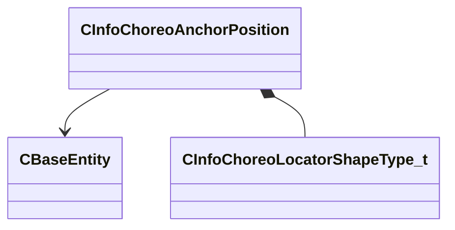

[Schemas](../../schemas.md) / [server](../server.md) / CInfoChoreoAnchorPosition

# CInfoChoreoAnchorPosition

> Source: **Build 25000182** · 2026-08-28 · `windows-x86_64` · schema `0.10.0`

**Kind:** class · **Size:** 80 bytes (`0x50`) · **Align:** 16 · **Module:** server

**Relationships:**

## Memory layout

8 fields (8 declared here, 0 inherited). Offsets are absolute from the object base.

| Offset | Field | Type | From | Annotations |
|--------|-------|------|------|-------------|
| `0x0` | `m_vOriginLS` | Vector |  |  |
| `0x10` | `m_qAnglesLS` | Quaternion |  |  |
| `0x20` | `m_vExtentsMin` | Vector |  |  |
| `0x2c` | `m_vExtentsMax` | Vector |  |  |
| `0x38` | `m_flRadius` | float32 |  |  |
| `0x3c` | `m_bOnlyWarpPosition` | bool |  |  |
| `0x40` | `m_hParent` | CHandle< [CBaseEntity](../server/CBaseEntity.md) > |  |  |
| `0x44` | `m_nShapeType` | [CInfoChoreoLocatorShapeType_t](../server/CInfoChoreoLocatorShapeType_t.md) |  |  |

KV3 class defaults

<pre>{
	&quot;m_vOriginLS&quot;:
	[
		0.000000,
		0.000000,
		0.000000
	],
	&quot;m_qAnglesLS&quot;:
	[
		0.000000,
		0.000000,
		0.000000,
		0.000000
	],
	&quot;m_vExtentsMin&quot;:
	[
		0.000000,
		-20.000000,
		0.000000
	],
	&quot;m_vExtentsMax&quot;:
	[
		0.000000,
		20.000000,
		0.000000
	],
	&quot;m_flRadius&quot;: 12.000000,
	&quot;m_bOnlyWarpPosition&quot;: false,
	&quot;m_hParent&quot;: null,
	&quot;m_nShapeType&quot;: &quot;POINT&quot;
}</pre>

