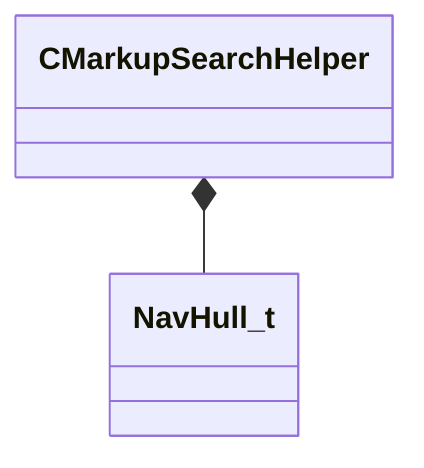

[Schemas](../../schemas.md) / [server](../server.md) / CMarkupSearchHelper

# CMarkupSearchHelper

**Kind:** class · **Size:** 688 bytes (`0x2b0`) · **Align:** 255 · **Module:** server

**Relationships:**

## Memory layout

7 fields (7 declared here, 0 inherited). Offsets are absolute from the object base.

| Offset | Field | Type | From | Annotations |
|--------|-------|------|------|-------------|
| `0x0` | `m_navHull` | [NavHull_t](../navlib/NavHull_t.md) |  |  |
| `0x8` | `m_tagString` | CUtlString |  |  |
| `0x10` | `m_nameString` | CUtlString |  |  |
| `0x18` | `m_vRefPos` | VectorWS |  |  |
| `0x24` | `m_bRefPosSet` | bool |  |  |
| `0x25` | `m_bUseStepHeight` | bool |  |  |
| `0x26` | `m_bActive` | bool |  |  |
