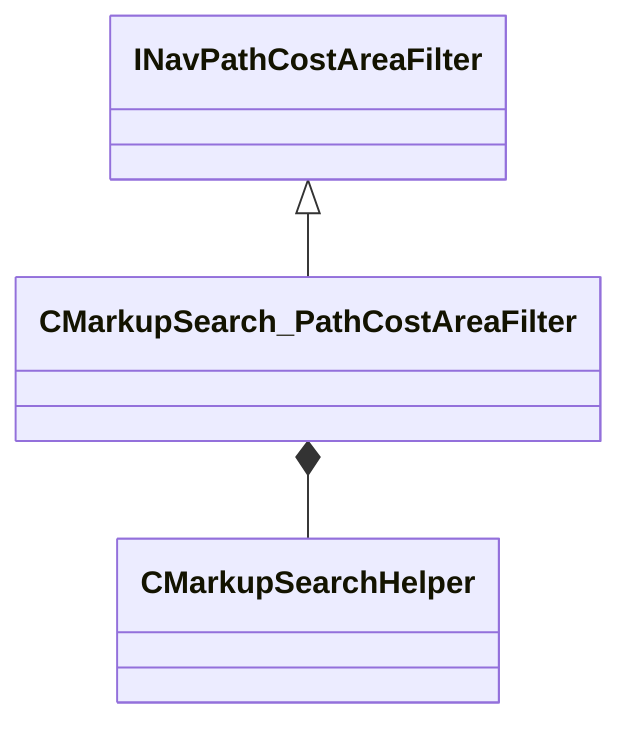

[Schemas](../../schemas.md) / [server](../server.md) / CMarkupSearch_PathCostAreaFilter

# CMarkupSearch_PathCostAreaFilter

**Kind:** class · **Size:** 696 bytes (`0x2b8`) · **Align:** 255 · **Module:** server

**Inherits from:** [INavPathCostAreaFilter](../server/INavPathCostAreaFilter.md)

**Relationships:**

## Memory layout

1 fields (1 declared here, 0 inherited). Offsets are absolute from the object base.

| Offset | Field | Type | From | Annotations |
|--------|-------|------|------|-------------|
| `0x8` | `m_searchHelper` | [CMarkupSearchHelper](../server/CMarkupSearchHelper.md) |  |  |
