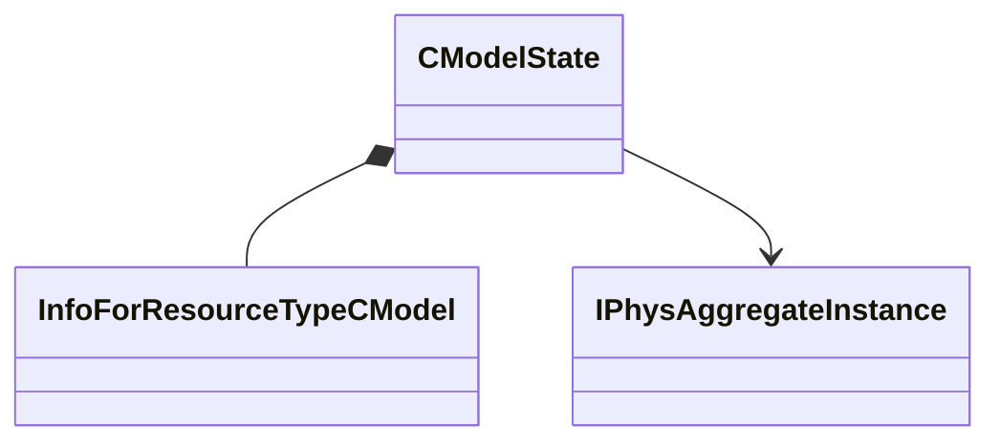

[Schemas](../../schemas.md) / [server](../server.md) / CModelState

# CModelState

**Kind:** class · **Size:** 656 bytes (`0x290`) · **Align:** 255 · **Module:** server

**Relationships:**

## Memory layout

14 fields (14 declared here, 0 inherited). Offsets are absolute from the object base.

| Offset | Field | Type | From | Annotations |
|--------|-------|------|------|-------------|
| `0xa0` | `m_hModel` | CStrongHandle< [InfoForResourceTypeCModel](../resourcesystem/InfoForResourceTypeCModel.md) > |  |  |
| `0xa8` | `m_ModelName` | CUtlSymbolLarge |  |  |
| `0xe0` | `m_pVPhysicsAggregate` | [IPhysAggregateInstance](../vphysics2/IPhysAggregateInstance.md)* |  | `MPhysPtr` |
| `0xe8` | `m_flRootBoneOffset_x` | float32 |  |  |
| `0xec` | `m_flRootBoneOffset_y` | float32 |  |  |
| `0xf0` | `m_flRootBoneOffset_z` | float32 |  |  |
| `0xf4` | `m_nRootBoneOffsetResetSerialNumber` | uint8 |  |  |
| `0xf5` | `m_bClientClothCreationSuppressed` | bool |  |  |
| `0x1e0` | `m_nAnimStateNoInterpSerialNumber` | uint8 |  |  |
| `0x1e8` | `m_MeshGroupMask` | uint64 |  |  |
| `0x238` | `m_nBodyGroupChoices` | CNetworkUtlVectorBase< int32 > |  |  |
| `0x282` | `m_nIdealMotionType` | int8 |  |  |
| `0x283` | `m_nForceLOD` | int8 |  |  |
| `0x284` | `m_nClothUpdateFlags` | int8 |  |  |
