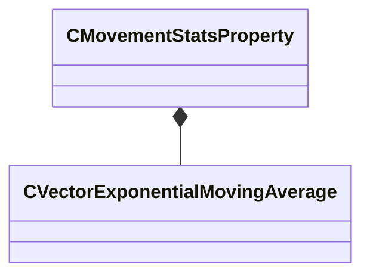

[Schemas](../../schemas.md) / [server](../server.md) / CMovementStatsProperty

# CMovementStatsProperty

**Kind:** class · **Size:** 64 bytes (`0x40`) · **Align:** 8 · **Module:** server

**Relationships:**

## Memory layout

2 fields (2 declared here, 0 inherited). Offsets are absolute from the object base.

| Offset | Field | Type | From | Annotations |
|--------|-------|------|------|-------------|
| `0x10` | `m_nUseCounter` | int32 |  |  |
| `0x14` | `m_emaMovementDirection` | [CVectorExponentialMovingAverage](../server/CVectorExponentialMovingAverage.md) |  |  |

KV3 class defaults

<pre>{
	&quot;_class&quot;: &quot;CMovementStatsProperty&quot;,
	&quot;m_nUseCounter&quot;: 0,
	&quot;m_emaMovementDirection&quot;:
	{
		&quot;m_nSampleCount&quot;: 0,
		&quot;m_nMaxSampleCount&quot;: 0,
		&quot;m_previousSample&quot;:
		[
			0.000000,
			0.000000,
			0.000000
		],
		&quot;m_average&quot;:
		[
			0.000000,
			0.000000,
			0.000000
		],
		&quot;m_averageDelta&quot;:
		[
			0.000000,
			0.000000,
			0.000000
		]
	}
}</pre>

