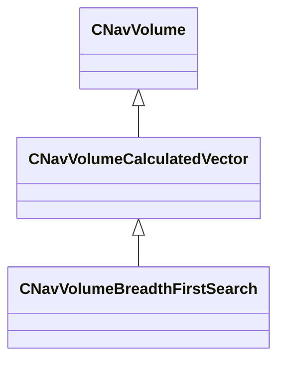

[Schemas](../../schemas.md) / [server](../server.md) / CNavVolumeBreadthFirstSearch

# CNavVolumeBreadthFirstSearch

**Kind:** class · **Size:** 192 bytes (`0xc0`) · **Align:** 255 · **Module:** server

**Inherits from:** [CNavVolumeCalculatedVector](../server/CNavVolumeCalculatedVector.md)

**Relationships:**

## Memory layout

2 fields (2 declared here, 0 inherited). Offsets are absolute from the object base.

| Offset | Field | Type | From | Annotations |
|--------|-------|------|------|-------------|
| `0xa8` | `m_vStartPos` | VectorWS |  |  |
| `0xb4` | `m_flSearchDist` | float32 |  |  |
