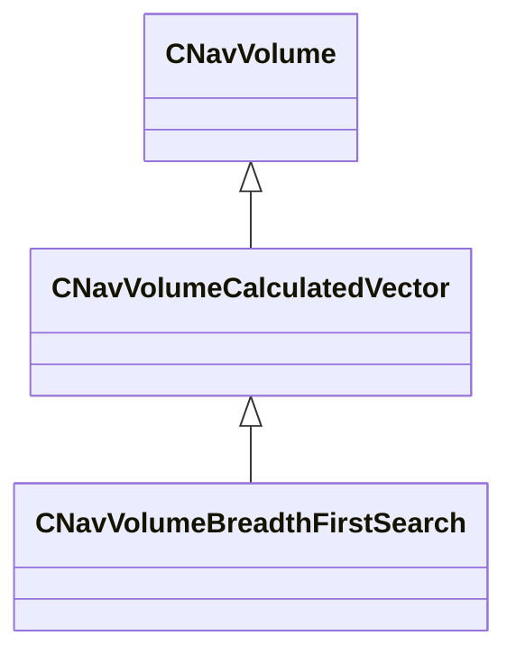

[Schemas](../../schemas.md) / [server](../server.md) / CNavVolumeCalculatedVector

# CNavVolumeCalculatedVector

> Source: **Build 25000182** · 2026-08-28 · `windows-x86_64` · schema `0.10.0`

**Kind:** class · **Size:** 160 bytes (`0xa0`) · **Align:** n/a (unspecified) · **Module:** server

**Inherits from:** [CNavVolume](../navlib/CNavVolume.md)

**Derived by:** [CNavVolumeBreadthFirstSearch](../server/CNavVolumeBreadthFirstSearch.md)

**Relationships:**

## Memory layout

No schema-visible fields (160 bytes of opaque storage).
