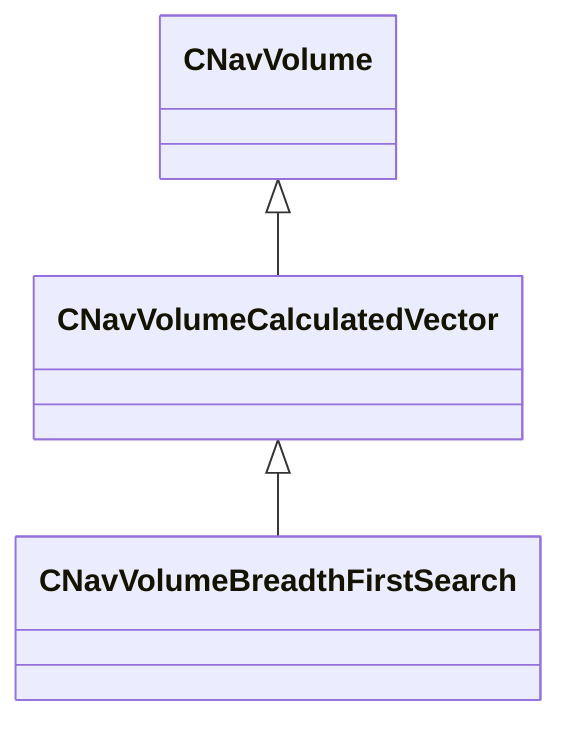

[Schemas](../../schemas.md) / [server](../server.md) / CNavVolumeCalculatedVector

# CNavVolumeCalculatedVector

**Kind:** class · **Size:** 160 bytes (`0xa0`) · **Align:** 255 · **Module:** server

**Inherits from:** [CNavVolume](../navlib/CNavVolume.md)

**Derived by:** [CNavVolumeBreadthFirstSearch](../server/CNavVolumeBreadthFirstSearch.md)

**Relationships:**

