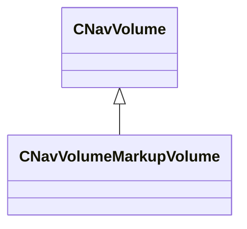

[Schemas](../../schemas.md) / [server](../server.md) / CNavVolumeMarkupVolume

# CNavVolumeMarkupVolume

**Kind:** class · **Size:** 224 bytes (`0xe0`) · **Align:** 255 · **Module:** server

**Inherits from:** [CNavVolume](../navlib/CNavVolume.md)

**Relationships:**

