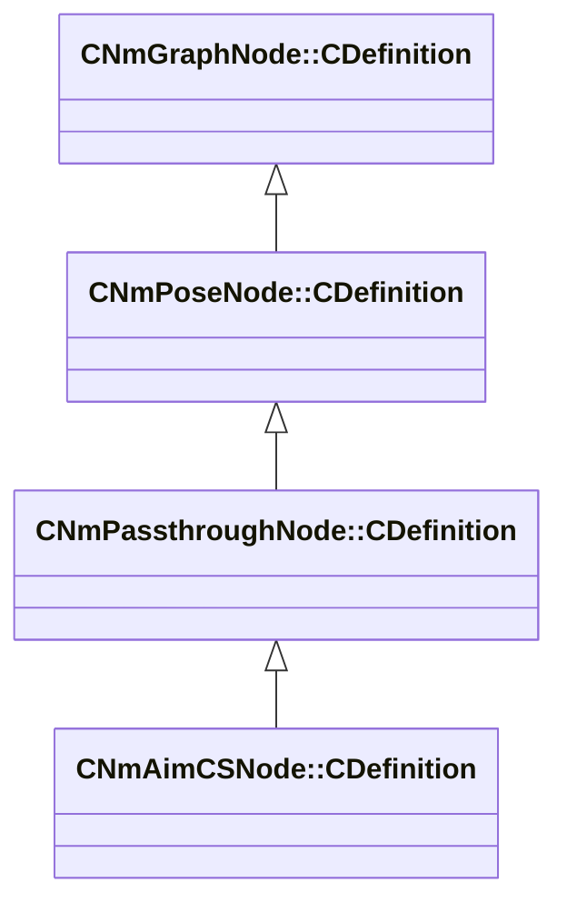

[Schemas](../../schemas.md) / [server](../server.md) / CNmAimCSNode::CDefinition

# CNmAimCSNode::CDefinition

> Source: **Build 25000182** · 2026-08-28 · `windows-x86_64` · schema `0.10.0`

**Kind:** class · **Size:** 56 bytes (`0x38`) · **Align:** 8 · **Module:** server

**Inherits from:** [CNmPassthroughNode::CDefinition](../animlib/CNmPassthroughNode.CDefinition.md)

**Relationships:**

## Memory layout

13 fields (11 declared here, 2 inherited). Offsets are absolute from the object base.

| Offset | Field | Type | From | Annotations |
|--------|-------|------|------|-------------|
| `0x8` | `m_nNodeIdx` | int16 | [CNmGraphNode::CDefinition](../animlib/CNmGraphNode.CDefinition.md) |  |
| `0x10` | `m_nChildNodeIdx` | int16 | [CNmPassthroughNode::CDefinition](../animlib/CNmPassthroughNode.CDefinition.md) |  |
| `0x18` | `m_nVerticalAngleNodeIdx` | int16 |  |  |
| `0x1a` | `m_nHorizontalAngleNodeIdx` | int16 |  |  |
| `0x1c` | `m_nWeaponCategoryNodeIdx` | int16 |  |  |
| `0x1e` | `m_nWeaponTypeNodeIdx` | int16 |  |  |
| `0x20` | `m_nWeaponActionNodeIdx` | int16 |  |  |
| `0x22` | `m_nWeaponDropNodeIdx` | int16 |  |  |
| `0x24` | `m_nIsDefusingNodeIdx` | int16 |  |  |
| `0x26` | `m_nCrouchWeightNodeIdx` | int16 |  |  |
| `0x28` | `m_flHandIKBlendInTimeSeconds` | float32 |  |  |
| `0x2c` | `m_flActionBlendTimeSeconds` | float32 |  |  |
| `0x30` | `m_flPlantingBlendTimeSeconds` | float32 |  |  |

KV3 class defaults

<pre>{
	&quot;_class&quot;: &quot;CNmAimCSNode::CDefinition&quot;,
	&quot;m_nNodeIdx&quot;: -1,
	&quot;m_nChildNodeIdx&quot;: -1,
	&quot;m_nVerticalAngleNodeIdx&quot;: -1,
	&quot;m_nHorizontalAngleNodeIdx&quot;: -1,
	&quot;m_nWeaponCategoryNodeIdx&quot;: -1,
	&quot;m_nWeaponTypeNodeIdx&quot;: -1,
	&quot;m_nWeaponActionNodeIdx&quot;: -1,
	&quot;m_nWeaponDropNodeIdx&quot;: -1,
	&quot;m_nIsDefusingNodeIdx&quot;: -1,
	&quot;m_nCrouchWeightNodeIdx&quot;: -1,
	&quot;m_flHandIKBlendInTimeSeconds&quot;: 0.000000,
	&quot;m_flActionBlendTimeSeconds&quot;: 0.000000,
	&quot;m_flPlantingBlendTimeSeconds&quot;: 0.000000
}</pre>

