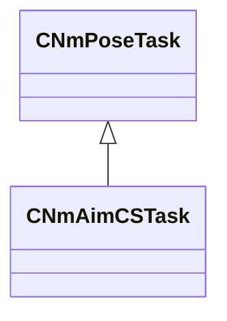

[Schemas](../../schemas.md) / [server](../server.md) / CNmAimCSTask

# CNmAimCSTask

**Kind:** class · **Size:** 304 bytes (`0x130`) · **Align:** 16 · **Module:** server

**Inherits from:** [CNmPoseTask](../animlib/CNmPoseTask.md)

**Relationships:**

