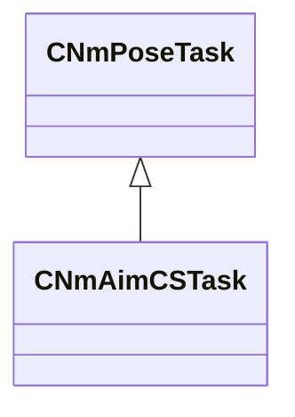

[Schemas](../../schemas.md) / [server](../server.md) / CNmAimCSTask

# CNmAimCSTask

> Source: **Build 25000182** · 2026-08-28 · `windows-x86_64` · schema `0.10.0`

**Kind:** class · **Size:** 304 bytes (`0x130`) · **Align:** 16 · **Module:** server

**Inherits from:** [CNmPoseTask](../animlib/CNmPoseTask.md)

**Relationships:**

## Memory layout

No schema-visible fields (304 bytes of opaque storage).
