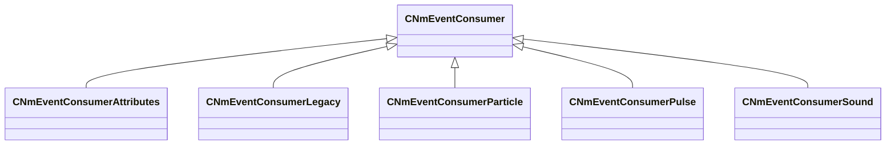

[Schemas](../../schemas.md) / [server](../server.md) / CNmEventConsumer

# CNmEventConsumer

> Source: **Build 25000182** · 2026-08-28 · `windows-x86_64` · schema `0.10.0`

**Kind:** class · **Size:** 176 bytes (`0xb0`) · **Align:** n/a (unspecified) · **Module:** server

**Derived by:** [CNmEventConsumerAttributes](../server/CNmEventConsumerAttributes.md), [CNmEventConsumerLegacy](../server/CNmEventConsumerLegacy.md), [CNmEventConsumerParticle](../server/CNmEventConsumerParticle.md), [CNmEventConsumerPulse](../server/CNmEventConsumerPulse.md), [CNmEventConsumerSound](../server/CNmEventConsumerSound.md)

**Relationships:**

## Memory layout

No schema-visible fields (176 bytes of opaque storage).
