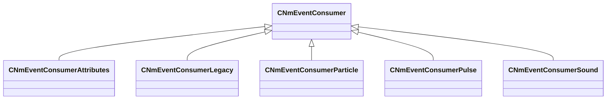

[Schemas](../../schemas.md) / [server](../server.md) / CNmEventConsumer

# CNmEventConsumer

**Kind:** class · **Size:** 176 bytes (`0xb0`) · **Align:** 255 · **Module:** server

**Derived by:** [CNmEventConsumerAttributes](../server/CNmEventConsumerAttributes.md), [CNmEventConsumerLegacy](../server/CNmEventConsumerLegacy.md), [CNmEventConsumerParticle](../server/CNmEventConsumerParticle.md), [CNmEventConsumerPulse](../server/CNmEventConsumerPulse.md), [CNmEventConsumerSound](../server/CNmEventConsumerSound.md)

**Relationships:**

