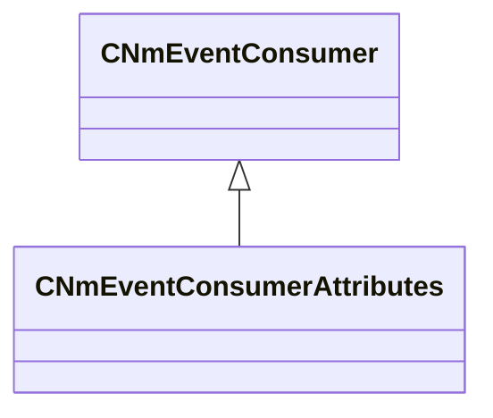

[Schemas](../../schemas.md) / [server](../server.md) / CNmEventConsumerAttributes

# CNmEventConsumerAttributes

**Kind:** class · **Size:** 176 bytes (`0xb0`) · **Align:** 8 · **Module:** server

**Inherits from:** [CNmEventConsumer](../server/CNmEventConsumer.md)

**Relationships:**

KV3 class defaults

<pre>{
	&quot;_class&quot;: &quot;CNmEventConsumerAttributes&quot;
}</pre>

