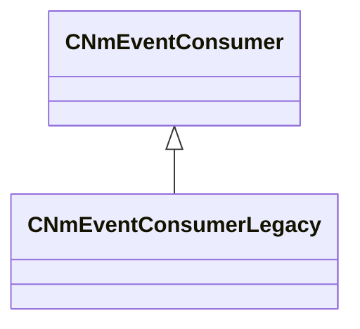

[Schemas](../../schemas.md) / [server](../server.md) / CNmEventConsumerLegacy

# CNmEventConsumerLegacy

> Source: **Build 25000182** · 2026-08-28 · `windows-x86_64` · schema `0.10.0`

**Kind:** class · **Size:** 1000 bytes (`0x3e8`) · **Align:** 8 · **Module:** server

**Inherits from:** [CNmEventConsumer](../server/CNmEventConsumer.md)

**Relationships:**

## Memory layout

No schema-visible fields (1000 bytes of opaque storage).

KV3 class defaults

<pre>{
	&quot;_class&quot;: &quot;CNmEventConsumerLegacy&quot;
}</pre>

