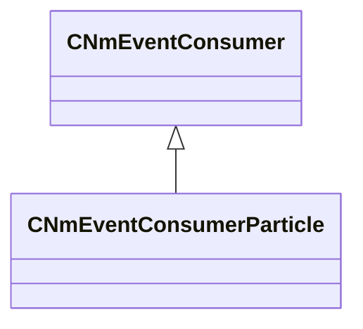

[Schemas](../../schemas.md) / [server](../server.md) / CNmEventConsumerParticle

# CNmEventConsumerParticle

> Source: **Build 25000182** · 2026-08-28 · `windows-x86_64` · schema `0.10.0`

**Kind:** class · **Size:** 176 bytes (`0xb0`) · **Align:** 8 · **Module:** server

**Inherits from:** [CNmEventConsumer](../server/CNmEventConsumer.md)

**Relationships:**

## Memory layout

No schema-visible fields (176 bytes of opaque storage).

KV3 class defaults

<pre>{
	&quot;_class&quot;: &quot;CNmEventConsumerParticle&quot;
}</pre>

