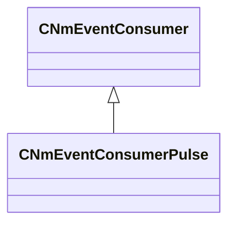

[Schemas](../../schemas.md) / [server](../server.md) / CNmEventConsumerPulse

# CNmEventConsumerPulse

**Kind:** class · **Size:** 200 bytes (`0xc8`) · **Align:** 8 · **Module:** server

**Inherits from:** [CNmEventConsumer](../server/CNmEventConsumer.md)

**Relationships:**

KV3 class defaults

<pre>{
	&quot;_class&quot;: &quot;CNmEventConsumerPulse&quot;
}</pre>

